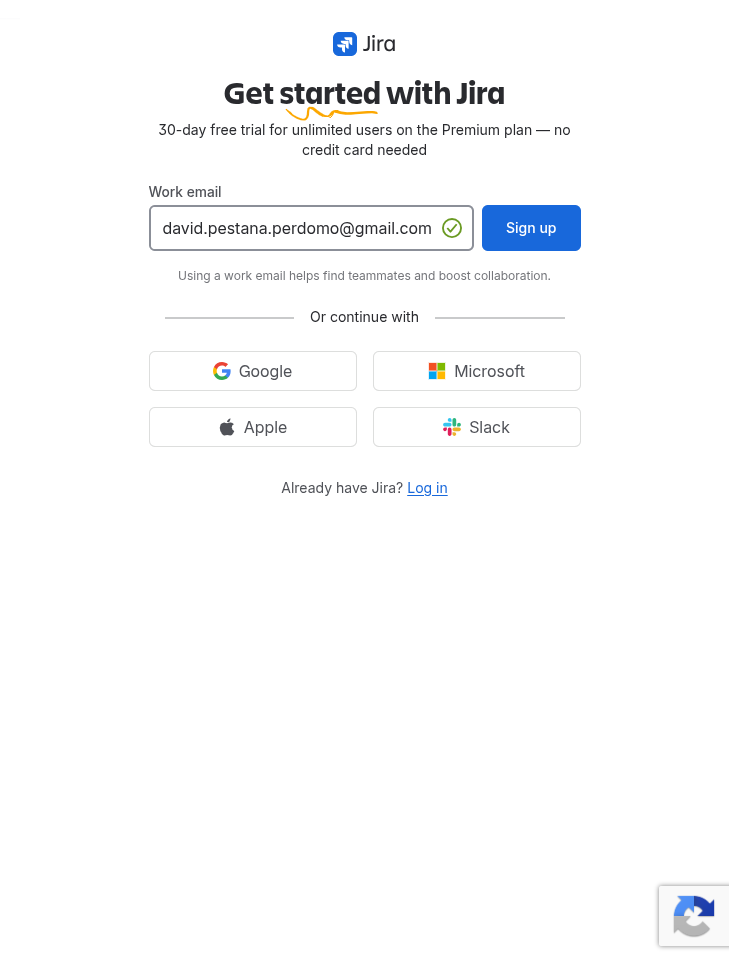
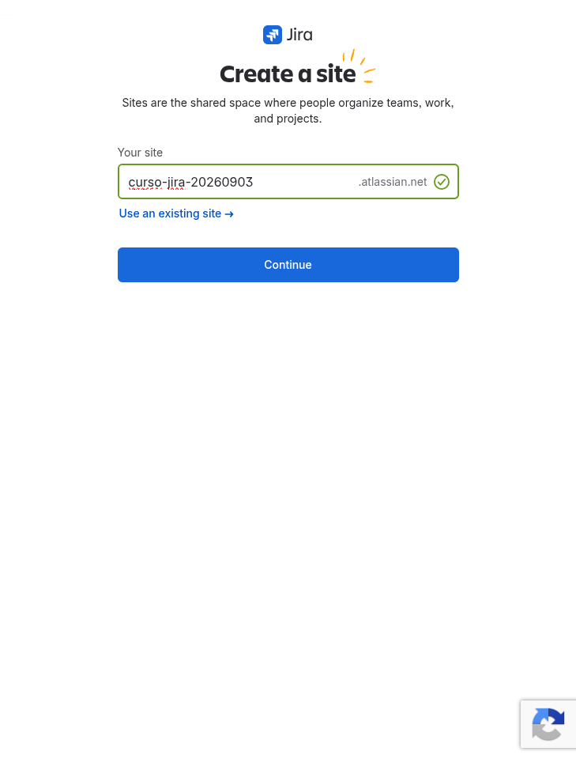
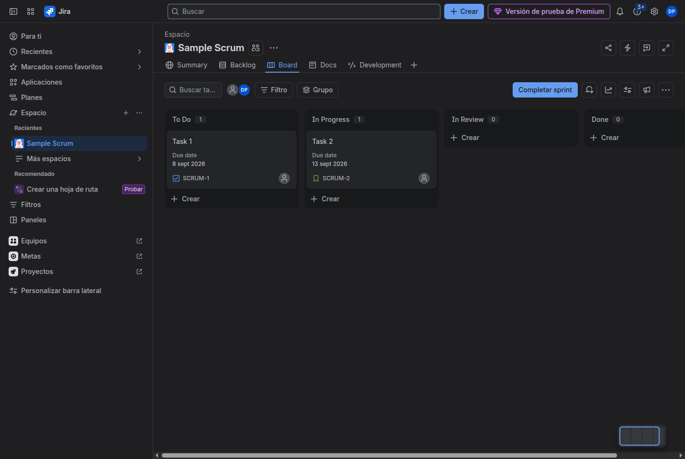

# M01-01 — Crear el trial

[← Página anterior](README.md) · [Siguiente página →](M01-02-explorar-admin.md)

> Práctica del módulo. La teoría y la demo están en el [README del módulo](README.md).

### Objetivo

Dejar operativo un site Jira Cloud **Premium trial** tuyo, con la URL anotada, listo para el resto del curso.

### Prerrequisitos

- Navegador actualizado.
- Correo al que tengas acceso (el de trabajo suele ir mejor; Gmail también vale).
- **No** hace falta tarjeta.

### En qué consiste

Alta en Atlassian → verificación de correo → nombre de site → aterrizaje en Jira. Ese site es tu laboratorio.

### 1 — Abrir el alta Premium

**Acción:** Abre [el alta de Jira Software Cloud Premium](https://www.atlassian.com/try/cloud/signup?bundle=jira-software&edition=premium).

**Por qué:** El trial Premium dura **30 días**, no pide tarjeta y deja practicar automation y gobierno sin el techo de Free.

**Resultado esperado:** Página de alta de Jira con trial de 30 días en plan Premium y un campo de correo.

> [!TIP]
> Si esa URL no carga el trial Premium, usa [Standard (14 días)](https://www.atlassian.com/try/cloud/signup?bundle=jira-software&edition=standard) y sigue igual.

### 2 — Correo y verificación

**Acción:** Introduce tu correo (o **Continuar con Google / Microsoft**). Completa el mail de verificación o el 2FA que te pida Atlassian.

**Por qué:** El site queda ligado a esa identidad: es el organization admin del laboratorio.

**Resultado esperado:** El asistente deja de pedir el correo y pasa a la configuración del site.

> [!WARNING]
> El captcha y el 2FA no se pueden saltar. Si el correo no llega, mira spam y «Atlassian».

### 3 — Nombre del site

**Acción:** Elige un nombre **neutro y único**. Recomendación: `curso-jira-` + fecha (`curso-jira-20260903`). Si está ocupado, añade un sufijo corto. Confirma. **No** uses un site antiguo si Atlassian propone reactivarlo: eso puede pedir cobro inmediato. Pulsa **Empezar un sitio nuevo**.

**Por qué:** Ese slug es la URL permanente `https://<nombre>.atlassian.net`. Si está ocupado, el asistente te lo dice: cambia una letra.

**Resultado esperado:** El asistente acepta el nombre y empieza a aprovisionar productos.

### 4 — Aterrizar en Jira

**Acción:** En el asistente, elige plantilla Scrum si te la piden y **Hazlo más tarde** / **Ir a Jira** en las invitaciones. Cierra avisos con **Aceptar** u **Omitir**. Copia la URL hasta `.atlassian.net`.

**Por qué:** El resto de labs asume esa URL. Un site de más (creado dos veces) te dispersa los ejercicios.

**Resultado esperado:** Estás autenticado en `https://<tu-site>.atlassian.net` y ves el home de Jira (vacío o con un proyecto de ejemplo).

> [!NOTE]
> Atlassian a veces crea un proyecto de muestra. Puedes dejarlo: no lo uses como DEV/SUP/OPS/PMO. Esos los creas en M03.

## Comprueba tu entendimiento

**URL del laboratorio**
Mira la barra de direcciones y recorta hasta `.atlassian.net`.
→ Obtienes exactamente `https://<nombre>.atlassian.net` sin `/jira/software/...` detrás.

**Plan**
**Configuración** (engranaje) → **Facturación**, o `admin.atlassian.com` → **Aplicaciones** / **Facturación**.
→ Jira aparece como **Premium** (trial) o, si hiciste fallback, Standard/Free. Anota cuál.

## Reto

### 1 — Un solo site

Si en el proceso te ha salido más de un site (otra URL), quédate con **uno** y úsalo en todo el curso. El otro puedes dejarlo; no mezcles laboratorios.

Ver solución

En `admin.atlassian.com` → **Aplicaciones** ves todos los sites de tu org. Trabaja siempre contra la misma URL. Si el segundo site está vacío, ignóralo.

## Errores frecuentes

| Síntoma | Causa probable | Cómo arreglarlo |
|---------|----------------|-----------------|
| No llega el correo | Spam, o SSO corporativo que bloquea | Reenviar; usar Gmail; Continue with Google |
| «Site name is taken» | Slug ocupado en Atlassian | Añade un número o iniciales |
| Pide tarjeta | Has caído en un plan de pago, no en trial | Vuelve a la URL de Premium trial de este lab |
| Quedaste en Free | El asistente eligió Free por defecto | Settings → Billing → Change plan → probar Premium/Standard |
| Captcha infinito | Automatización / VPN | Otro navegador, sin VPN, o el formador te invita a su site de respaldo |
