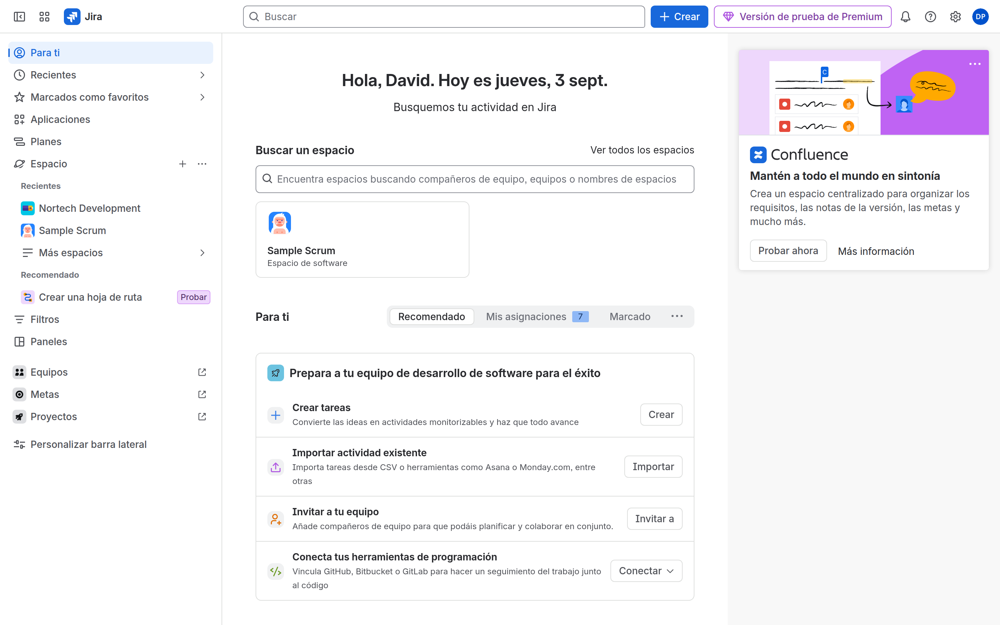
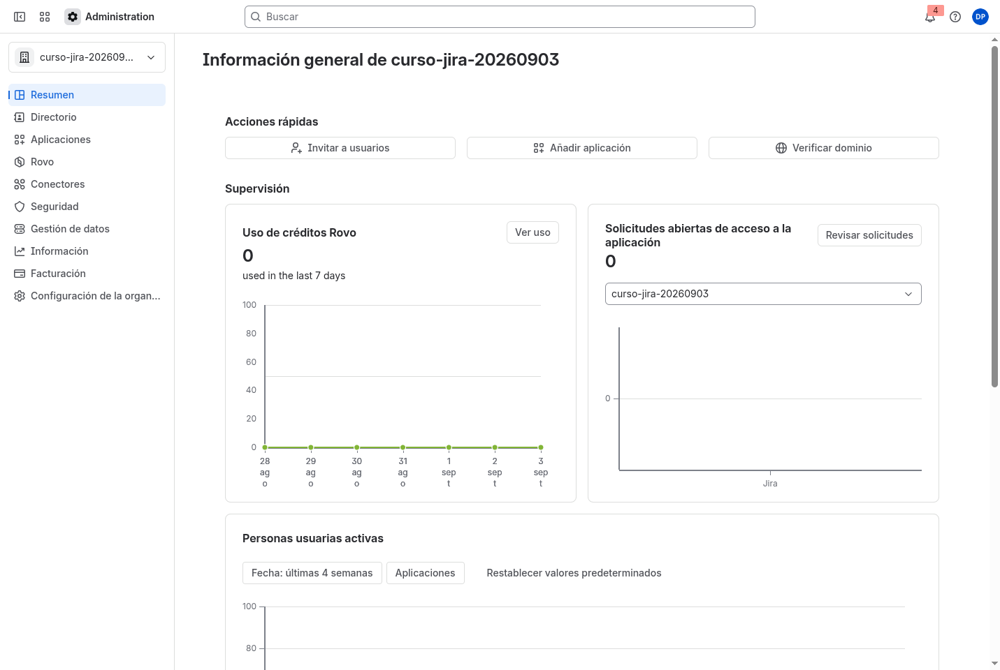
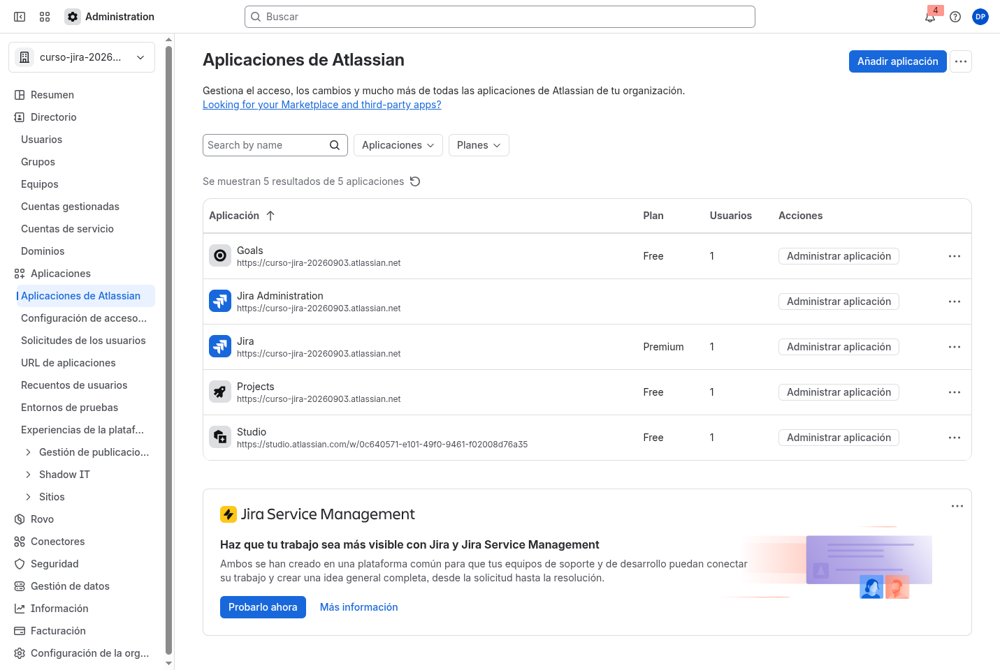
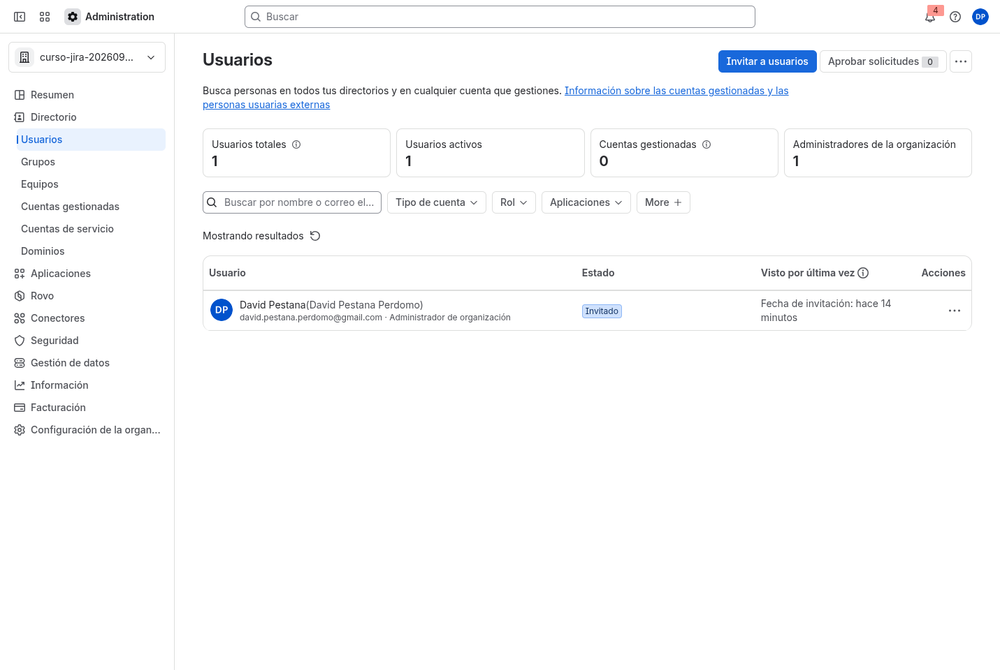
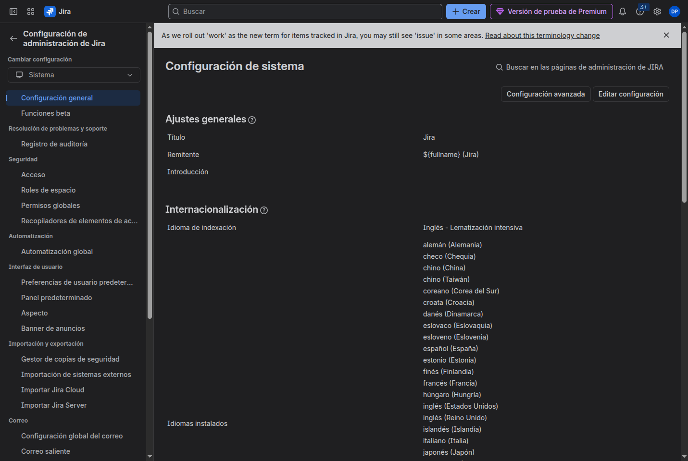

# M01-02 — Explorar la consola administrativa

[← Página anterior](M01-01-crear-trial.md) · [Siguiente página →](M01-preparacion-examen.md)

### Objetivo

Localizar, sin perderte, la organización, las aplicaciones, el Directorio y la administración de Jira.

### Prerrequisitos

- [M01-01](M01-01-crear-trial.md) terminado: tienes URL de site y sesión.

### En qué consiste

Recorrido de las tres consolas: Jira (producto), Atlassian Administration (org) y **Sistema** de Jira (admin del site).

### 1 — Home del producto

**Acción:** Abre `https://<tu-site>.atlassian.net/jira`. Identifica la barra superior (**Buscar**, **Crear**, engranaje **Configuración**) y, a la izquierda, **Para ti** y **Espacio**.

**Por qué:** Ahí vivirás el 80 % del curso. El engranaje tiene destinos distintos: la configuración *de un espacio* (dentro de Sample Scrum, por ejemplo) y **Atlassian Administration** / la configuración global de Jira.

**Resultado esperado:** Home **Para ti** de tu site, en castellano, sin estar en `id.atlassian.com`.

> [!NOTE]
> En la UI actual, lo que ACP-620 llama *project* aparece como **espacio**. El enlace **Proyectos** del pie de la barra es otro producto de Atlassian, no la lista de espacios de Jira.

### 2 — Atlassian Administration

**Acción:** **Configuración** (engranaje) → **Atlassian Administration** (o abre `https://admin.atlassian.com`). Si hay varias organizaciones, entra en la que contiene **tu** site del curso. No elijas una org antigua.

**Por qué:** Usuarios, grupos, facturación y acceso a aplicaciones **no** se gestionan dentro de un espacio.

**Resultado esperado:** **Resumen** de la organización con el site listado.

### 3 — Aplicaciones y plan

**Acción:** En Administration, **Aplicaciones** → **Aplicaciones de Atlassian**. Localiza **Jira**, el plan (**Premium**) y la URL `*.atlassian.net`. Opcional: **Facturación** (verás una *vista previa*; **no** pulses «Añadir datos de pago» ni «Reactivar»).

**Por qué:** M09 (automatización) y M10 (auditoría, algunas apps) dependen de ese plan. Si estás en Free, ya sabes dónde se va a notar.

**Resultado esperado:** Jira aparece con plan **Premium** y el site `*.atlassian.net`.

### 4 — Directorio

**Acción:** **Directorio** → **Usuarios**. Ábrete a ti mismo y mira las aplicaciones a las que tienes acceso y si eres **Administrador de organización**.

**Por qué:** En M02 vas a invitar gente y crear grupos. El Directorio es la fuente de verdad de identidades.

**Resultado esperado:** Al menos un usuario (tú) con acceso a Jira. El estado puede ser **Invitado** los primeros minutos.

### 5 — Administración de Jira (site)

**Acción:** Vuelve a Jira → **Configuración** → **Sistema** (o **Configuración de Jira** → **Sistema** → **Configuración general**). No entres en un espacio.

**Por qué:** Workflows globales, campos, esquemas y el registro de auditoría de Jira viven aquí. Es el territorio del *administrador de Jira*, distinto del de la organización.

**Resultado esperado:** Página **Configuración de sistema** (título, idiomas instalados, **Editar configuración**).

## Comprueba tu entendimiento

**Tres URLs**
Anota (en local, no en git): site Jira, `admin.atlassian.com`, y Sistema de Jira.
→ Las tres abren consolas distintas. Si las tres parecen «el espacio Sample Scrum», estás dentro de un espacio: sal con el logo de Jira.

**Quién eres**
Directorio → tu usuario.
→ Debes figurar como administrador de la organización o del site. Si no, el trial no te pertenece: revisa la cuenta con la que hiciste el alta.

## Reto

### 1 — Engranaje correcto

Sin abrir un espacio, llega a **Campos personalizados** (**Configuración** → **Elementos de trabajo** / **Incidencias** → **Campos personalizados**). Luego vuelve a **Para ti**.

Ver solución

**Configuración** (arriba a la derecha, no la del espacio) → cambia a **Elementos de trabajo** o **Incidencias** → **Campos personalizados**. Si solo ves la configuración del espacio, estás *dentro* de Sample Scrum: sal a **Para ti** y usa el engranaje global.

## Errores frecuentes

| Síntoma | Causa probable | Cómo arreglarlo |
|---------|----------------|-----------------|
| El engranaje solo muestra la configuración del espacio | Estás dentro de un espacio | Sal a **Para ti** / **Más espacios** |
| `admin.atlassian.com` pide otra cuenta | SSO / varios perfiles de Chrome | Misma cuenta que el alta |
| No ves **Sistema** | No eres administrador de Jira | Directorio: tu usuario debe ser admin de la org/site del trial |
| Facturación vacía o pide tarjeta | Has abierto «Gestionar» / reactivar | Quédate en **Aplicaciones de Atlassian** o en la vista previa; no añadas pago |
