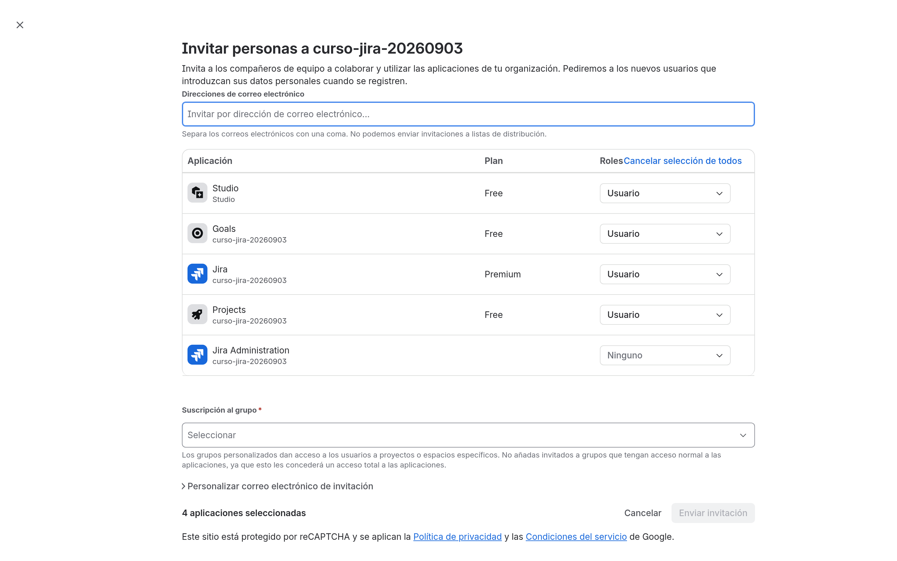
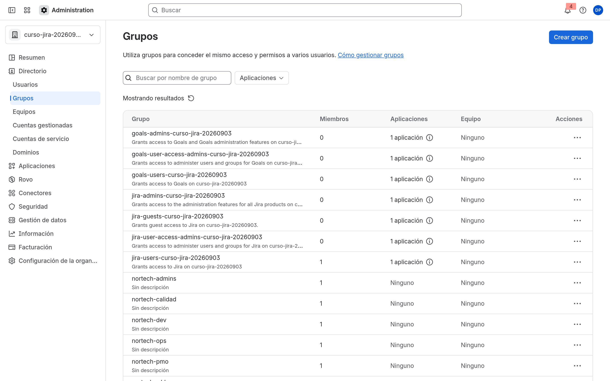
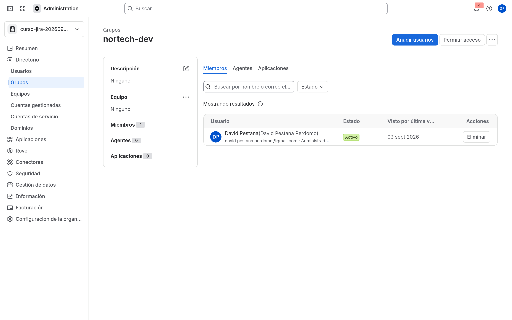

# M02-01 — Grupos corporativos

[← Página anterior](README.md) · [Siguiente página →](M02-02-modelo-seguridad.md)

### Objetivo

Dejar creados los grupos departamentales de Nortech y al menos un usuario además de ti (aunque sea una segunda cuenta tuya).

### Prerrequisitos

- Site de M01. Eres org admin.

### En qué consiste

Directorio: listar usuarios → invitar → crear grupos → meter miembros.

### 1 — Listar usuarios

**Acción:** `admin.atlassian.com` → **Directorio** → **Usuarios**.

**Por qué:** Confirmas cuántas cuentas hay antes de invitar (el plan Free se llena en 10).

**Resultado esperado:** Apareces tú como usuario (activo o **Invitado** los primeros minutos).

### 2 — Invitar

**Acción:** **Invitar a usuarios**. Correo de un compañero o una segunda cuenta tuya. Aplicación: **Jira**. Rol: usuario (no administrador). Envía.

**Por qué:** Necesitas alguien que no sea administrador de organización para validar permisos en M02-02 y M10.

**Resultado esperado:** Invitación enviada (o usuario ya en el Directorio si aceptó al vuelo).

> [!TIP]
> Si estás solo, crea un usuario con otro correo (alias). Sin segundo usuario, varios labs de seguridad no se pueden comprobar.

### 3 — Crear grupos

**Acción:** Directorio → **Grupos** → crear. Crea: `nortech-dev`, `nortech-soporte`, `nortech-ops`, `nortech-pmo`, `nortech-rrhh`, `nortech-calidad`.

**Por qué:** M03–M10 reutilizan estos nombres. Un typo ahora se arrastra.

**Resultado esperado:** Los seis grupos existen (vacíos o con miembros).

### 4 — Membresía

**Acción:** Abre `nortech-dev` y añade tu usuario. Añade al invitado a `nortech-soporte`.

**Por qué:** En M03 el permission scheme usará estos grupos vía project roles.

**Resultado esperado:** Tú en `nortech-dev`; el segundo usuario en `nortech-soporte`.

## Comprueba tu entendimiento

**Conteo**
Directorio → **Grupos** → abre `nortech-dev`.
→ Tu usuario figura como miembro.

**Invitación**
**Usuarios:** el segundo correo aparece como **Invitado** o activo.
→ Si lleva horas en invited, reenvía el mail.

## Reto

### 1 — Grupo de administradores de plataforma

Crea `nortech-admins` y métete solo tú. No le des todavía permisos extra: solo el grupo.

Ver solución

Directorio → **Grupos** → crear `nortech-admins` → añadir miembros → tu cuenta. Los permisos de administrador de Jira se asignan en M04 (esquema de permisos / **Permisos globales**), no aquí.

## Errores frecuentes

| Síntoma | Causa probable | Cómo arreglarlo |
|---------|----------------|-----------------|
| **Invitar a usuarios** falla | Límite de Free (10) o correo inválido | Quita usuarios de prueba o sube de plan |
| No aparece **Grupos** | No eres administrador de organización | Vuelve a la cuenta del trial |
| Grupo duplicado con otro nombre | Mayúsculas / espacios | Usa exactamente `nortech-dev` (kebab, minúsculas) |
