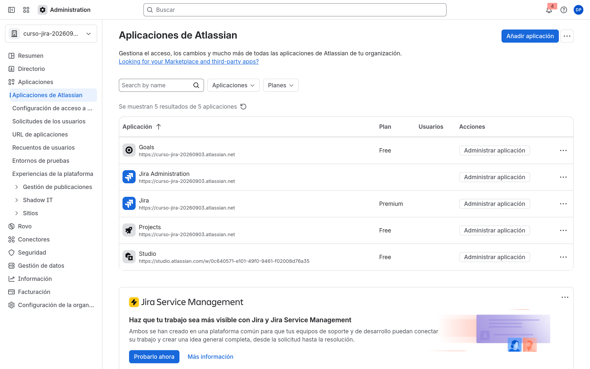
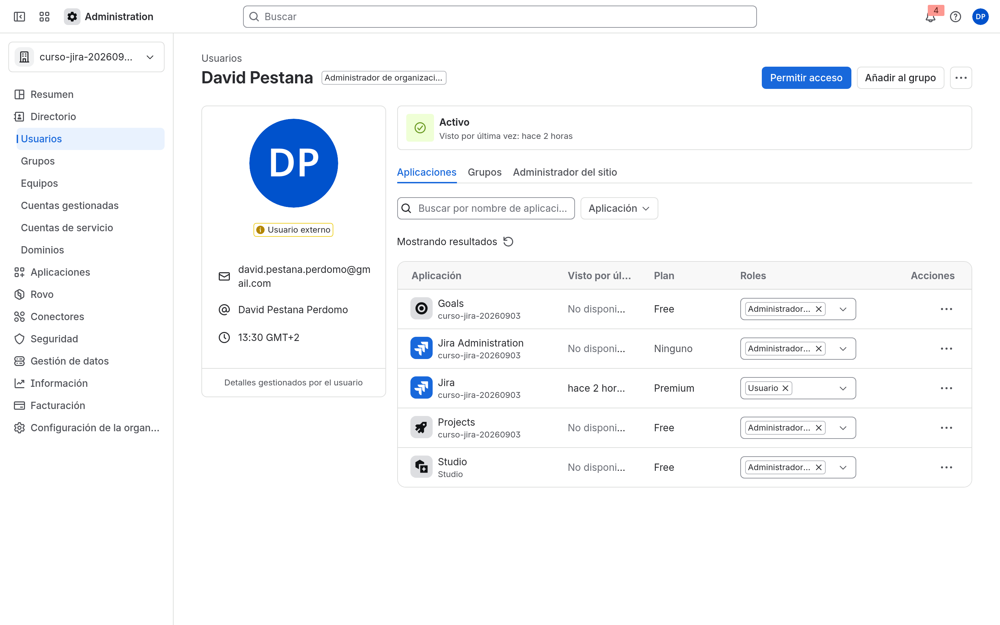
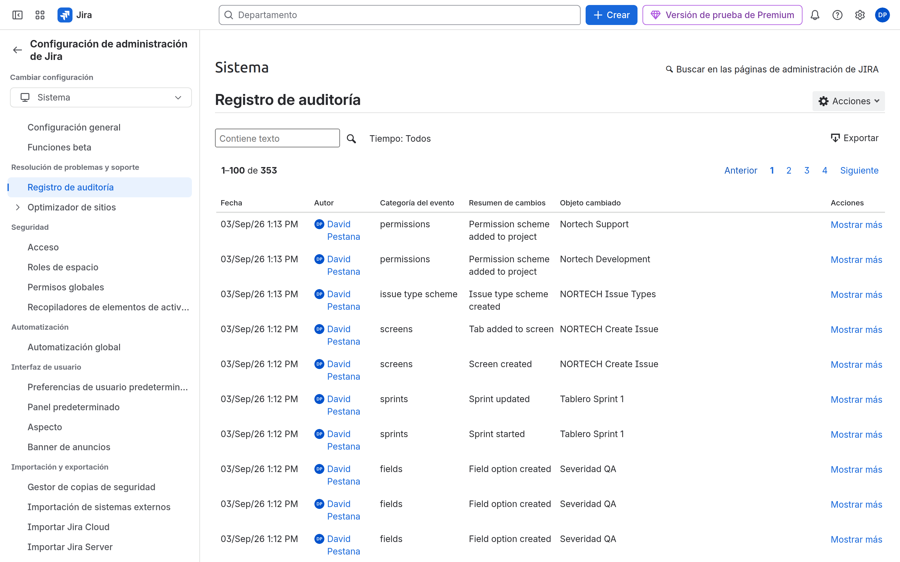

# M02-02 — Modelo de seguridad corporativo

[← Página anterior](M02-01-grupos-departamentos.md) · [Siguiente página →](M02-preparacion-examen.md)

### Objetivo

Dejar el acceso a la aplicación acotado y comprobar que un usuario sin acceso no entra a Jira.

### Prerrequisitos

- [M02-01](M02-01-grupos-departamentos.md): grupos e invitado.

### En qué consiste

Revisar el acceso a la aplicación, los roles de organización y (si el plan lo permite) el registro de auditoría de una invitación.

### 1 — Acceso a la aplicación

**Acción:** Administration → **Aplicaciones** → **Configuración de acceso a la aplicación**. Asegura que el grupo `nortech-dev` (y los demás Nortech que deban usar Jira) tienen acceso de usuario. Quita accesos sueltos «a todo el mundo» si el trial los creó.

**Por qué:** Un usuario en un grupo del Directorio **sin** acceso a la aplicación no abre Jira. Es la primera puerta.

**Resultado esperado:** Jira se concede por grupos Nortech, no por «all users» indiscriminado.

### 2 — Quién es admin

**Acción:** **Directorio** → tu usuario y el invitado. Tú: **Administrador de organización** o admin del site. El invitado: usuario, no admin.

**Por qué:** Si todos son admin, M04–M10 no demuestran restricción ninguna.

**Resultado esperado:** El invitado no ve **Facturación** ni puede crear grupos.

### 3 — Validar con el invitado

**Acción:** Abre una ventana de incógnito, entra con el invitado, abre el site. Luego, en tu sesión admin, **revoca** temporalmente el acceso a Jira de ese usuario (o quítalo del grupo con acceso), recarga incógnito, y **vuelve a concederlo**.

**Por qué:** Ver el síntoma «no tengo Jira» evita diagnosticar esquemas de permisos cuando el problema es el acceso a la aplicación.

**Resultado esperado:** Sin acceso a la aplicación, el invitado no entra al producto. Con acceso, sí.

### 4 — Registro de auditoría (si existe)

**Acción:** Administration → **Seguridad** (busca actividad de la organización / registro). Filtra por usuarios/grupos.

**Por qué:** En Premium hay más eventos. En Free puede no haber nada útil: anótalo y sigue.

**Resultado esperado:** Ves (o no, según plan) el alta de grupos o la invitación.

## Comprueba tu entendimiento

**Puerta 1 vs puerta 2**
El invitado entra a Jira pero aún no tiene espacios (M03).
→ Acceso a la aplicación OK. Falta rol de espacio, no «está roto Jira».

## Reto

### 1 — No conviertas al invitado en administrador de organización

Encuentra la pantalla donde *podrías* darle ese rol y **no lo hagas**.

Ver solución

**Directorio** → usuario → roles / permisos de organización. Administrador de organización es una palanca de incidente. Para labs de admin de espacio basta con usuario + grupos.

## Errores frecuentes

| Síntoma | Causa probable | Cómo arreglarlo |
|---------|----------------|-----------------|
| No tienes acceso a este producto | Sin acceso a la aplicación | **Aplicaciones** → **Configuración de acceso a la aplicación** → grupo |
| El invitado ve Administration | Lo hiciste admin | Quita el rol de org/site |
| No hay registro de auditoría | Plan Free | Esperable; M10 lo retoma en Premium |
