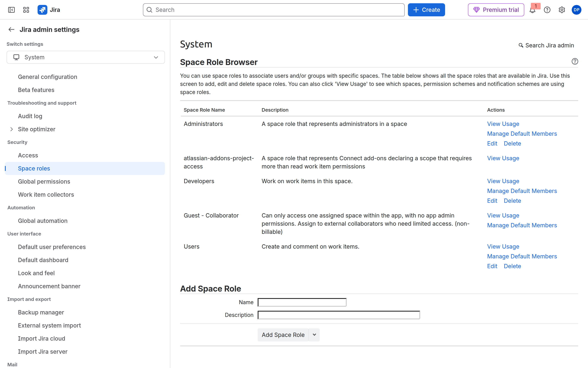
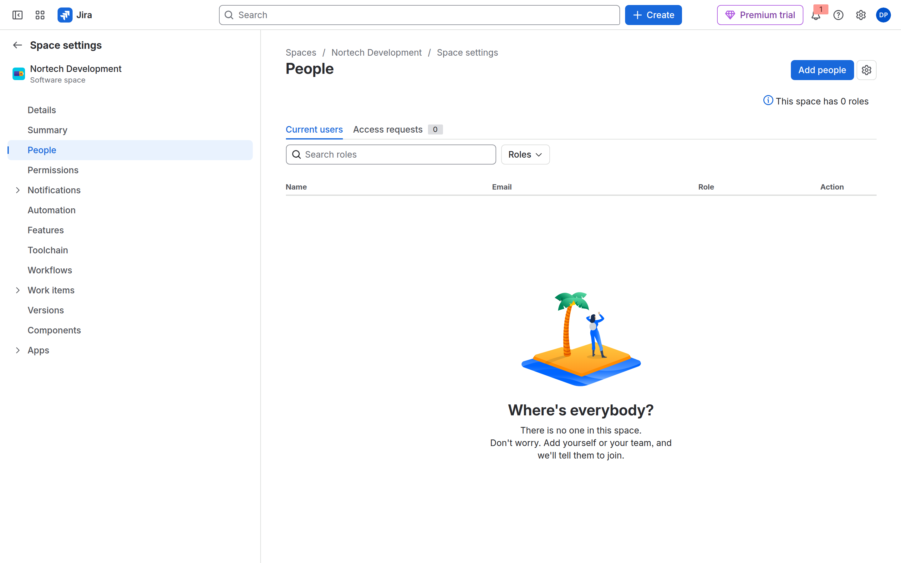
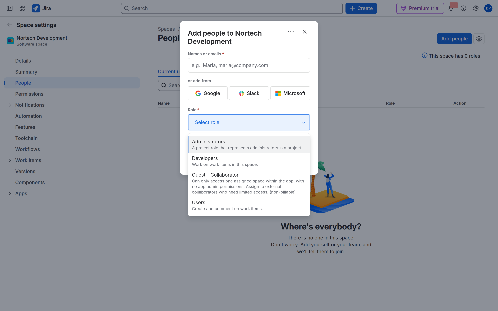
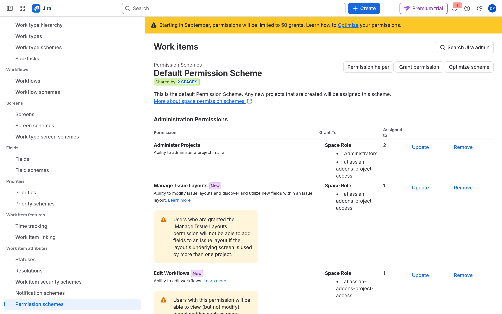

# M03-01 — Crear proyectos corporativos

[← Página anterior](README.md) · [Siguiente página →](M03-02-componentes-versiones.md)

### Objetivo

Tener cuatro espacios **gestionados por la empresa** (*company-managed*) con claves `DEV`, `SUP`, `OPS` y `PMO`.

### Prerrequisitos

- M01 y grupos de M02 (puedes crear espacios sin grupos, pero **Personas** se hace mejor con ellos).

### En qué consiste

**Crear espacio** × 4, eligiendo a propósito **gestionado por la empresa**.

### 1 — Asistente

**Acción:** En Jira, barra izquierda → **Crear espacio** (o **Más espacios** → crear). Recorre las plantillas (Scrum, Kanban, negocio).

**Por qué:** La plantilla rellena tipos de trabajo y un tablero inicial. Luego puedes cambiar esquemas (M04).

**Resultado esperado:** Galería de plantillas.

> [!NOTE]
> **Espacio**, no el enlace **Proyectos** del pie de la barra: ese abre otro producto de Atlassian.

### 2 — Gestionado por la empresa

**Acción:** Elige **Scrum**. En el tipo, marca **Gestionado por la empresa** (*company-managed*; a veces «administrado por Jira»). Nombre: `Nortech Development`. Clave: `DEV`. **Crear**.

**Por qué:** CMP comparte workflows y permisos. Es el estándar corporativo del curso.

**Resultado esperado:** Espacio DEV abierto. En **Configuración del espacio** → **Detalles** no dice gestionado por el equipo.

> [!WARNING]
> Si ves «Añadir un estado» estilo TMP o **Funciones** de gestionado por el equipo, **borra el espacio** y créalo otra vez como gestionado por la empresa. No «lo dejas para luego».

### 3 — SUP, OPS, PMO

**Acción:**

| Nombre | Clave | Plantilla | Tipo |
|--------|-------|-----------|------|
| Nortech Support | SUP | **Kanban** | Gestionado por la empresa |
| Nortech Operations | OPS | Negocio: **Seguimiento de tareas** (o **Gestión del trabajo**) | Gestionado por la empresa |
| Nortech PMO | PMO | La **misma** familia que OPS | Gestionado por la empresa |

En la galería de 2026 **no** hay un recuadro «Negocio / gestión de proyectos». PMO no es Scrum: busca plantillas de **negocio / trabajo / tareas**. Si solo ves Software, **Kanban** gestionado por la empresa vale igual (sin sprints). Lo que no puedes es dejarlo team-managed.

**Por qué:** Mismos cuatro espacios que la propuesta formativa (desarrollo, soporte, operaciones, PMO).

**Resultado esperado:** **Configuración del espacio** → **Detalles** de cada uno con la clave correcta.

### 4 — Lista y categoría

**Acción:** **Más espacios**. Opcional: **Configuración de Jira** → espacios → **Categorías**. Crea `Nortech` y asigna los cuatro.

**Por qué:** Las categorías agrupan en la lista y en gadgets. No sustituyen a los grupos de usuarios.

**Resultado esperado:** Cuatro espacios visibles (más Sample Scrum, que no usas como DEV).

### 5 — Personas: el grupo no se pega al espacio

En company-managed **no** hay «añadir `nortech-dev` a DEV». Hay una cadena. El grupo nunca entra solo:

| Pieza | Dónde | Qué es |
|-------|--------|--------|
| **Grupo** | `admin.atlassian.com` → Directory (M02) | Quién es de Desarrollo |
| **Rol de espacio** | Lista **del site** (paso 5a) | Etiqueta: Administrators, Developers, Users |
| **Personas** | **Este** espacio (paso 5b) | Quién lleva esa etiqueta **aquí** |
| **Esquema de permisos** | Site, asociado al espacio (M04) | Qué puede **hacer** esa etiqueta |

Hoy cierras grupo → rol. Lo que el rol puede hacer lo miras (no lo editas) en 5c.

### 5a — Crear el rol Developers en el site

**Acción:** Engranaje **arriba a la derecha de Jira** (configuración del **producto**, no la del espacio) → **System** / **Sistema** → **Space roles** (*Roles del espacio*, bloque Security). Si no está **Developers**, abajo: **Add Space Role** → nombre `Developers` → añadir. Opcional: otro rol `Users`.

**Por qué:** El desplegable de Personas solo lista roles **del site**. En trials 2026 a menudo vienen solo **Administrators** y **Guest - Collaborator**. Developers no «falta en DEV»: **no está creado**.

**Resultado esperado:** En *Space Role Browser* ves Administrators, Developers y (si lo creaste) Users. Guest queda para externos; no lo uses con grupos Nortech.

> [!WARNING]
> *This space has 0 roles* / *1 role* en Personas **no** es esta pantalla. Cuenta roles **con miembros en ese espacio**, no los roles que existen en el site.

### 5b — En DEV, el grupo lleva el sombrero Developers

**Acción:** DEV → **Configuración del espacio** → **People** / **Personas** → **Add people**. En *Names or emails* escribe **`nortech-dev`** (el **grupo**, no tu usuario). Rol: **Developers**. **Add**. Tú, como creador, ya sueles ser Administrators: no te vuelvas a añadir ni elijas Guest.

**Por qué:** Personas rellena la membresía del rol **en este espacio**. El mismo grupo en PMO puede ir a otro rol. El esquema (M04) hablará de Developers, no de `nortech-dev`.

**Resultado esperado:** Tras **Add**, `nortech-dev` está en la tabla de Personas con rol Developers. Hasta entonces la pantalla puede decir *Where's everybody?* / *0 roles*: no está roto, aún no has asignado el sombrero.

Repite:

| Espacio | Grupo | Rol |
|---------|-------|-----|
| DEV | `nortech-dev` | Developers |
| SUP | `nortech-soporte` | Developers |
| OPS | `nortech-ops` | Developers |
| PMO | `nortech-pmo` | Developers |

> [!NOTE]
> Si el desplegable no muestra Developers, vuelve a 5a: el rol no existe en el site. **Guest - Collaborator** es para un externo sin licencia, un solo espacio: no es el rol del lab.

### 5c — El esquema habla de roles (solo mira)

**Acción:** Engranaje de Jira → **Work items** / **Elementos de trabajo** → **Permission schemes** → **Permisos** del esquema que usa DEV (*Default software scheme*). Abre **Update** de una fila (p. ej. Administer Projects) y mira **Grant to**. **Cancel**: hoy no cambies nada.

**Por qué:** Ahí ves las reglas encorsetadas (Space Role, Group, Single user…). El modelo corporativo concede a **Space Role** (Administrators, Developers). No a un usuario suelto. En M04 copias este esquema a `NORTECH Permissions` y añades Developers a Browse / Create / Assignable.

**Resultado esperado:** *Grant to* muestra **Space Role**, no el grupo `nortech-dev`. Cierra sin guardar.

## Comprueba tu entendimiento

**Tipo**
Abre DEV → **Configuración del espacio**.
→ Esquema de tipos / workflows (CMP). Si ves tipos solo locales estilo TMP, está mal creado.

**Cadena, no atajo**
En Personas de DEV busca `nortech-dev`. En el engranaje de Jira → **Space roles**, confirma que existe Developers.
→ El grupo está en el rol de **este** espacio. El rol existe en el **site**. No hay un campo «grupos del espacio».

## Reto

### 1 — Un TMP de demostración

Crea un quinto espacio **gestionado por el equipo** `LAB-TMP` (clave `TMP`) y ábrelo 2 minutos para ver **Funciones**. No lo uses en M04–M09.

Ver solución

**Crear espacio** → Kanban → **Gestionado por el equipo** → clave TMP. En la configuración verás **Funciones**, tipos locales y acceso Abierto/Limitado/Privado. Eso es lo que ACP-620 contrapone a CMP.

## Errores frecuentes

| Síntoma | Causa probable | Cómo arreglarlo |
|---------|----------------|-----------------|
| Clave ocupada | Espacio de muestra | Otra clave (`DEV2`) o borra el sample |
| No sale **Gestionado por la empresa** | UI nueva / plantilla solo TMP | Cambia de plantilla; busca más plantillas / empresa |
| No sale «gestión de proyectos» para PMO | Atlassian unificó las plantillas de negocio | **Seguimiento de tareas** o **Gestión del trabajo**, CMP; si no, **Kanban** CMP |
| No puedes **Crear espacio** | No eres administrador de Jira | Cuenta del trial |
| En Add people no sale **Developers** | El rol no existe en el site (trial 2026) | Engranaje Jira → **System** → **Space roles** → **Add Space Role** `Developers` |
| Solo ves Administrators y **Guest** | Guest es el colaborador externo | No lo uses para `nortech-dev`. Crea Developers (5a) |
| Escribiste tu nombre, no el grupo | Personas admite usuarios y grupos | Borra y escribe exactamente `nortech-dev` |
| El grupo no «entra» al espacio | CMP no asocia grupo↔espacio | Asociación: grupo → **rol** en Personas; el esquema nombra el rol |
