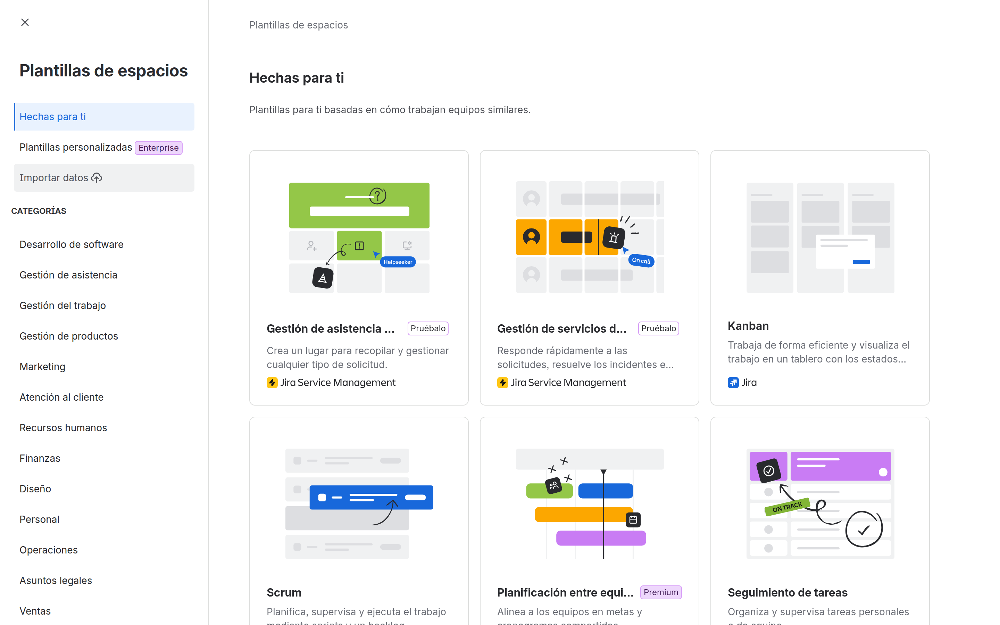
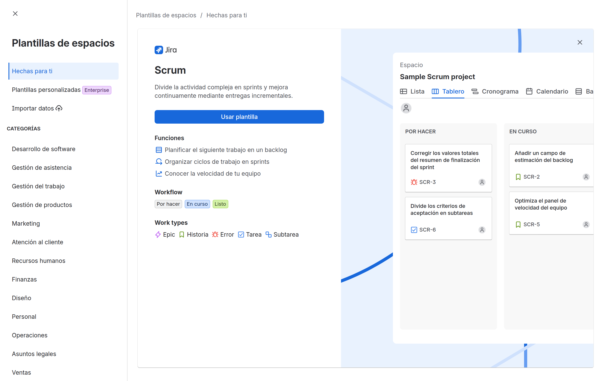
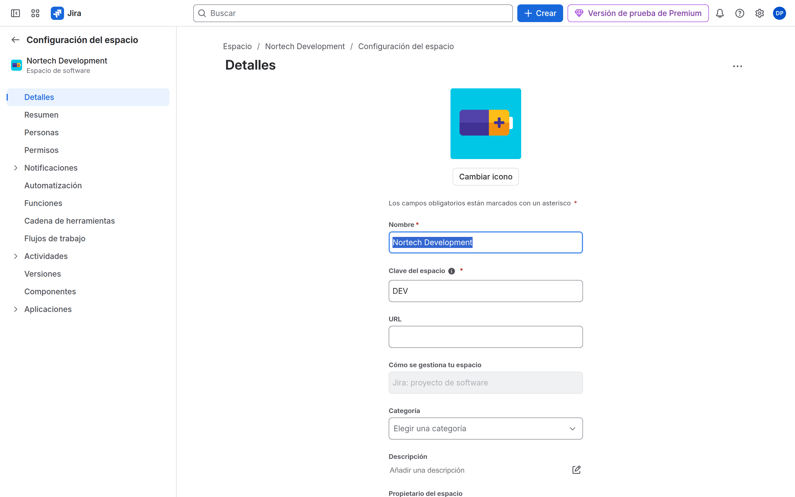
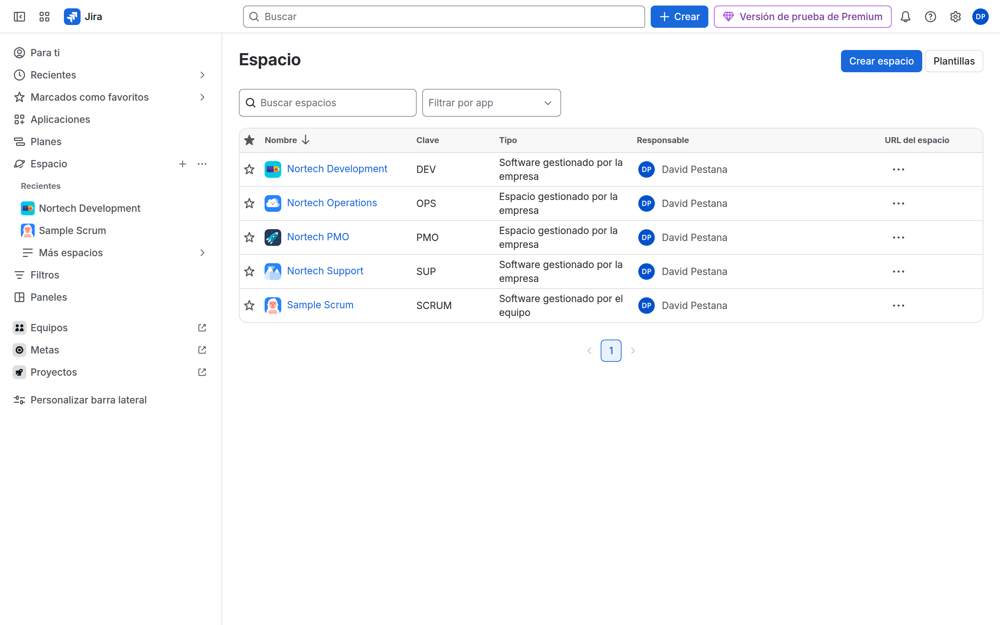

# M03-01 — Crear proyectos corporativos

[← Página anterior](README.md) · [Siguiente página →](M03-02-componentes-versiones.md)

> Práctica del módulo. La teoría y la demo están en el [README del módulo](README.md).

### Objetivo

Tener cuatro espacios **gestionados por la empresa** (*company-managed*) con claves `DEV`, `SUP`, `OPS` y `PMO`.

### Prerrequisitos

- M01 y grupos de M02 (puedes crear espacios sin grupos, pero **Personas** se hace mejor con ellos).

### En qué consiste

**Crear espacio** × 4, eligiendo a propósito **gestionado por la empresa**.

### 1 — Asistente

**Acción:** En Jira, barra izquierda → **Crear espacio** (o **Más espacios** → crear). Recorre las plantillas (Scrum, Kanban, negocio).

**Por qué:** La plantilla rellena tipos de trabajo y un tablero inicial. Luego puedes cambiar esquemas (M04).

**Resultado esperado:** Galería de plantillas.

> [!NOTE]
> **Espacio**, no el enlace **Proyectos** del pie de la barra: ese abre otro producto de Atlassian.

### 2 — Gestionado por la empresa

**Acción:** Elige **Scrum**. En el tipo, marca **Gestionado por la empresa** (*company-managed*; a veces «administrado por Jira»). Nombre: `Nortech Development`. Clave: `DEV`. **Crear**.

**Por qué:** CMP comparte workflows y permisos. Es el estándar corporativo del curso.

**Resultado esperado:** Espacio DEV abierto. En **Configuración del espacio** → **Detalles** no dice gestionado por el equipo.

> [!WARNING]
> Si ves «Añadir un estado» estilo TMP o **Funciones** de gestionado por el equipo, **borra el espacio** y créalo otra vez como gestionado por la empresa. No «lo dejas para luego».

### 3 — SUP, OPS, PMO

**Acción:**

| Nombre | Clave | Plantilla | Tipo |
|--------|-------|-----------|------|
| Nortech Support | SUP | Kanban | Gestionado por la empresa |
| Nortech Operations | OPS | Negocio / seguimiento de tareas | Gestionado por la empresa |
| Nortech PMO | PMO | Negocio / gestión de proyectos | Gestionado por la empresa |

**Por qué:** Mismos cuatro espacios que la propuesta formativa (desarrollo, soporte, operaciones, PMO).

**Resultado esperado:** **Configuración del espacio** → **Detalles** de cada uno con la clave correcta.

### 4 — Lista y categoría

**Acción:** **Más espacios**. Opcional: **Configuración de Jira** → espacios → **Categorías**. Crea `Nortech` y asigna los cuatro.

**Por qué:** Las categorías agrupan en la lista y en gadgets. No sustituyen a los grupos de usuarios.

**Resultado esperado:** Cuatro espacios visibles (más Sample Scrum, que no usas como DEV).

### 5 — Personas (roles)

**Acción:** En DEV → **Configuración del espacio** → **Personas**. Rol Administrators: tú. Rol Developers: grupo `nortech-dev`. En SUP, rol del grupo `nortech-soporte`. Análogo OPS/PMO.

**Por qué:** Sin rol, el esquema de permisos por defecto puede dejarte solo a ti con acceso.

**Resultado esperado:** El grupo aparece en **Personas** de su espacio.

## Comprueba tu entendimiento

**Tipo**
Abre DEV → **Configuración del espacio**.
→ Esquema de tipos / workflows (CMP). Si ves tipos solo locales estilo TMP, está mal creado.

## Reto

### 1 — Un TMP de demostración

Crea un quinto espacio **gestionado por el equipo** `LAB-TMP` (clave `TMP`) y ábrelo 2 minutos para ver **Funciones**. No lo uses en M04–M09.

Ver solución

**Crear espacio** → Kanban → **Gestionado por el equipo** → clave TMP. En la configuración verás **Funciones**, tipos locales y acceso Abierto/Limitado/Privado. Eso es lo que ACP-620 contrapone a CMP.

## Errores frecuentes

| Síntoma | Causa probable | Cómo arreglarlo |
|---------|----------------|-----------------|
| Clave ocupada | Espacio de muestra | Otra clave (`DEV2`) o borra el sample |
| No sale **Gestionado por la empresa** | UI nueva / plantilla solo TMP | Cambia de plantilla; busca más plantillas / empresa |
| No puedes **Crear espacio** | No eres administrador de Jira | Cuenta del trial |
