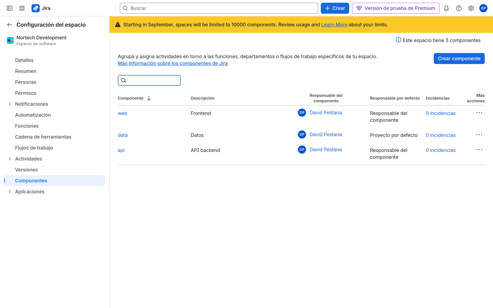
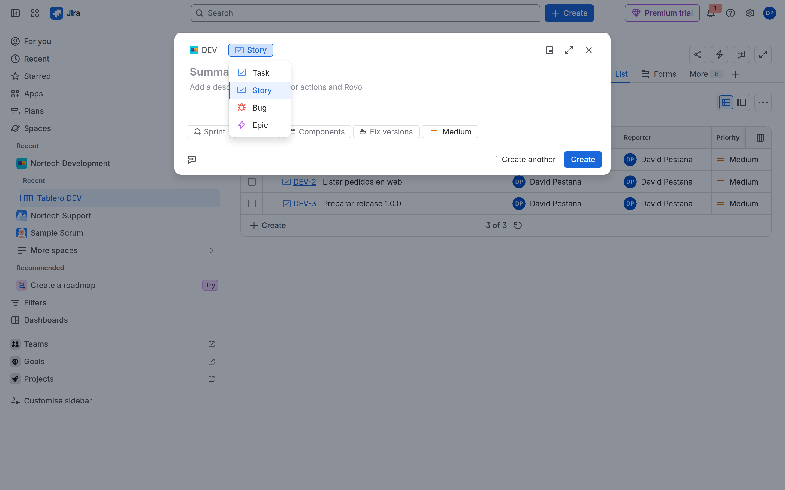
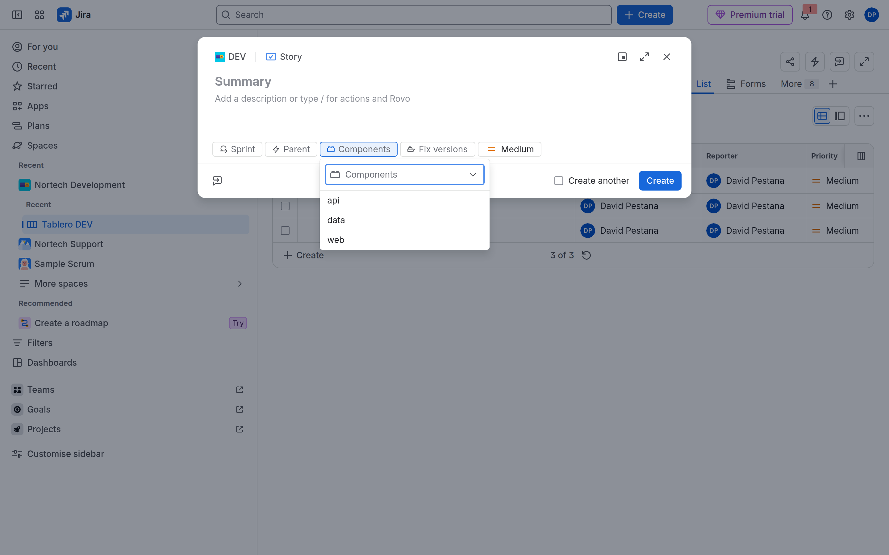
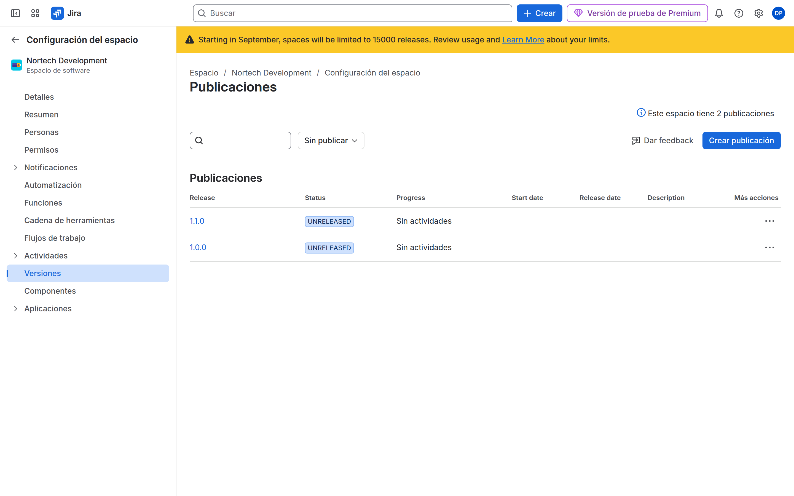
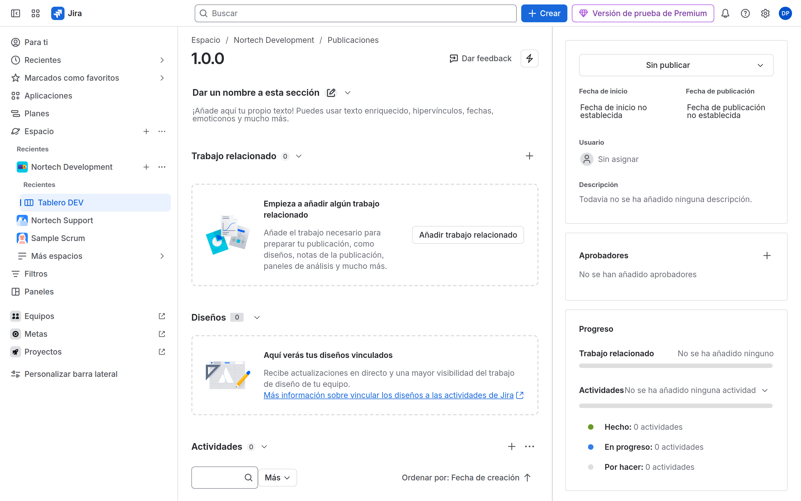

# M03-02 — Componentes y versiones

[← Página anterior](M03-01-crear-proyectos.md) · [Siguiente página →](M03-preparacion-examen.md)

### Objetivo

Dejar DEV con componentes que asignan trabajo y una versión para una release.

### Prerrequisitos

- Espacio **gestionado por la empresa** `DEV` ([M03-01](M03-01-crear-proyectos.md)).

### En qué consiste

Components con lead + Default assignee. Releases con una versión `1.0.0`.

### 1 — Componentes

**Acción:** DEV → **Configuración del espacio** → **Componentes**. Crea:

| Componente | Lead | Default assignee |
|------------|------|------------------|
| `api` | tú | Component lead |
| `web` | tú | Component lead |
| `data` | tú | Project default |

**Por qué:** Default assignee = Component lead es el truco de asignación automática **sin** automation (ACP-620 lo pregunta).

**Resultado esperado:** Tres componentes listados.

> [!NOTE]
> En TMP los componentes no existen igual (usas fields). Por eso DEV es CMP.

### 2 — Probar asignación

**Acción:** En **DEV**, pulsa **Create** / **Crear** (barra superior). En la **cabecera** del diálogo, a la derecha de **DEV**, el tipo suele decir *Story* / *Historia* o *Task* / *Tarea*: **pulsa esa palabra**. Elige **Bug** (en español a veces **Error**). No está en el cuerpo del formulario.

Resumen: p. ej. `Fallo al autenticar en API`. Pulsa la pastilla **Components** / **Componentes** → `api`. **No** te elijas en Asignatario: déjalo automático / vacío. **Create**.

**Por qué:** Si el componente `api` tiene Default assignee = Component lead, Jira te asigna el Bug al crear. Si te asignas a mano, no pruebas nada.

**Resultado esperado:** El Bug queda asignado al lead de `api` (tú).

### 3 — Versiones

**Acción:** DEV → **Versiones** / **Lanzamientos** (o **Configuración del espacio** → versiones). Crea `1.0.0` (fecha de inicio hoy) y `1.1.0` (sin empezar).

**Por qué:** Fix Version/s alimenta el release hub y varios reports.

**Resultado esperado:** Dos versiones; `1.0.0` se puede marcar Unreleased / In progress.

### 4 — Release hub

**Acción:** Abre el hub de `1.0.0`. Añade el Bug del paso 2 a **Versión de corrección** `1.0.0`.

**Por qué:** Ver el impacto de scope: meter o sacar issues de la versión.

**Resultado esperado:** El hub muestra al menos una issue en `1.0.0`.

## Comprueba tu entendimiento

**Component lead**
Crea otro Bug con componente `web` y Assignee vacío.
→ Assignee = lead de `web`.

## Reto

### 1 — Labels vs componentes

Crea un label `urgente` en una issue. ¿Sustituye al componente `api`?

Ver solución

No. El label no tiene lead ni default assignee. Sirve para filtrar, no para gobierno de ownership.

## Errores frecuentes

| Síntoma | Causa probable | Cómo arreglarlo |
|---------|----------------|-----------------|
| No hay menú **Componentes** | Espacio TMP o función oculta | Espacio CMP; **Configuración del espacio** → **Funciones** si aplica |
| No asigna el lead | Asignatario por defecto = del espacio; o el lead no es usuario asignable | Cambia el valor por defecto; esquema de permisos |
| No ves **Bug** en Crear | Estás en otro espacio, o el tipo se llama **Error**; o el desplegable es la palabra *Story* de la cabecera | Cambia el espacio a **DEV**; pulsa *Story*/*Tarea* **arriba**, no busques un campo Tipo |
| No ves **Versiones** | La barra del espacio oculta lanzamientos | **Configuración del espacio** → **Detalles** / **Funciones** |
