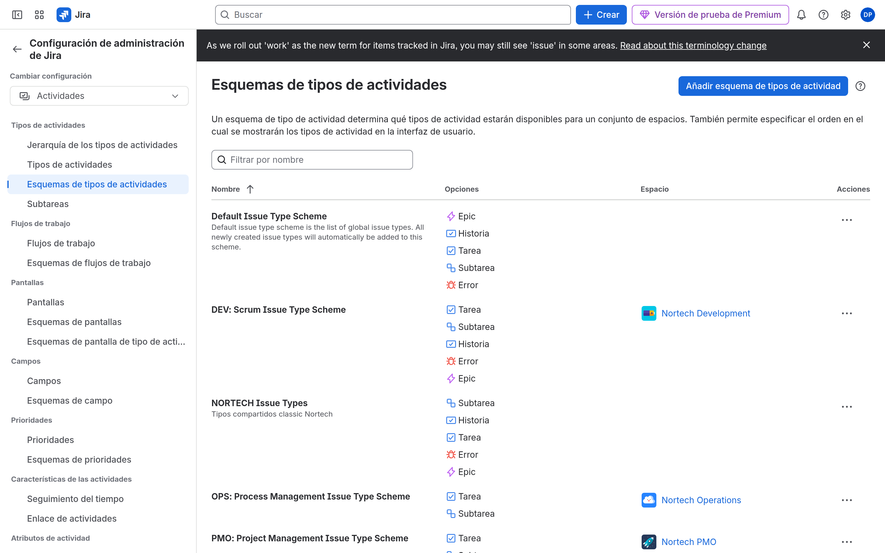
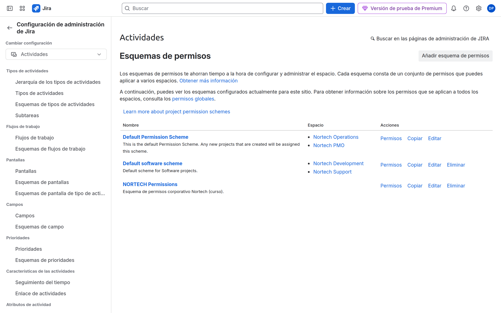
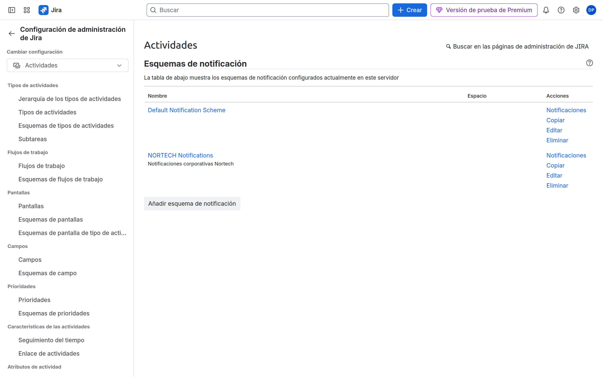
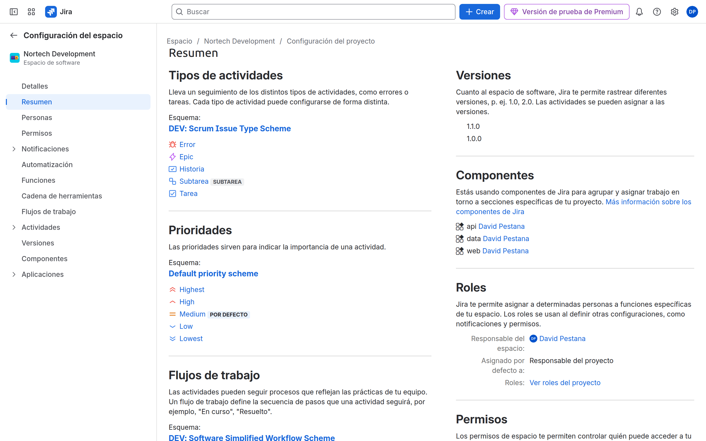
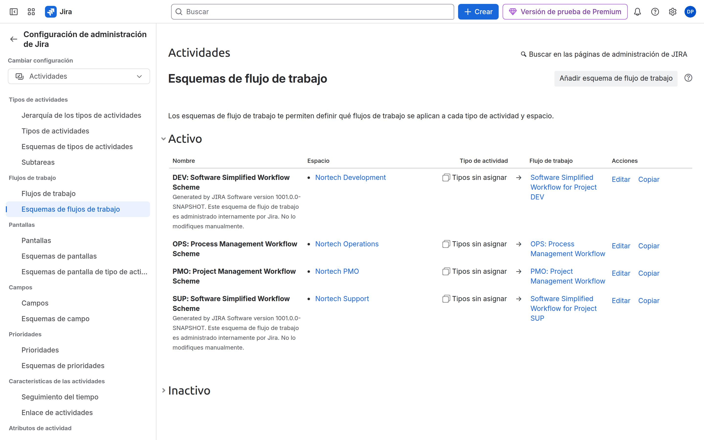

# M04-01 — Construcción de una plantilla corporativa

[← Página anterior](README.md) · [Siguiente página →](M04-preparacion-examen.md)

### Objetivo

Tener schemes `NORTECH-*` asociados al menos a **DEV** y **SUP**.

### Prerrequisitos

- Proyectos CMP de M03. Eres Jira admin.

### En qué consiste

Copiar schemes por defecto → renombrar NORTECH → asociar a proyectos → comprobar que dos proyectos apuntan al mismo permission scheme.

### 1 — Issue type scheme

**Acción:** **Configuración** → **Elementos de trabajo** (o **Incidencias**) → **Esquemas de tipos**. Copia el que usa DEV (o el predeterminado). Nombre: `NORTECH Issue Types`. Incluye Bug, Story, Task, Sub-task. Asocia **DEV** y **SUP**.

**Por qué:** Misma taxonomía en desarrollo y soporte; OPS/PMO pueden unirse después.

**Resultado esperado:** El scheme lista DEV y SUP.

### 2 — Permission scheme

**Acción:** **Esquemas de permisos** → copiar el predeterminado. Nombre: `NORTECH Permissions`. Edita:

- Browse Projects: Project Role (Administrators, Developers, Users)
- Create Issues: Developers + Users
- Assignable User: Developers
- Administer Projects: Administrators

Asocia DEV y SUP (**Configuración del espacio** → **Permisos** → usar un esquema distinto, o desde la lista de esquemas).

**Por qué:** Un solo reglamento para varios proyectos. M02 ya metió grupos en roles.

**Resultado esperado:** DEV y SUP usan `NORTECH Permissions`.

### 3 — Notification scheme

**Acción:** Copia el predeterminado → `NORTECH Notifications`. Deja Asignatario y Reportero en eventos clave. Asocia DEV y SUP.

**Por qué:** Evitar que «All watchers + all developers» inunde el correo corporativo.

**Resultado esperado:** Scheme NORTECH asociado.

### 4 — Vista consolidada

**Acción:** DEV → **Configuración del espacio** → **Esquemas** (o **Detalles**). Comprueba los nombres NORTECH. Repite en SUP.

**Por qué:** Es el mapa que vas a mirar cuando «en SUP pasó X y en DEV no».

**Resultado esperado:** Ambos proyectos comparten al menos permisos y tipos.

> [!TIP]
> Workflow, screens y field config se retocan de verdad en M05 y M06. Hoy basta con **copiar** el workflow scheme a `NORTECH Workflows` y asociarlo, aunque aún sea el flujo por defecto.

### 5 — Workflow scheme (copia)

**Acción:** **Esquemas de flujo de trabajo** → copiar → `NORTECH Workflows` → asigna a DEV y SUP.

**Por qué:** M05 edita *este* scheme, no el Default.

**Resultado esperado:** Nombre NORTECH visible en la configuración de DEV.

## Comprueba tu entendimiento

**Compartido de verdad**
Cambia una frase de descripción del permission scheme NORTECH.
→ Se ve el mismo scheme desde DEV y desde SUP (un solo objeto).

## Reto

### 1 — OPS al mismo permission scheme

Asocia `NORTECH Permissions` también a OPS. PMO déjalo en Default a propósito.

Ver solución

OPS → **Configuración del espacio** → **Permisos** → usar un esquema distinto → `NORTECH Permissions`. PMO sigue en el predeterminado: así ves un espacio «fuera de plantilla».

## Errores frecuentes

| Síntoma | Causa probable | Cómo arreglarlo |
|---------|----------------|-----------------|
| No puedo asociar | No Jira admin / proyecto TMP | CMP + cuenta admin |
| Cambié Default y se rompió otro proyecto | Editaste el scheme original | Copy siempre; no toques Default |
| El grupo no tiene permiso | El scheme habla de **roles**, no de grupos | People: grupo → rol |
