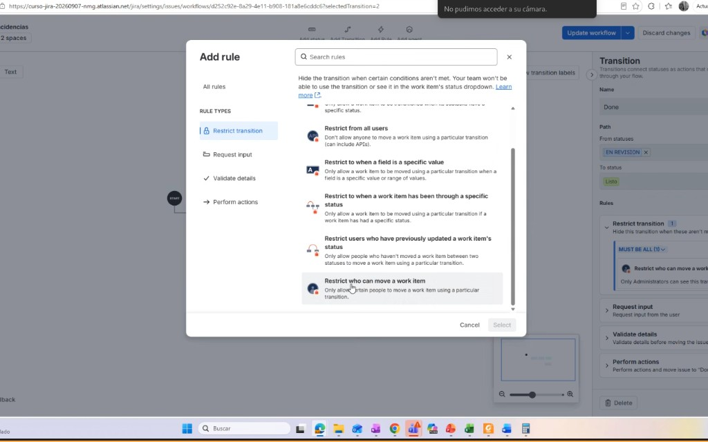

# M05-02 — Workflow de aprobación

[← Página anterior](M05-01-workflow-incidencias.md) · [Siguiente página →](M05-preparacion-examen.md)

### Objetivo

Un flujo de solicitud con revisión y dos salidas (aprobado / rechazado) publicado y asociado a un tipo en PMO u OPS.

### Prerrequisitos

- M05-01 hecho (sabes publicar). Proyecto PMO o OPS CMP.

### En qué consiste

Nuevo workflow `NORTECH Aprobación` + issue type `Solicitud` (o Task) mapeado solo en PMO.

### 1 — Issue type Solicitud

**Acción:** **Elementos de trabajo** → **Tipos** → añadir `Solicitud` (tipo Task/estándar). Añádelo al esquema de tipos de PMO (copia el esquema a `NORTECH PMO Types` si PMO aún usa el predeterminado, para no contaminar DEV).

**Por qué:** El flujo de aprobación no debe comerse los Bug de DEV.

**Resultado esperado:** PMO puede crear `Solicitud`.

### 2 — Diagrama

**Acción:** **Flujos de trabajo** → añadir `NORTECH Aprobación`. Estados: `Open` → `In Review` → `Approved` → `Closed`, y `In Review` → `Rejected` → `Closed`. Transiciones: `Submit`, `Approve`, `Reject`, `Close`.

**Por qué:** Dos salidas desde revisión: es el patrón de la propuesta formativa.

**Resultado esperado:** Diagrama con bifurcación.

### 3 — Quién aprueba

No busques la pestaña **Condiciones** del editor clásico: en 2026 son **reglas**.

**Acción:** En el diagrama, pulsa la **flecha** (no el recuadro del estado) de En revisión / In Review → Aprobado / Listo. A veces la transición se llama `Approve` o `Done`. En el panel derecho: **Rules** → **Add**.

1. Tipo de regla (izquierda): **Restrict transition** (*Restringir transición*). No elijas *Validate details*.
2. Baja la lista hasta el final. La que sirve es **Restrict who can move a work item** (*Restringir quién puede mover un elemento de trabajo*). **Select**.
3. **Restrict to** → **Roles** / **Space role** / **Project role** → **Administrators**. No Guest, no un usuario suelto. **Add**.
4. Repite lo mismo en **Reject**. **Update workflow** / publica.

**Por qué:** Esa regla es la condición de rol. Oculta la transición a quien no está en Administrators de **ese** espacio. El solicitante (Users) no se autoaprueba.

**Resultado esperado:** En el panel de la transición: *Only Administrators can see this transition* (o equivalente). Tú, como admin, **sigues viendo** el botón. El invitado de M02, si no está en Administrators de PMO, no lo ve.

### 4 — Validador

**Acción:** En `Approve`, Validators → Field required: un campo que ya exista (p. ej. **Comment** si está disponible, o **Fix Version** no: mejor **Description** ya relleno; usa **Attachment required** solo si tiene sentido). Alternativa sólida: validador **Permission** (Modify Reporter no). Lo habitual: **Field Required Validator** en un custom field que crearás en M06; hoy usa **Comment Required** si aparece, si no, **Validators → Field has been changed** no. **Práctico hoy:** Validators → *Field Required* → **Assignee**.

**Por qué:** Un validador demuestra la diferencia con la condición: el botón se ve, pero falla si falta el dato.

**Resultado esperado:** Approve exige Assignee (o comentario).

### 5 — Scheme y prueba

**Acción:** El esquema de flujo de PMO: `Solicitud` → `NORTECH Aprobación`. Publica. Crea una Solicitud, Submit, intenta Approve sin asignatario (debe fallar), asigna, Approve, Close.

**Por qué:** Cierre del proceso de la propuesta.

**Resultado esperado:** Issue en Closed con resolución.

## Comprueba tu entendimiento

**Bifurcación**
Desde In Review ves Approve y Reject.
→ Dos transiciones, no un campo «sí/no» mágico.

## Reto

### 1 — Post function de resolución

En Reject, post function: Resolution = `Won't Do` (o equivalente). En Approve, `Done`.

Ver solución

Cada transición a Closed/Approved puede setear Resolution distinta. Así los reports distinguen aprobado vs rechazado.

## Errores frecuentes

| Síntoma | Causa probable | Cómo arreglarlo |
|---------|----------------|-----------------|
| Solicitud usa el workflow de Bug | Scheme no mapeó el tipo | Workflow scheme → Assign |
| Approve no aparece | Condición de rol; o no publicaste | Métete en Administrators de PMO; **Update workflow** |
| No ves **Condiciones** ni «usuario en el rol» | Editor nuevo de Cloud | **Rules** → **Add** → **Restrict transition** → baja a **Restrict who can move a work item** |
| La regla no está en la lista | Te quedaste en *Validate details* o no bajaste | Categoría **Restrict transition**; la opción va al **final** |
| Restrict to no tiene Administrators | Elegiste Users / Guest / un correo | **Roles** (space role), no grupo Directory ni Guest |
| Tú ves Approve y el alumno también | Sois los dos Administrators del espacio | Prueba con el invitado **fuera** de ese rol |
| Validador no dispara | Draft sin publicar | Publish |
