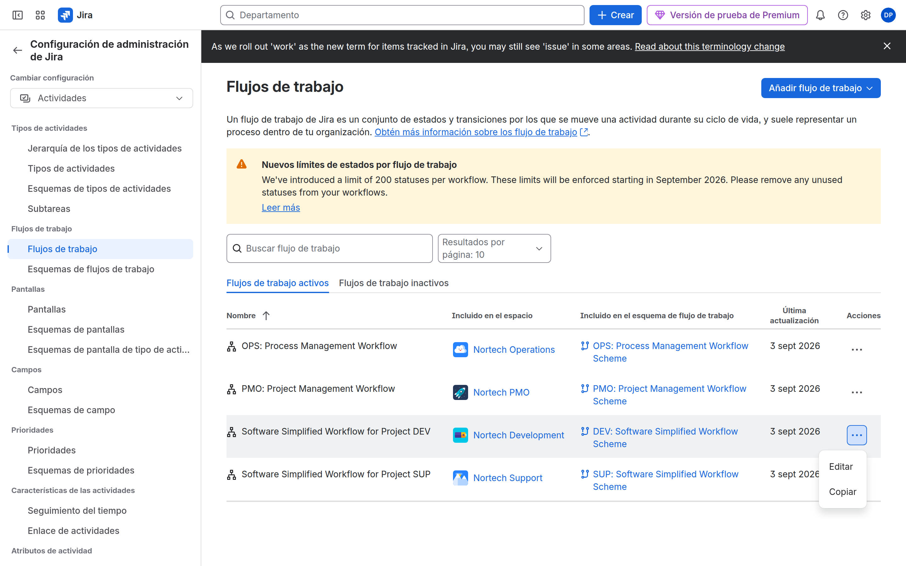
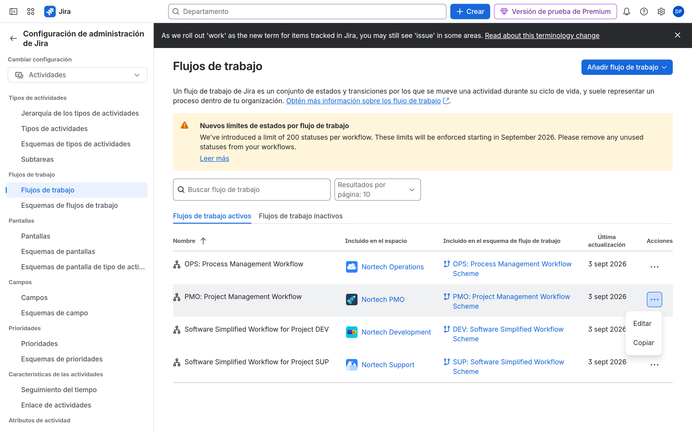

# M05 — Workflows empresariales

[← Página anterior](../M04-esquemas-reutilizables/M04-preparacion-examen.md) · [Siguiente página →](M05-01-workflow-incidencias.md)

## Qué aprenderás

- Diseñar estados y transiciones.
- Usar **condiciones**, **validadores** y **post functions**.
- Publicar un workflow y asociarlo por issue type.
- Montar un flujo de **aprobación**.

## Explicación

| Pieza | Función |
|-------|---------|
| **Estado** | Dónde está la issue (`statusCategory`: To Do / In Progress / Done) |
| **Transición** | Puente entre estados (puede ser *global*) |
| **Condición** | ¿Puede este usuario ver/usar la transición? |
| **Validador** | ¿Van los datos bien? Si no, no transita |
| **Post function** | Efectos al transitar (assignee, resolución, evento) |
| **Resolución** | Campo que suele ponerse al cerrar; vacío = no resuelta |

> [!NOTE]
> El **tablero** (M07) solo **muestra** estados. Si un estado no tiene columna, la issue «desaparece» del board, no del proyecto.

El workflow **no es** el board. Puedes tener un flujo rico y un Kanban de tres columnas.

## Demostración

1. **Configuración de Jira** → **Flujos de trabajo**. Abre un diagrama. Al pulsar una transición aparecen Conditions, Validators y Post functions.

2. En el flujo de aprobación se ven estados de revisión y dos salidas: aprobado y rechazado.

## Laboratorio

Te toca a ti.

| Lab | Título |
|-----|--------|
| M05-01 | [Workflow de incidencias](M05-01-workflow-incidencias.md) |
| M05-02 | [Workflow de aprobación](M05-02-workflow-aprobacion.md) |
| — | [Preparación para el examen ACP-620](M05-preparacion-examen.md) |

→ **[M05-01](M05-01-workflow-incidencias.md)**
