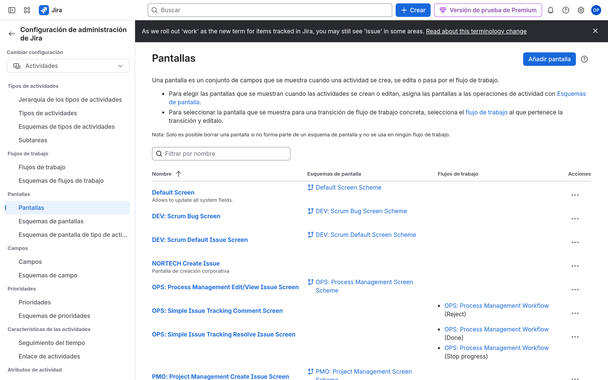

# M06-01 — Formularios por departamento

[← Página anterior](README.md) · [Siguiente página →](M06-02-campos-avanzados.md)

> Práctica del módulo. La teoría y la demo están en el [README del módulo](README.md).

### Objetivo

Cuatro campos de negocio visibles en las pantallas correctas (RRHH, Operaciones, Desarrollo, Calidad).

### Prerrequisitos

- Proyectos CMP. Jira admin.

### En qué consiste

Crear campos → pantallas NORTECH → issue type screen scheme.

### 1 — Custom fields

**Acción:** **Elementos de trabajo** → **Campos personalizados** → crear.

| Campo | Tipo | Uso |
|-------|------|-----|
| `Departamento` | Select list (single) | RRHH / PMO. Opciones: RRHH, Finanzas, Legal |
| `Cambio estándar` | Checkbox / Select Sí-No | OPS |
| `Story points` | (si no existe) Number | DEV — o usa el campo nativo |
| `Severidad QA` | Select: Bloqueante, Mayor, Menor | Calidad / SUP |

**Por qué:** Cada departamento tiene *una* pregunta extra, no un proyecto distinto.

**Resultado esperado:** Los campos existen en la lista.

### 2 — Pantallas

**Acción:** **Elementos de trabajo** → **Pantallas**. Copia la pantalla que usa DEV. Nombres:

- `NORTECH DEV Create/Edit`
- `NORTECH SUP Create/Edit`
- `NORTECH OPS Create/Edit`
- `NORTECH PMO Create/Edit`

Añade a cada una los campos de su fila. No pongas `Severidad QA` en DEV Create.

**Por qué:** La pantalla es el formulario.

**Resultado esperado:** Screens listadas.

### 3 — Screen schemes

**Acción:** **Esquemas de pantallas** + **esquemas de pantallas por tipo**. Crea `NORTECH SUP Screens` que use la pantalla SUP para Crear y Editar. Asocia al espacio SUP. Análogo DEV (sin campos de RRHH).

**Por qué:** El proyecto no apunta a una pantalla suelta: apunta a un scheme.

**Resultado esperado:** Create issue en SUP muestra `Severidad QA` y/o `Departamento`.

## Comprueba tu entendimiento

**Create en DEV vs SUP**
Abre Create en ambos.
→ Campos distintos. Si son iguales, el screen scheme no está asociado.

## Reto

### 1 — View screen

Deja `Severidad QA` en View de SUP pero **no** en Create, y créalo solo en Edit. ¿Cuándo lo rellena el agente?

Ver solución

Tras crear la issue, en Edit. Útil para datos que no debe pedir al reporter externo.

## Errores frecuentes

| Síntoma | Causa probable | Cómo arreglarlo |
|---------|----------------|-----------------|
| Campo no sale | Contexto, pantalla o field config hidden | M06-02 checklist |
| Campo duplicado | Lo creaste dos veces | Busca por nombre exacto; no clones |
