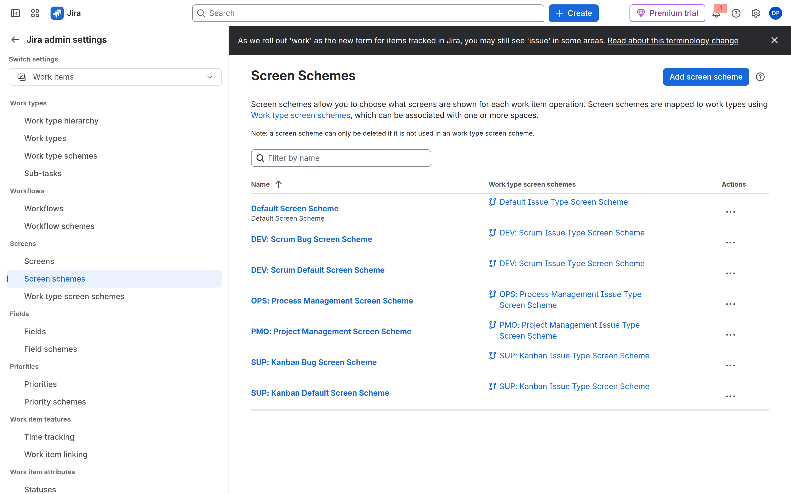
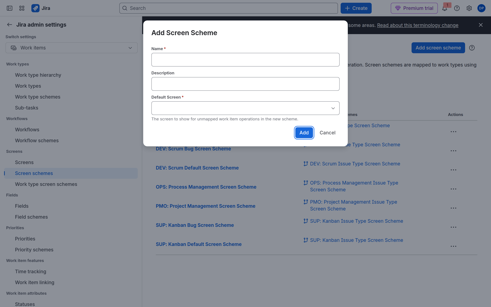
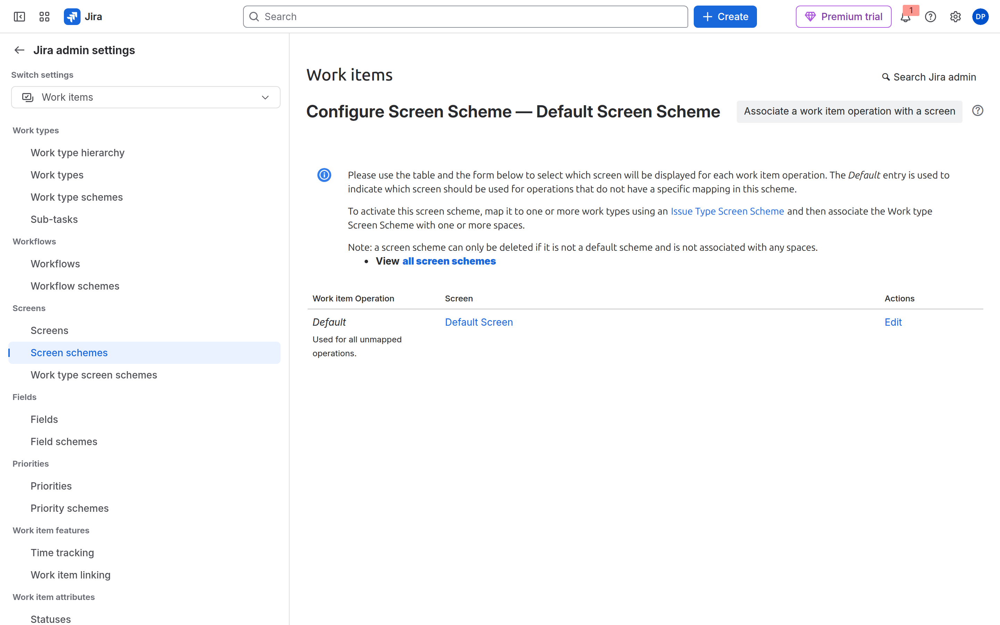
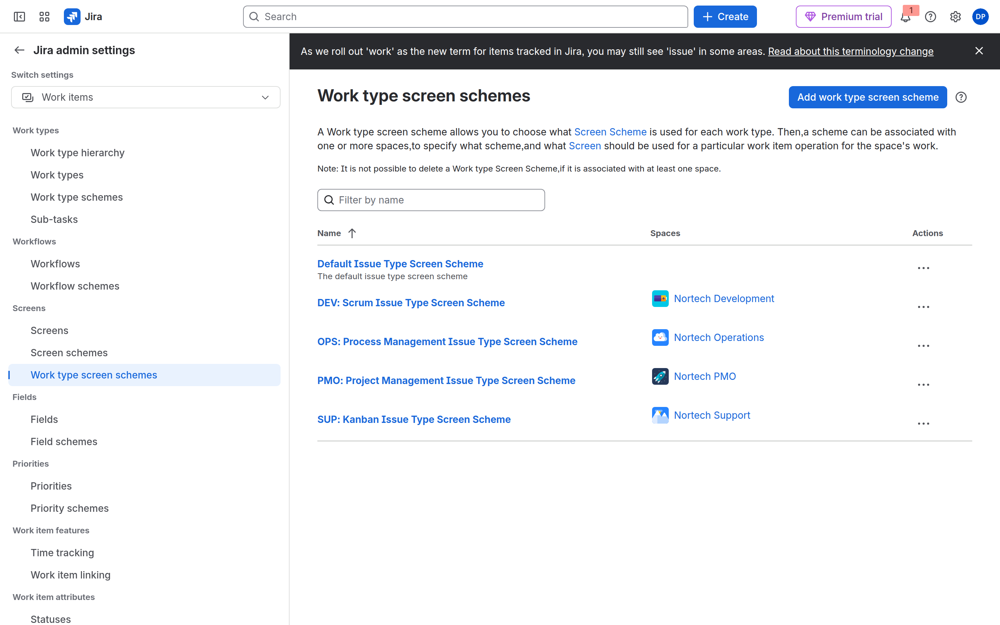
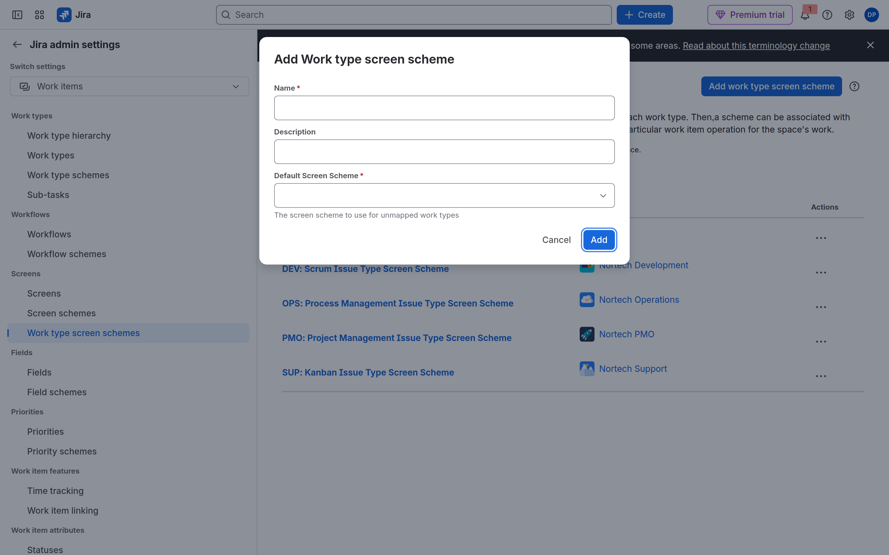
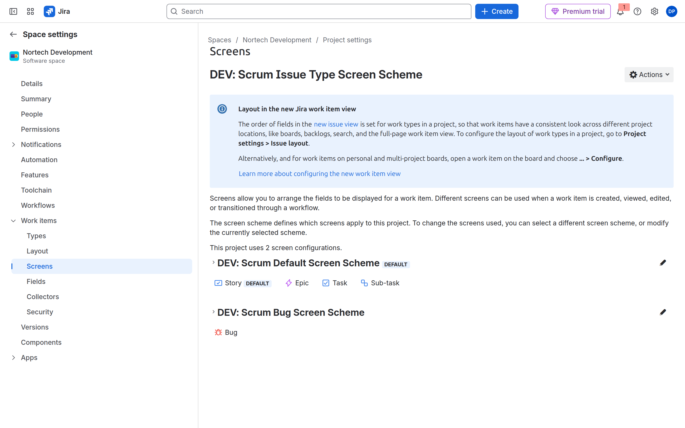
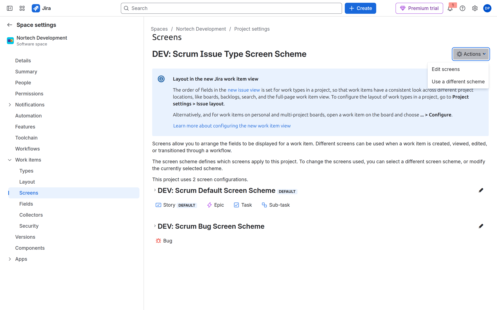

# M06-01 — Formularios por departamento

[← Página anterior](README.md) · [Siguiente página →](M06-02-campos-avanzados.md)

### Objetivo

Cuatro formularios distintos (DEV, SUP, OPS, PMO) **sin tocar el Default**. Cada espacio apunta a su paquete `NORTECH`.

### Prerrequisitos

- Proyectos CMP. Jira admin.

### En qué consiste

Campos nuevos → **copiar** 4 pantallas → **4 esquemas de pantallas** → **4 esquemas por tipo** → **en cada espacio**, Screens → Actions → *Use a different scheme*.

> [!WARNING]
> No añadas campos a *Default Screen* ni edites *Default Screen Scheme*. Eso cambia **todos** los espacios que aún apuntan al predeterminado. El Create de DEV y el de SUP se volverían iguales.

Inventario (cuatro de cada; nombres exactos):

| Espacio | Pantalla (copia) | Esquema de pantallas | Esquema de pantallas por tipo → asócialo al espacio |
|---------|------------------|----------------------|-----------------------------------------------------|
| DEV | `NORTECH DEV Create/Edit` | `NORTECH DEV Screens` | `NORTECH DEV Issue Type Screens` |
| SUP | `NORTECH SUP Create/Edit` | `NORTECH SUP Screens` | `NORTECH SUP Issue Type Screens` |
| OPS | `NORTECH OPS Create/Edit` | `NORTECH OPS Screens` | `NORTECH OPS Issue Type Screens` |
| PMO | `NORTECH PMO Create/Edit` | `NORTECH PMO Screens` | `NORTECH PMO Issue Type Screens` |

El espacio **no** se engancha a una pantalla. Se engancha al **esquema de pantallas por tipo**.

### 1 — Custom fields

**Acción:** **Elementos de trabajo** → **Campos personalizados** → crear.

| Campo | Tipo | Uso |
|-------|------|-----|
| `Departamento` | Select list (single) | RRHH / PMO. Opciones: RRHH, Finanzas, Legal |
| `Cambio estándar` | Checkbox / Select Sí-No | OPS |
| `Story points` | (si no existe) Number | DEV — o usa el campo nativo |
| `Severidad QA` | Select: Bloqueante, Mayor, Menor | Calidad / SUP |

**Por qué:** Cada departamento tiene *una* pregunta extra, no un proyecto distinto.

**Resultado esperado:** Los campos existen en la lista.

### 2 — Cuatro pantallas (copia, no Default)

**Acción:** **Elementos de trabajo** → **Pantallas**. En la que usa DEV: **Copiar** (no Editar). Repite hasta tener las cuatro del inventario. En cada copia, añade solo los campos de su departamento:

| Pantalla | Campos extra |
|----------|----------------|
| DEV | `Story points` (si no es nativo) |
| SUP | `Severidad QA` |
| OPS | `Cambio estándar` |
| PMO | `Departamento` |

No pongas `Severidad QA` ni `Departamento` en la de DEV.

**Por qué:** La pantalla es el formulario. Cuatro copias = cuatro formularios.

**Resultado esperado:** En la lista ves las cuatro `NORTECH …`. El Default **sigue igual**.

### 3 — Cuatro esquemas de pantallas

El paso 2 era el menú **Screens** / **Pantallas** (el formulario). Este paso es el de **abajo**: **Screen schemes** / **Esquemas de pantallas**. Si sigues en Pantallas y pulsas Editar, estás otra vez en Default.

**Acción:**

1. Engranaje de Jira → **Work items** / **Elementos de trabajo**. Barra izquierda, bloque **Screens**: entra en **Screen schemes** (no en *Screens*, no en *Work type screen schemes*).
2. Arriba a la derecha: **Add screen scheme** / **Añadir esquema de pantalla**. **No** abras los `…` del *Default Screen Scheme*.
3. **Name:** `NORTECH DEV Screens`. **Default Screen:** elige `NORTECH DEV Create/Edit` (la copia del paso 2). Nunca *Default Screen*. **Add**.
4. Repite tres veces: `NORTECH SUP Screens` → pantalla SUP, OPS → OPS, PMO → PMO.

Hoy Create, Edit y View pueden ir todos a esa misma pantalla (el *Default Screen* del scheme cubre las operaciones sin mapear). Si quieres ver el mapeo: `…` de **tu** esquema `NORTECH DEV Screens` → **Configure**. Si el título dice *Default Screen Scheme*, saliste al sitio equivocado.

**Por qué:** El screen scheme no es el formulario: dice *qué* pantalla sale al crear / editar / ver. Aún **no** está pegado al espacio (eso es el paso 4).

**Resultado esperado:** En la lista hay cuatro `NORTECH * Screens`. El *Default Screen Scheme* no lista tus campos nuevos.

### 4 — Cuatro esquemas por tipo

Sin crearlos, no hay nada que asociar en el paso 5.

**Acción:** Engranaje de Jira → **Work type screen schemes** / **Esquemas de pantalla de tipo de actividad** (tercer enlace del bloque Screens). **Add work type screen scheme**. **Name:** `NORTECH DEV Issue Type Screens`. **Default Screen Scheme:** `NORTECH DEV Screens` (paso 3, no el Default). **Add**. Igual SUP, OPS y PMO.

**Por qué:** Este paquete es el único que un espacio puede llevar puesto.

**Resultado esperado:** Cuatro ITSS `NORTECH … Issue Type Screens` en la lista. Aún pone *Spaces* vacío o el Scrum/Kanban viejo: eso se cambia en el paso 5.

### 5 — Asociar el esquema al espacio

**No** busques Associate en los `…` de la lista global (solo sale Configure / Edit / Copy). **No** asocies una pantalla. El espacio se cambia **desde el propio espacio**.

**Acción (DEV, luego los otros tres):**

1. Abre **Nortech Development** → **Space settings** / **Configuración del espacio**.
2. Despliega **Work items** / **Elementos de trabajo** (si solo ves Versions, sigue bajando).
3. **Screens** / **Pantallas**. Verás el esquema actual, p. ej. `DEV: Scrum Issue Type Screen Scheme`.
4. **Actions** (engranaje) → **Use a different scheme** / **Usar un esquema distinto**.
5. Elige `NORTECH DEV Issue Type Screens` → **Associate**.

| Espacio | Scheme que debe quedar |
|---------|------------------------|
| DEV | `NORTECH DEV Issue Type Screens` |
| SUP | `NORTECH SUP Issue Type Screens` |
| OPS | `NORTECH OPS Issue Type Screens` |
| PMO | `NORTECH PMO Issue Type Screens` |

Atajo: **Summary** del espacio → bloque Screens → el enlace azul del *Issue type screen scheme* lleva a la misma página.

**Por qué:** Por eso meter el campo en Default «funcionaba»: el espacio aún llevaba el scheme de la plantilla Scrum/Kanban.

**Resultado esperado:** Create en SUP muestra `Severidad QA`. Create en DEV **no**. Create en PMO muestra `Departamento`.

## Comprueba tu entendimiento

**Create en DEV vs SUP**
Abre Create en ambos.
→ Campos distintos. Si son iguales, o editaste Default, o los cuatro espacios siguen en el mismo issue type screen scheme.

## Reto

### 1 — View screen

Deja `Severidad QA` en View de SUP pero **no** en Create, y créalo solo en Edit. ¿Cuándo lo rellena el agente?

Ver solución

Tras crear la issue, en Edit. Útil para datos que no debe pedir al reporter externo.

## Errores frecuentes

| Síntoma | Causa probable | Cómo arreglarlo |
|---------|----------------|-----------------|
| Campo no sale | Contexto, pantalla o field config hidden | M06-02 checklist |
| Campo duplicado | Lo creaste dos veces | Busca por nombre exacto; no clones |
| DEV y SUP muestran los mismos campos | Editaste **Default** o no asociaste los 4 ITSS | Quita el campo del Default; asocia cada espacio a `NORTECH … Issue Type Screens` |
| Solo creaste pantallas | El espacio no apunta a una pantalla | Faltan screen schemes, ITSS **y** el paso 5 en el espacio |
| Editaste *Default Screen Scheme* | Estabas en Configure del Default | Crea `NORTECH DEV Screens` con **Add screen scheme**; Default Screen = tu copia |
| No ves Associate en los `…` globales | Esa lista no asocia espacios | **Espacio** → **Work items** → **Screens** → **Actions** → **Use a different scheme** |
| No aparece **Screens** en el espacio | Estás en Details o People | Despliega **Work items**; no es el menú Pantallas del engranaje global |
