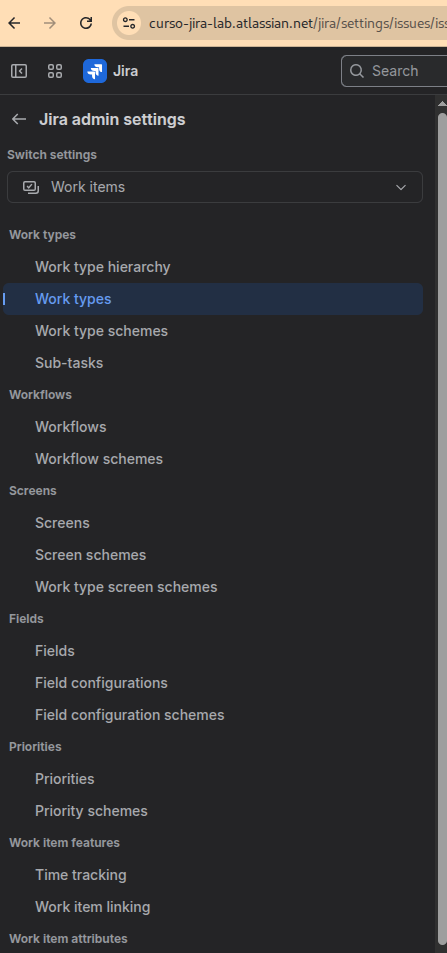
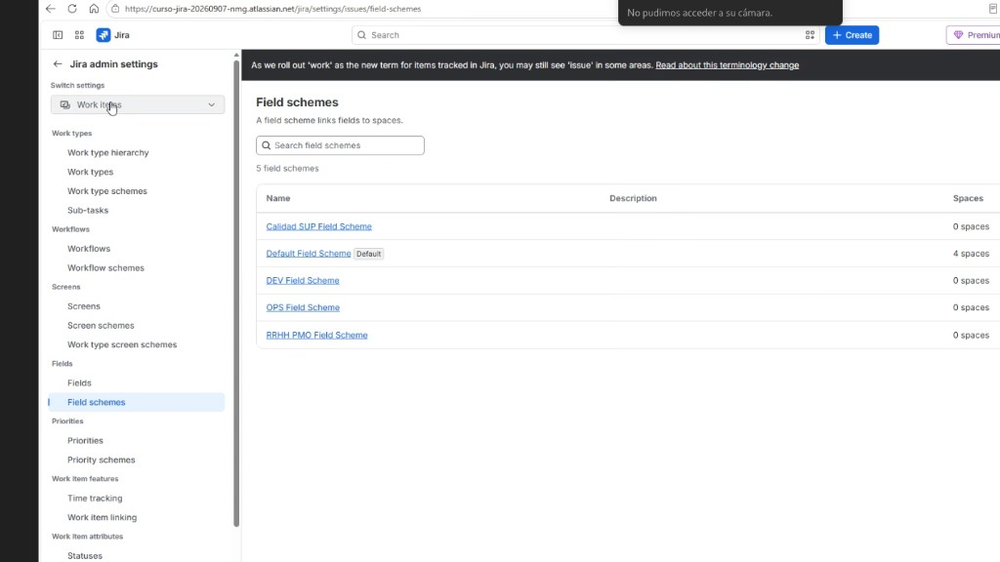

# M06-02 — Gestión avanzada de campos

[← Página anterior](M06-01-formularios-departamento.md) · [Siguiente página →](M06-preparacion-examen.md)

### Objetivo

Un campo con **contexto** solo en SUP, otro **required**, otro **hidden** en DEV. El menú de Fields **no es el mismo en todos los trials**: hay dos UIs oficiales de Atlassian en 2026. Las dos valen para el lab.

### Prerrequisitos

- Campos de M06-01.

### En qué consiste

Contextos + required/hidden **sin tocar Default**. Según el site usas *Field configurations* **o** *Field schemes*.

### 0 — Qué menú tienes (obligatorio)

Engranaje de Jira → **Work items** → bloque **Fields**. Cuenta los enlaces.

| Lo que ves | Nombre Atlassian | Este lab |
|------------|------------------|----------|
| **Fields** + **Field configurations** + **Field configuration schemes** (tres) | Modelo clásico | Sigue **2a** |
| **Fields** + **Field schemes** (dos) | *Field Schemes* (GA julio 2026, despliegue progresivo) | Sigue **2b** |

No es un error de permisos ni de plan Premium. Atlassian unifica las dos capas clásicas (*field configuration* + *field configuration scheme*) en **un** Field scheme. El examen ACP-620 aún puede decir *field configuration scheme*: es el mismo concepto.

**Citas y enlaces de Atlassian** (Support, Launch notes, Community Team) para proyectar en clase: [M06-02 fuentes oficiales](M06-02-fuentes-oficiales.md). Support dice literalmente: *If you can’t see Field schemes on your site, that means you’re still on the old experience.*

> [!WARNING]
> En el caso B, si **Default Field Scheme** lista **4 spaces** y tus copias van a **0 spaces**, los required/hidden de NORTECH **no aplican**. Hay que asociar el scheme al espacio (paso 2b).

### 1 — Contexto

**Acción:** **Fields** → campo `Departamento` → **Contextos**. Limita a espacios PMO y SUP (no DEV). Opcional: en PMO añade `Dirección`.

**Por qué:** El mismo campo, distintas listas. Evitas un campo `Departamento PMO` duplicado. En Field Schemes el contexto ya **no** oculta el campo; solo opciones/valores por defecto. La visibilidad va en el scheme o en la pantalla (M06-01).

**Resultado esperado:** El contexto no incluye DEV.

### 2a — Caso A (tres enlaces)

**Acción:** **Field configurations** → **Copiar** la predeterminada → `NORTECH Fields`. No edites Default. Marca `Severidad QA` **Obligatorio**. Oculta un campo ruidoso (p. ej. Entorno). Luego **Field configuration schemes** → copia o crea `NORTECH Field Config` que use esa configuración → **asocia SUP**.

**Por qué:** Required aquí ≠ required en el custom field. Hidden quita el campo aunque esté en la pantalla.

**Resultado esperado:** Create en SUP no deja el Bug sin severidad (si el tipo usa esa config).

El menú es el de tres enlaces (captura del caso A arriba). Entras en **Field configurations**, no en Fields.

### 2b — Caso B (solo Field schemes)

**Acción:** **Field schemes**. **No** edites *Default Field Scheme* si todavía tiene los cuatro espacios. Abre (o **Add** / copia) `NORTECH SUP` (o el `Calidad SUP Field Scheme` si ya lo creaste). Ahí: `Severidad QA` **required**; oculta lo ruidoso. **Asocia** el scheme a **Nortech Support**:

- en el propio field scheme (espacios / associate), o
- SUP → **Space settings** → **Work items** → **Fields** → **Actions** → **Use a different scheme** (mismo gesto que pantallas).

Default debe bajar de 4 spaces; el de SUP debe pasar a **1**.

**Por qué:** Un Field scheme **es** la configuración y el esquema. Por eso no hay tercer menú.

**Resultado esperado:** Create en SUP exige severidad. Default ya no gobierna SUP.

UI en inglés (trial reciente) y en español (misma pantalla: *Esquemas de campo*). En ambas, **Default = 4 espacios** y las copias a **0** significa que aún no has asociado.

### 3 — Optimizar DEV

**Acción:**

- **Caso A:** otra field config `NORTECH DEV Fields` (oculta `Severidad QA`) + su scheme asociado a DEV.
- **Caso B:** field scheme `NORTECH DEV` (o `DEV Field Scheme`) con Severidad QA fuera / hidden; asócialo a DEV. Deja de usar Default en DEV.

**Por qué:** Desarrollo no carga el formulario de soporte.

**Resultado esperado:** Create DEV sin Severidad QA.

## Comprueba tu entendimiento

**Checklist mudo**
Campo invisible en DEV: ¿contexto? ¿pantalla / ITSS? ¿hidden o field scheme?
→ Recorre las palancas. La primera que falle explica el síntoma.

**Dos UIs, un lab**
Si tu compañero tiene tres enlaces y tú dos, ¿quién no puede hacer required?
→ Los dos pueden. Tú en **Field schemes**; el otro en **Field configurations** + scheme.

## Reto

### 1 — Render wiki

En Description, renderer **Wiki style** vs Default (si tu UI lo ofrece: field config clásica o parámetros del field scheme).

Ver solución

Caso A: Field configuration → Description → Renderers. Caso B: el field scheme del espacio → el campo Description. Wiki permite markup. No lo cambies en producción sin aviso: cambia cómo se ve el histórico.

## Errores frecuentes

| Síntoma | Causa probable | Cómo arreglarlo |
|---------|----------------|-----------------|
| Solo veo Fields y Field schemes | Site ya migrado (julio 2026+) | Es el **caso B**. No busques el tercer enlace |
| Required no obliga | Campo fuera de Create, o scheme a 0 spaces | Pantalla NORTECH + asociar el field scheme al espacio |
| Default Field Scheme = 4 spaces | No asociaste las copias | Actions en Fields del espacio, o associate en el scheme |
| Contexto «Global» sigue activo | No desactivaste el contexto por defecto | Un solo contexto; en Field Schemes el contexto no oculta |
| Required en todos los espacios | Editaste Default | Scheme NORTECH **solo** en SUP |
