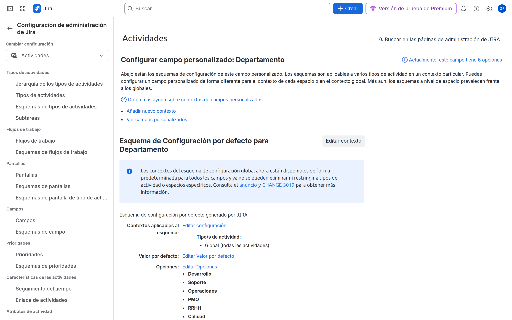
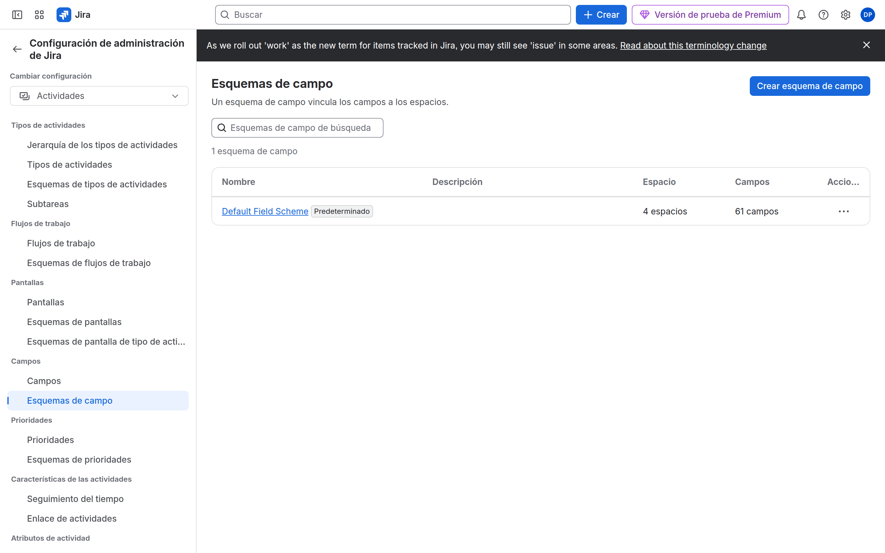

# M06-02 — Gestión avanzada de campos

[← Página anterior](M06-01-formularios-departamento.md) · [Siguiente página →](M06-autoescuela.md)

> Práctica del módulo. La teoría y la demo están en el [README del módulo](README.md).

### Objetivo

Un campo con **contexto** solo en SUP, otro **required**, otro **hidden** en DEV.

### Prerrequisitos

- Campos de M06-01.

### En qué consiste

Contexts + field configuration scheme NORTECH.

### 1 — Contexto

**Acción:** Campo personalizado `Departamento` → **Contextos**. Limita a espacios PMO y SUP (no DEV). Opciones distintas si quieres: en PMO añade `Dirección`.

**Por qué:** El mismo campo, distintas listas. Evitas un campo `Departamento PMO` duplicado.

**Resultado esperado:** El contexto no incluye DEV.

### 2 — Field configuration

**Acción:** **Elementos de trabajo** → **Configuraciones de campo**. Copia la predeterminada → `NORTECH Fields`. Marca `Severidad QA` como **Obligatorio**. Marca un campo ruidoso (p. ej. Entorno) como **Oculto**. Esquema `NORTECH Field Config` → asocia SUP.

**Por qué:** Required en field config ≠ required en el custom field. Hidden quita el campo aunque esté en la pantalla.

**Resultado esperado:** Create en SUP no deja crear Bug sin severidad (si el tipo usa esa config).

### 3 — Optimizar DEV

**Acción:** En la field config que use DEV (otra copia `NORTECH DEV Fields` si no quieres required de QA), oculta `Severidad QA`.

**Por qué:** Desarrollo no carga el formulario de soporte.

**Resultado esperado:** Create DEV sin Severidad QA.

## Comprueba tu entendimiento

**Checklist mudo**
Campo invisible en DEV: ¿contexto? ¿pantalla? ¿hidden?
→ Recorre las tres. La primera que falle explica el síntoma.

## Reto

### 1 — Render wiki

En Description (si la field config lo permite), renderer **Wiki style** vs Default.

Ver solución

Field configuration → Description → Renderers. Wiki permite markup. No lo cambies en producción sin aviso: cambia cómo se ve el histórico.

## Errores frecuentes

| Síntoma | Causa probable | Cómo arreglarlo |
|---------|----------------|-----------------|
| Required no obliga | No está en la pantalla de Create | Añádelo a la pantalla |
| Contexto «Global» sigue activo | No desactivaste el contexto por defecto | Un solo contexto o global sin proyectos = todos |
