# M06-02 — Gestión avanzada de campos

[← Página anterior](M06-01-formularios-departamento.md) · [Siguiente página →](M06-preparacion-examen.md)

### Objetivo

Un campo **required** en SUP y otro **hidden** en DEV, **sin editar Default**. En 2026 hay **dos menús oficiales**. Eliges el de tu site y sigues **un** camino, con captura en cada clic.

### Prerrequisitos

- Campos de M06-01 (`Severidad QA`, `Departamento`).

### En qué consiste

1. Identificar el menú (10 segundos).
2. Copiar Default → `NORTECH SUP`.
3. Marcar required / hidden **en la copia**.
4. Asociar esa copia **al espacio SUP**.

Atlassian unificó *field configuration* + *field configuration scheme* en un **Field scheme**. El despliegue es progresivo: en la misma aula conviven las dos UIs. No es un fallo de permisos ni de plan. Fuentes: [M06-02 oficiales](M06-02-fuentes-oficiales.md).

---

## 0 — Cuenta los enlaces (obligatorio)

Engranaje de Jira → **Work items** → bloque **Fields**.

| Enlaces que ves | Tu caso | Sigue |
|-----------------|---------|-------|
| **Fields** + **Field configurations** + **Field configuration schemes** | Experiencia clásica (*old experience*) | **Caso A** |
| **Fields** + **Field schemes** | Site ya migrado | **Caso B** |

No hagas los dos caminos. El de tu compañero puede ser el otro; los dos terminan igual: SUP exige severidad, DEV no.

---

## Caso A — tres enlaces

### A1 — Lista de Field configurations

**Acción:** En el bloque Fields, entra en **Field configurations** (no en Fields). Verás *Default Field Configuration* y, si alguien copió antes, una copia.

**Por qué:** Required y hidden viven aquí, no en el custom field.

**Resultado esperado:** Lista *View Field Configurations*. Default sigue asociado a algún espacio; las copias no.

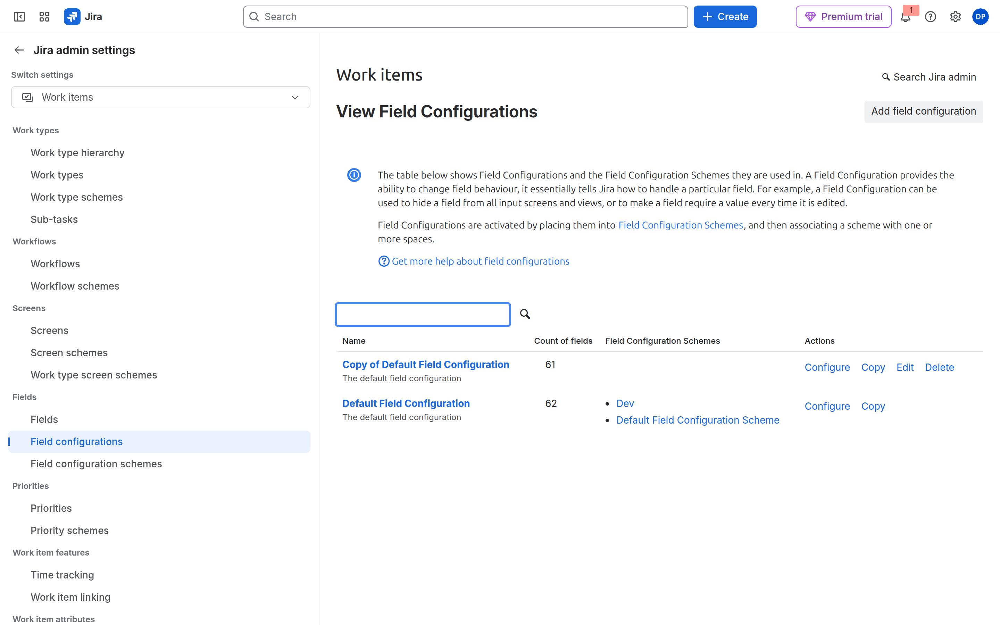

### A2 — Copiar Default

**Acción:** En la fila **Default Field Configuration** → **Copy**. **Name:** `NORTECH SUP Fields`. **Copy**. No edites Default.

**Por qué:** Required en Default obliga a **todos** los espacios que aún lo usan.

**Resultado esperado:** Formulario *Copy Field Configuration* con el nombre NORTECH, luego la copia aparece en la lista.

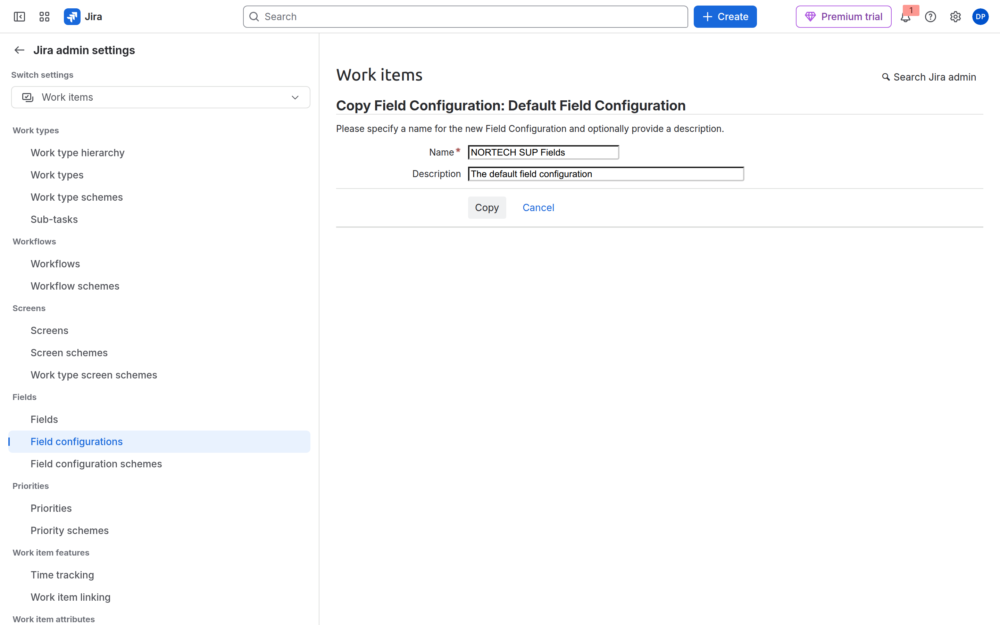

### A3 — Required en la copia

**Acción:** **Configure** de `NORTECH SUP Fields` (o de tu copia). Columna **Required**: activa el interruptor de `Severidad QA`. No toques Default.

**Por qué:** Esta pantalla es la field configuration: required / hide / renderer.

**Resultado esperado:** El encabezado dice que la copia *is not used in any spaces* hasta el paso A5. Eso es correcto.

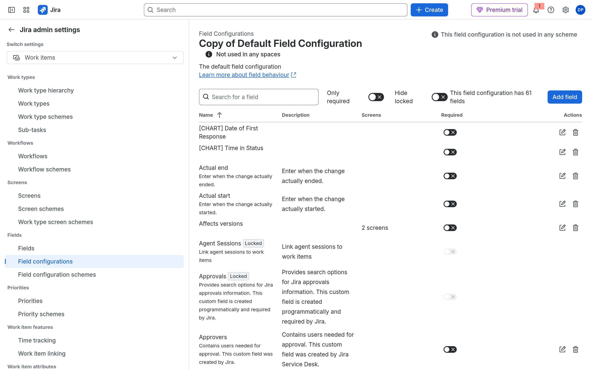

### A4 — Field configuration schemes

**Acción:** Bloque Fields → **Field configuration schemes**. **Copy** el Default (o **Add field configuration scheme**). Nombre: `NORTECH SUP Field Config`. El scheme debe usar la configuración `NORTECH SUP Fields`.

**Por qué:** El espacio no se pega a una field configuration. Se pega a un **scheme**.

**Resultado esperado:** Lista con Default (espacios) y tu copia (aún sin espacio).

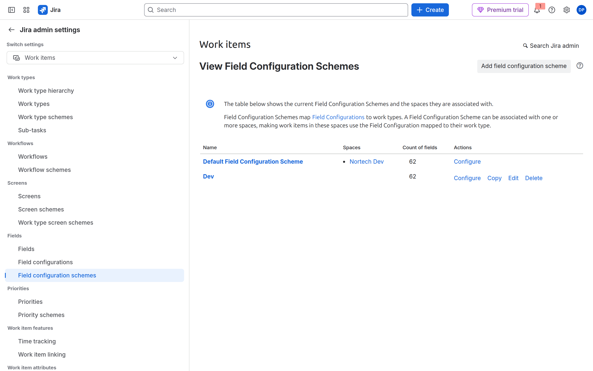

### A5 — El scheme apunta a tu configuración

**Acción:** **Configure** de tu scheme. El tipo *Default* (y Bug, si lo mapeas) debe usar `NORTECH SUP Fields`, no *Default Field Configuration*.

Luego asocia el **scheme** al espacio SUP: SUP → **Space settings** → **Work items** → **Fields**, o *Associate* desde el scheme si tu UI lo ofrece.

**Por qué:** Sin este paso, SUP sigue con Default y el required de NORTECH no aplica.

**Resultado esperado:** Create en SUP no deja el Bug sin severidad.

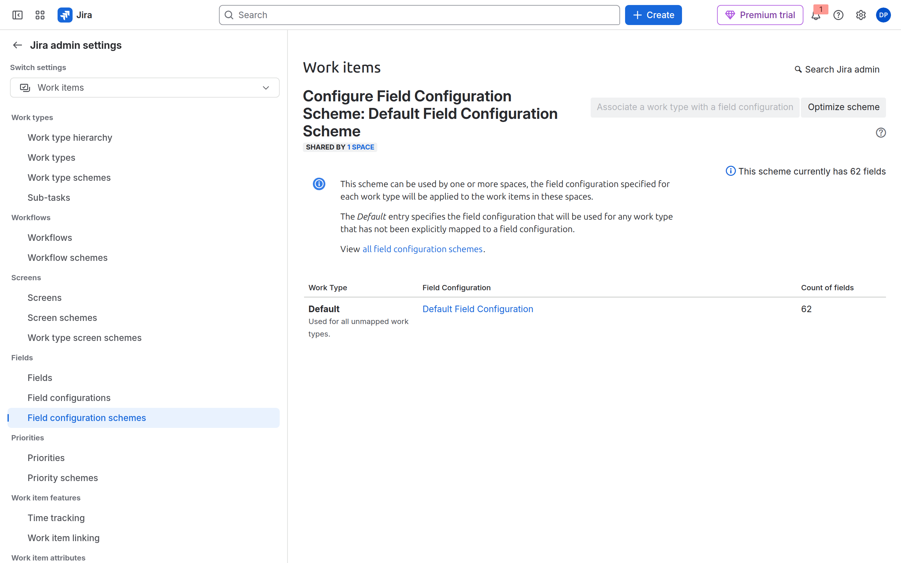

---

## Caso B — Field schemes

### B1 — Lista

**Acción:** Bloque Fields → **Field schemes**.

**Por qué:** Un Field scheme **es** la configuración y el esquema. Por eso no hay tercer enlace.

**Resultado esperado:** *Default Field Scheme* con **4 spaces**. Si creaste copias y dicen **0 spaces**, aún no están asociadas.

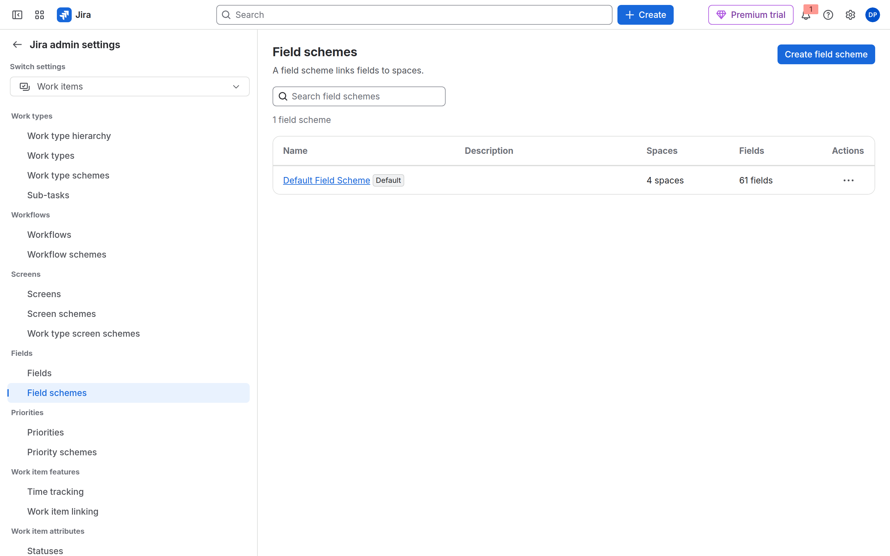

### B2 — Crear la copia

**Acción:** **Create field scheme**. **Name:** `NORTECH SUP`. **Create**. No edites Default.

**Por qué:** Igual que en A: Default gobierna los cuatro espacios.

**Resultado esperado:** Panel *Create field scheme* a la derecha. Tras Create, la lista tiene dos filas.

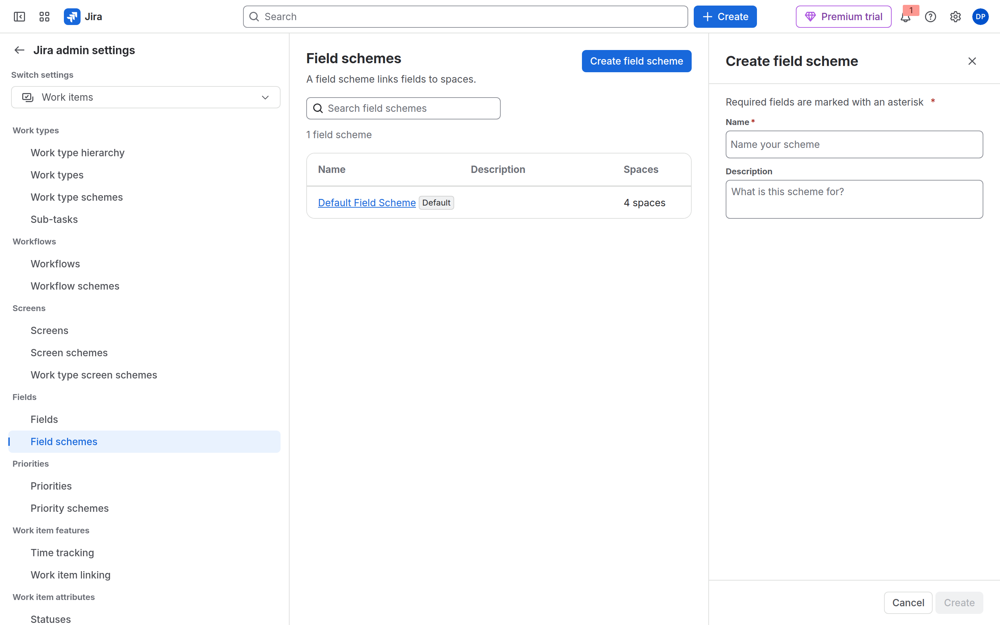

### B3 — Available on / Required on

**Acción:** Abre `NORTECH SUP` (o Default solo para **ver** las columnas; el required lo marcas en NORTECH). Cada campo tiene **Available on** y **Required on**.

**Por qué:** Available = se puede usar en ese tipo. Required = no se puede dejar vacío. Quitar el campo del scheme es el *hidden* de antes.

**Resultado esperado:** Columnas *Available on* y *Required on* visibles.

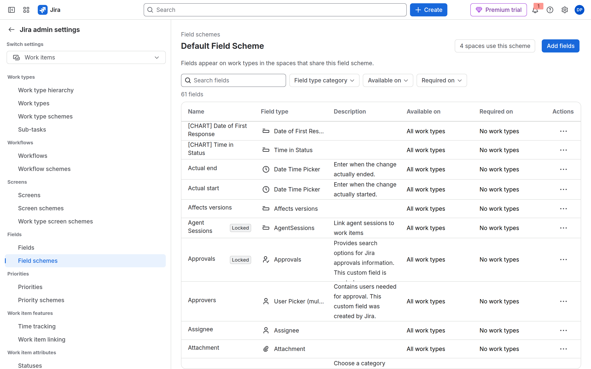

### B4 — Required por tipo

**Acción:** Busca `Severidad QA` (o el campo de Calidad). **…** → **Change field behaviour by work type**. En **Required on**, marca Bug / Error. **Save**. Hazlo en `NORTECH SUP`, no en Default.

**Por qué:** Es el mismo required del caso A, en un solo panel.

**Resultado esperado:** El menú **…** muestra *Change field behaviour by work type*. El panel derecho tiene *Required on*.

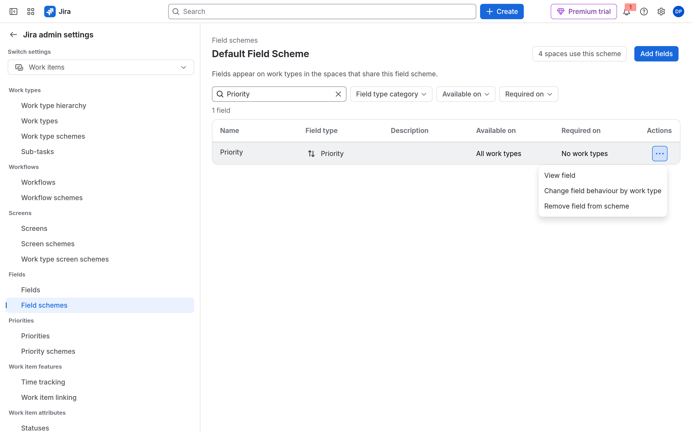

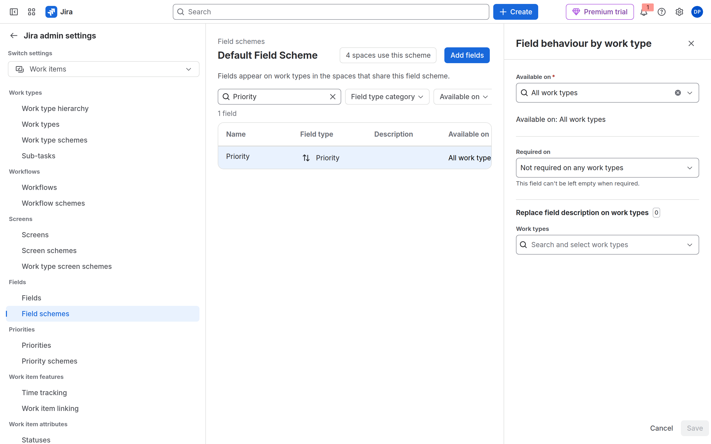

### B5 — Asociar al espacio (si no, 0 spaces)

**Acción:** SUP → **Space settings** → **Work items** → **Fields**. Arriba: *Default Field Scheme* y **4 spaces use this scheme**. **Actions** → **Use a different scheme** → `NORTECH SUP` → **Save**.

No marques *Use legacy field configuration schemes* (eso es volver al caso A).

**Por qué:** Atlassian: *For the rules in a field scheme to be applied, you must associate the scheme with a space.*

**Resultado esperado:** Default baja de 4 spaces; `NORTECH SUP` pasa a 1. Create en SUP exige severidad.

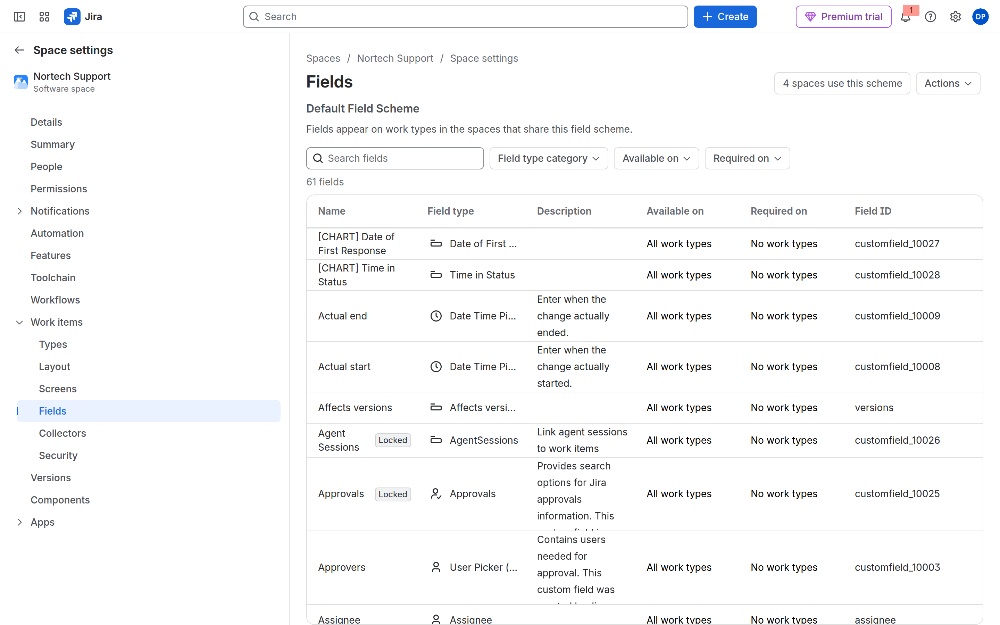

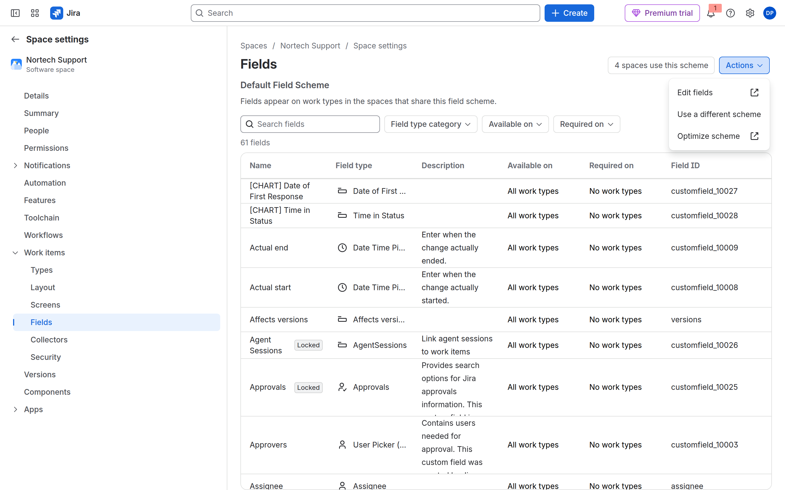

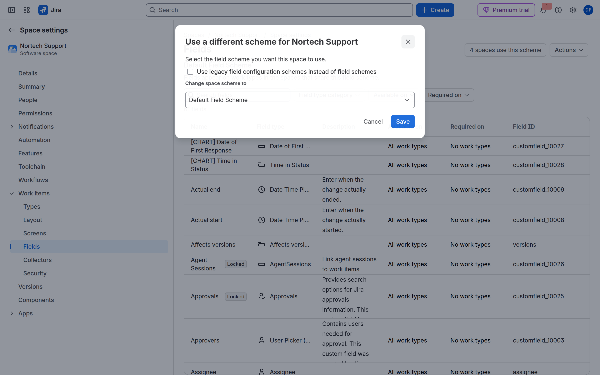

---

## Los dos casos — contexto del campo

**Acción:** **Fields** → `Departamento` → **Contexts**. Limita a PMO y SUP. En Field Schemes el contexto **ya no oculta** el campo: solo opciones y valor por defecto. La visibilidad es scheme + pantalla (M06-01).

**Resultado esperado:** El contexto no incluye DEV.

## DEV

- **Caso A:** otra field config `NORTECH DEV Fields` (sin / hidden `Severidad QA`) + su scheme asociado a DEV.
- **Caso B:** field scheme `NORTECH DEV` sin Severidad QA; **Actions** en DEV → ese scheme.

## Comprueba tu entendimiento

**Checklist mudo**
Campo invisible en DEV: ¿contexto? ¿pantalla / ITSS? ¿hidden o field scheme?
→ Recorre las palancas. La primera que falle explica el síntoma.

**Dos UIs, un lab**
Si tu compañero tiene tres enlaces y tú dos, ¿quién no puede hacer required?
→ Los dos pueden.

## Reto

### 1 — Render wiki

Description: renderer **Wiki style** (field config clásica o parámetros del field scheme).

Ver solución

Caso A: Configure de la field configuration → Description → renderer. Caso B: field scheme → el campo Description. Wiki permite markup. No lo cambies en producción sin aviso: cambia cómo se ve el histórico.

## Errores frecuentes

| Síntoma | Causa probable | Cómo arreglarlo |
|---------|----------------|-----------------|
| Solo veo Fields y Field schemes | Site migrado | **Caso B**. No busques el tercer enlace |
| Required no obliga | Campo fuera de Create, o scheme a 0 spaces | Pantalla NORTECH + asociar al espacio (A5 o B5) |
| Default Field Scheme = 4 spaces | No asociaste las copias | **Actions** → *Use a different scheme* |
| Required en todos los espacios | Editaste Default | Scheme NORTECH **solo** en SUP |
| Contexto «Global» sigue activo | No desactivaste el contexto por defecto | Un contexto; en Field Schemes el contexto no oculta |
