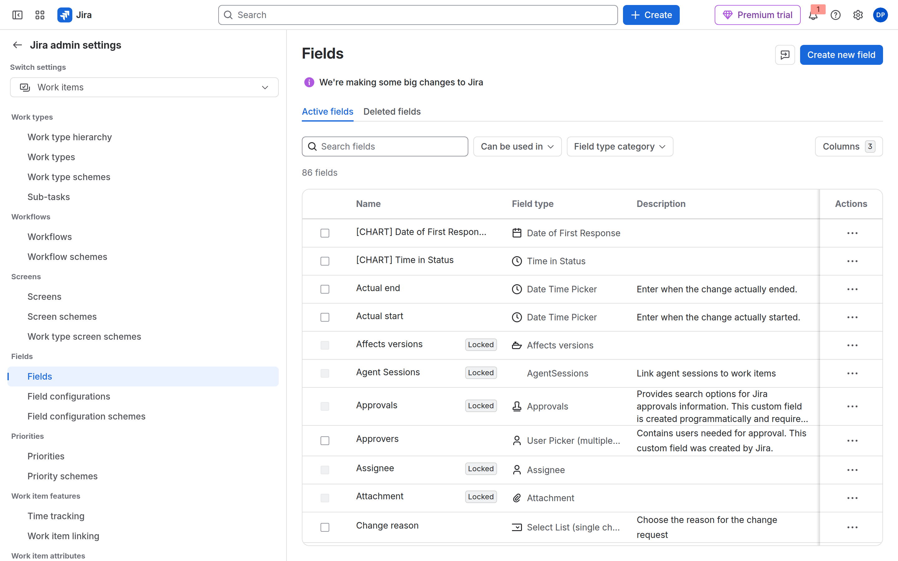
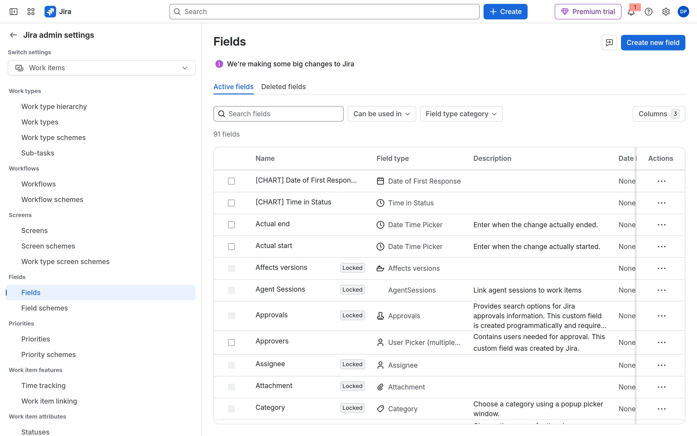

# M06-02 — Fuentes oficiales (Field Schemes)

[← Volver al laboratorio](M06-02-campos-avanzados.md)

Atlassian documenta **las dos UIs a la vez**. En el aula de septiembre de 2026 un trial puede estar en cualquiera de las dos. No es un fallo de permisos, de plan ni del laboratorio.

## 1. La frase que cierra el caso

Publicada en **Atlassian Support** (inglés, documentación de producto). Aparece tanto en la guía nueva como en la de *field configuration*:

> We’re replacing field configurations and field configuration schemes with a single, unified setting called field schemes. **We’re rolling out these changes progressively. If you can’t see Field schemes on your site, that means you’re still on the old experience.**

Fuente: [What are field schemes?](https://support.atlassian.com/jira-cloud-administration/docs/what-are-field-schemes/) · la misma frase en [Create or edit a field configuration](https://support.atlassian.com/jira-cloud-administration/docs/create-or-edit-a-field-configuration/)

Traducción para el aula: Atlassian **sustituye** las dos capas clásicas por un solo *field scheme*. El cambio **no llega a todos los sites el mismo día**. Si no ves *Field schemes*, sigues en la experiencia antigua. Si las ves, ya migraste.

Eso es exactamente lo que hay en clase:

| Site | Lo que ves | Según Atlassian |
|------|------------|-----------------|
| `curso-jira-lab.atlassian.net` | Fields + Field configurations + Field configuration schemes | *old experience* |
| `curso-jira-20260907-nmg.atlassian.net` (Nuria) | Fields + Field schemes | site ya convertido |

## 2. Launch notes de producto (27 jul 2026)

Documento de **Jira product team**, no un post de usuario:

[A simpler way to manage fields across Jira](https://jirareleases.atlassian.com/announcements/a-simpler-way-to-manage-fields-across-jira) — 27 July 2026

Citas útiles:

| Atlassian (EN) | Qué demuestra mañana |
|----------------|----------------------|
| *Field Schemes replaces the old multi-layered configuration model* | Un menú, no tres |
| *Managing fields used to mean navigating three separate layers — field configurations, field configuration schemes, and space assignments* | Por eso el site de clase tiene tres enlaces |
| *Field Schemes will be automatically enabled for your site — no action is required from admins* | Nuria no «activó» nada; el tenant migró solo |
| *Legacy field configuration pages will be hidden once your site is fully converted* | Por eso a Nuria **desaparecen** Field configurations |
| *Field contexts still control default values and dropdown options; they just no longer control field visibility* | El lab de contexto sigue; ya no oculta el campo |
| *Screens and Screen Schemes are not changing* | M06-01 no se toca |

Roadmap asociado: [Keep Jira fields organized… with shared schemes](https://jirareleases.atlassian.com/board/keep-jira-fields-organized-and-consistent-across-spaces-with-shared-schemes)

## 3. Support: cómo se hace el lab en el menú nuevo

Índice: [Manage field schemes in Jira](https://support.atlassian.com/jira-cloud-administration/docs/manage-field-schemes-in-jira/)

| Qué necesita el alumno | Documento oficial | Cita / paso |
|------------------------|-------------------|-------------|
| Qué es un field scheme | [What are field schemes?](https://support.atlassian.com/jira-cloud-administration/docs/what-are-field-schemes/) | *Set field requirements: Decide if a field is mandatory or optional* |
| Crear / copiar scheme | [Create or edit a field scheme](https://support.atlassian.com/jira-cloud-administration/docs/create-or-edit-a-field-scheme/) | Settings → Work items → **Field schemes** → Create field scheme |
| Required por tipo | [Change the way fields behave for different work types](https://support.atlassian.com/jira-cloud-administration/docs/change-the-way-fields-behave-for-different-work-types/) | *Required on: Check the Required box* |
| Asociar al espacio (si no, 0 spaces) | [Associate a space with a field scheme](https://support.atlassian.com/jira-cloud-administration/docs/associate-a-space-with-a-field-scheme/) | *For the rules in a field scheme to be applied, you must associate the scheme with a space.* Gesto del espacio: **Space settings → Work items → Fields → Actions → Use a different scheme** |

La última frase explica la captura de Nuria: copias a **0 spaces**, Default a **4 spaces**. Atlassian: sin asociación, las reglas del scheme NORTECH **no aplican**.

## 4. Support: el menú clásico sigue publicado

Mientras el site no migra, Atlassian mantiene la guía antigua:

- [Create or edit a field configuration](https://support.atlassian.com/jira-cloud-administration/docs/create-or-edit-a-field-configuration/) — *In the Fields section… select **Field configurations***
- Misma página avisa del reemplazo progresivo (cita del apartado 1)

Por eso el site de clase no está «roto»: está en la *old experience* que Support todavía documenta.

## 5. Community Atlassian Team (GA y calendario)

No es Support, pero son artículos firmados por **Carol Low, Atlassian Team**:

| Fecha | Documento | Cita para el aula |
|-------|-----------|-------------------|
| 25 feb 2026 | [FAQ & Reference Guide](https://community.atlassian.com/forums/Jira-Cloud-Admins-articles/FAQ-amp-Reference-Guide-Transitioning-to-the-New-Field-Schemes/ba-p/3197911) | Rollout progresivo desde **junio 2026**. Migración **automatizada**. Contextos: *They will no longer control whether a field is visible* |
| 10 jun 2026 | [Announcing General Availability of Field Schemes](https://community.atlassian.com/forums/Jira-Cloud-Admins-articles/Announcing-General-Availability-of-Field-Schemes/ba-p/3246894) | *progressive rollout over the next 6–8 weeks* (continuous). *bundled release tracks… September*. *Field Schemes: This new single layer… replaces the multi-layered Field Configuration Schemes* |
| 8 jun 2026 | [Migration Guide for API Users](https://community.atlassian.com/forums/Jira-Cloud-Admins-articles/From-Field-Configurations-to-Field-Schemes-Migration-Guide-for/ba-p/3245633) | *two-tier* (config + scheme) → *single-tier Field Scheme* |

Comentarios en el hilo de GA (septiembre 2026): hay sites en producción con Field Schemes desde julio y sandboxes aún sin migrar. Es el mismo patrón que esta aula (un tenant sí, otro no).

## 6. Cómo proyectarlo (orden)

1. Abre Support y lee en voz alta el banner de [What are field schemes?](https://support.atlassian.com/jira-cloud-administration/docs/what-are-field-schemes/) (*progressively* / *old experience*).
2. Enseña las dos capturas del lab (apartado 1).
3. Launch notes del 27 jul: *legacy pages will be hidden once converted*.
4. [Associate a space with a field scheme](https://support.atlassian.com/jira-cloud-administration/docs/associate-a-space-with-a-field-scheme/) → Nuria asocia el scheme; no busca un tercer menú.
5. ACP-620 puede decir todavía *field configuration scheme*. Es el nombre de la *old experience*. El objeto nuevo se llama *field scheme*.
