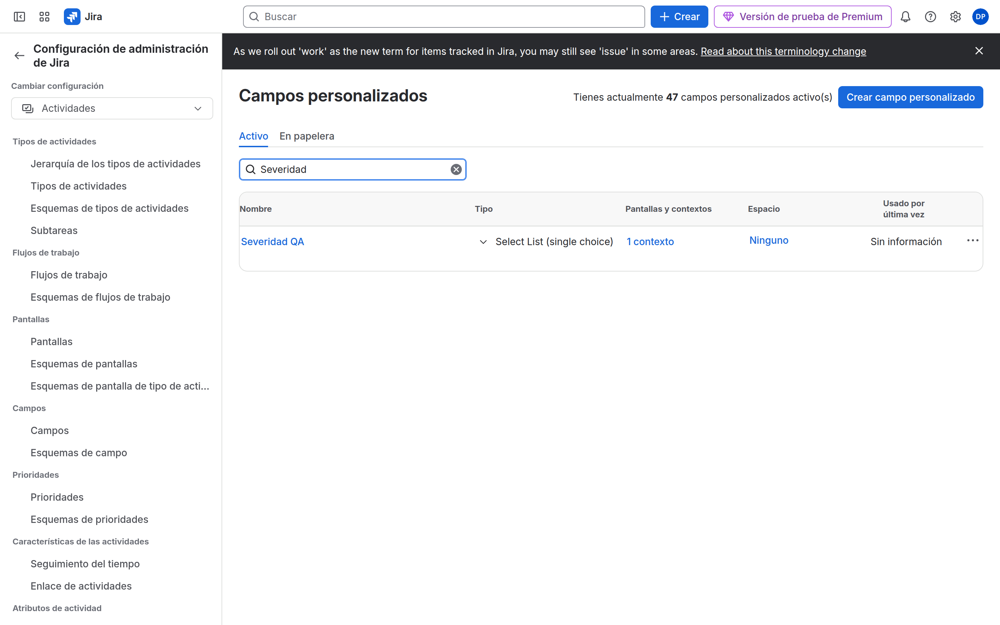
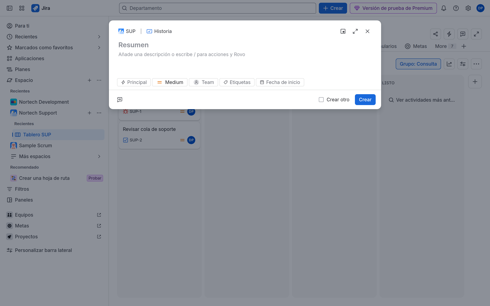

# M06 — Campos, pantallas y formularios

[← Página anterior](../M05-workflows-empresariales/M05-preparacion-examen.md) · [Siguiente página →](M06-01-formularios-departamento.md)

## Qué aprenderás

- Crear **custom fields** y **contextos**.
- Montar **pantallas** de create/edit/view.
- Hacer campos obligatorios u ocultos con **field configuration**.
- Formar formularios distintos por departamento sin duplicar Jira.

## Explicación

Tres capas (el «no me aparece el campo» vive aquí):

| Capa | Pregunta |
|------|----------|
| **Custom field + contexto** | ¿Existe el campo en este proyecto / tipo? |
| **Pantalla** | ¿Se muestra al crear / editar / ver? |
| **Field configuration** | ¿Es required, hidden, wiki renderer? |

> [!NOTE]
> En **team-managed** todo esto es la issue layout del proyecto. En **company-managed** son objetos globales. ACP-620 pregunta las dos.

Nortech: RRHH y Calidad necesitan datos que Desarrollo no debe ver en el Create de DEV.

## Demostración

1. **Elementos de trabajo** → **Campos personalizados**. Crea (o muestra) `Departamento` como lista. El contexto se limita a PMO y SUP: DEV no lo hereda.

2. **Crear** un trabajo en SUP: el campo aparece. En DEV, no.

## Laboratorio

Te toca a ti.

| Lab | Título |
|-----|--------|
| M06-01 | [Formularios por departamento](M06-01-formularios-departamento.md) |
| M06-02 | [Gestión avanzada de campos](M06-02-campos-avanzados.md) |
| — | [Preparación para el examen ACP-620](M06-preparacion-examen.md) |

→ **[M06-01](M06-01-formularios-departamento.md)**
