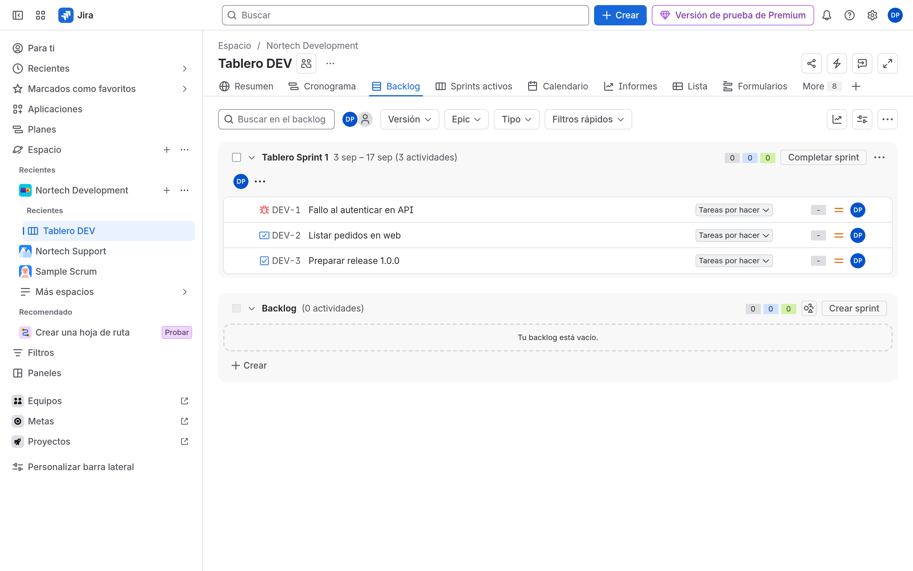
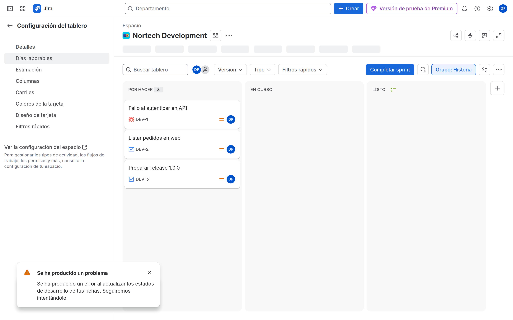
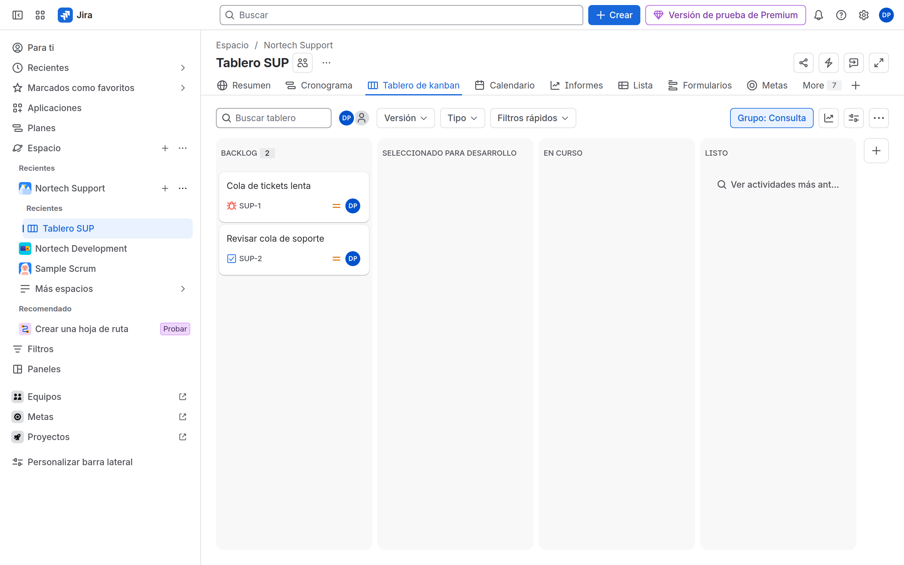

# M07-01 — Scrum y Kanban

[← Página anterior](README.md) · [Siguiente página →](M07-02-columnas-filtros.md)

### Objetivo

Un tablero Scrum en DEV (con un sprint de prueba) y un Kanban en SUP.

### Prerrequisitos

- DEV y SUP CMP. Issues de ejemplo (crea 5 en cada uno si están vacíos).

### En qué consiste

Usar el tablero de la plantilla o crear uno en **Tableros** → ver todos → **Crear**.

### 1 — Scrum DEV

**Acción:** Entra en DEV. Abre **Backlog**. Si no hay tablero, crear tablero → Scrum → a partir de un espacio existente → DEV. Crea un sprint, mete 3 elementos, **Iniciar sprint**.

**Por qué:** Reports de M08 necesitan un sprint.

**Resultado esperado:** Backlog + sprint activo.

### 2 — Estimación

**Acción:** **••• junto al nombre** del tablero → **Board settings** → **Estimación**. Story points (o estimación original de tiempo). Pon puntos a 2 elementos del sprint.

**Por qué:** ACP-620 pregunta el efecto de estimation vs time tracking en el burndown.

**Resultado esperado:** Estimation method visible; issues con puntos.

### 3 — Kanban SUP

**Acción:** SUP → tablero Kanban. **••• junto al nombre** del tablero → **Board settings** → **General settings** → **Board filter**: `project = SUP ORDER BY Rank ASC`. Si no hay Rank, deja el filtro por defecto. El subfiltro Kanban está **debajo**, en la misma página (detalle en [M07-02](M07-02-columnas-filtros.md) paso 4). No uses el **••• de la barra** (standup / release).

**Por qué:** El filtro *es* el tablero.

**Resultado esperado:** Kanban con las issues de SUP.

### 4 — Location y nombre

**Acción:** Mismo **Board settings** → **General settings**. Nombre: `NORTECH DEV Scrum`, ubicación DEV. SUP: `NORTECH SUP Kanban`.

**Por qué:** Location decide en qué proyecto aparece el board en la barra.

**Resultado esperado:** Nombres NORTECH.

## Comprueba tu entendimiento

**Filtro**
Configuración del tablero → **Filtro**. Ábrelo en la búsqueda avanzada de actividades.
→ Las mismas issues que el tablero (salvo swimlanes/sub-filter).

## Reto

### 1 — Board multi-proyecto

Crea un board Kanban extra con filtro `project in (OPS, PMO)`. Colócalo en PMO.

Ver solución

View all boards → Create board → Kanban → from an existing Saved Filter (crea el filtro primero, M08) o from projects. Sin Browse en OPS, el usuario de PMO no verá esas issues.

## Errores frecuentes

| Síntoma | Causa probable | Cómo arreglarlo |
|---------|----------------|-----------------|
| Backlog vacío | Issues sin estado To Do / no cumplen filtro | Filter; statusCategory |
| No Start sprint | No eres admin del board o no hay issues | Permiso Administer Projects / Manage sprints |
