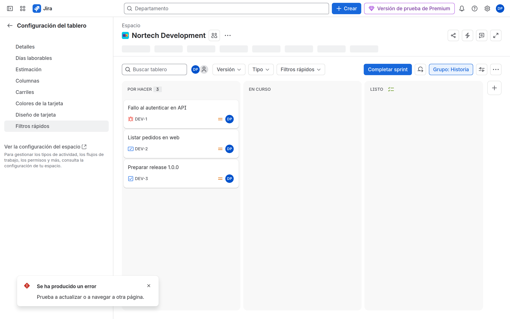
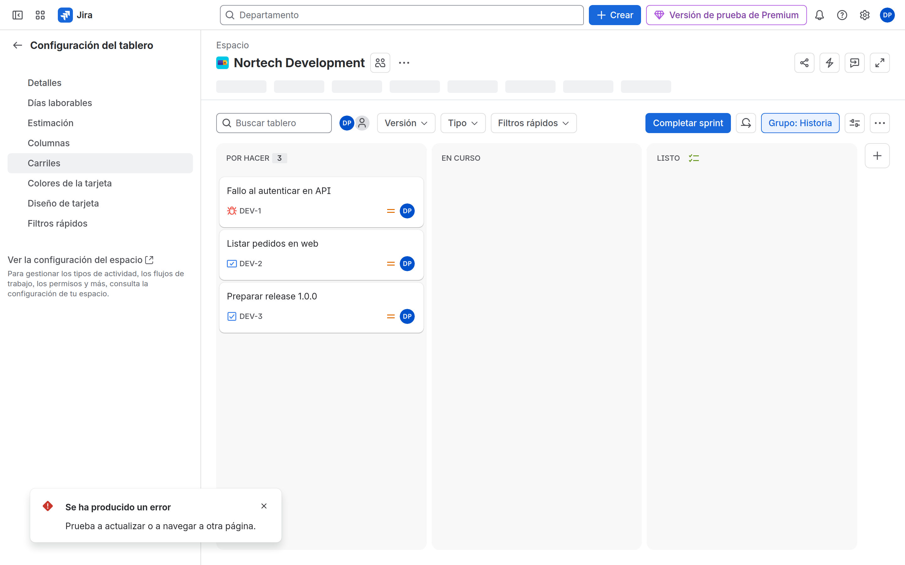

# M07-02 — Columnas, filtros y swimlanes

[← Página anterior](M07-01-scrum-kanban.md) · [Siguiente página →](M07-autoescuela.md)

> Práctica del módulo. La teoría y la demo están en el [README del módulo](README.md).

### Objetivo

Columnas alineadas al workflow de M05, dos quick filters y swimlanes por assignee.

### Prerrequisitos

- [M07-01](M07-01-scrum-kanban.md) y estado `In Review` en DEV.

### En qué consiste

Configuración del tablero de DEV y SUP.

### 1 — Columnas = estados

**Acción:** DEV Scrum → configuración del tablero → **Columnas**. Arrastra `In Review` a su propia columna. Ningún estado del workflow debe quedar en «Sin asignar» / *Unmapped*.

**Por qué:** Unmapped = desaparece del board.

**Resultado esperado:** Columna Review visible.

### 2 — Quick filters

**Acción:** **Filtros rápidos** → añade:

- `Mis issues` → `assignee = currentUser()`
- `Bugs` → `issuetype = Bug`

**Por qué:** No sustituyen al board filter; son vistas temporales.

**Resultado esperado:** Botones en el tablero.

### 3 — Swimlanes y card layout

**Acción:** Calles (*swimlanes*) → **Asignatario** (o Stories). Diseño de tarjeta: muestra Story points y Asignatario.

**Por qué:** ACP-620 cubre swimlanes, card colors, card layout, working days, issue detail view.

**Resultado esperado:** El tablero se parte en filas por persona.

### 4 — Kanban sub-filter

**Acción:** SUP Kanban → Columnas (Kanban) → **Subfiltro** del tablero Kanban. Si hay uno tipo `status != Done`, cámbialo a `statusCategory != Done OR updatedDate >= -14d` (o documenta el que haya).

**Por qué:** El sub-filter es la trampa clásica de tablero vacío.

**Resultado esperado:** Ves Done reciente o lo excluyes a propósito, no por accidente.

## Comprueba tu entendimiento

**Unmapped**
Mueve un estado a Unmapped, mira el board, **devuélvelo**.
→ Las issues de ese estado desaparecen y vuelven.

## Reto

### 1 — Card colors

Colorea Bugs en rojo (Queries: `issuetype = Bug`).

Ver solución

Board settings → Card colors → Queries. No es un permission scheme: solo visual.

## Errores frecuentes

| Síntoma | Causa probable | Cómo arreglarlo |
|---------|----------------|-----------------|
| Tablero vacío | Filter, sub-filter, permisos, columnas | En ese orden |
| Quick filter no hace nada | JQL inválido | Testea en Issue search |
