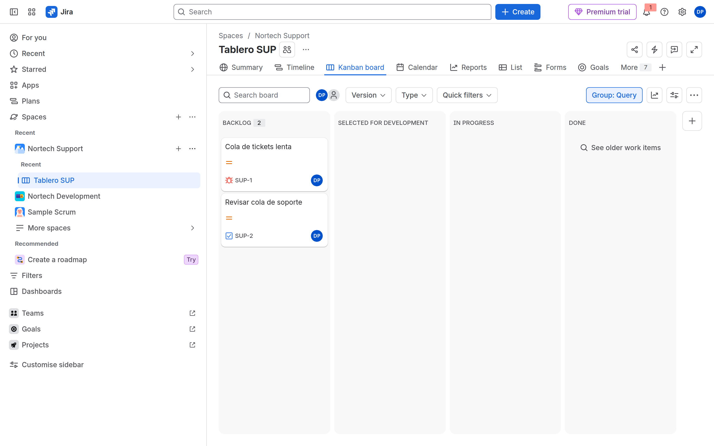
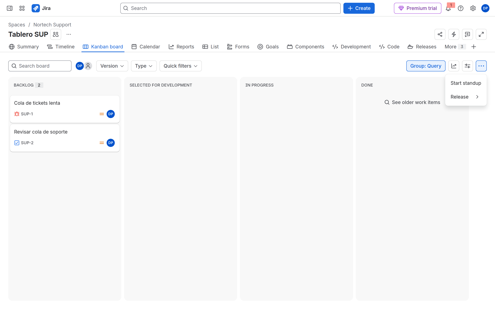
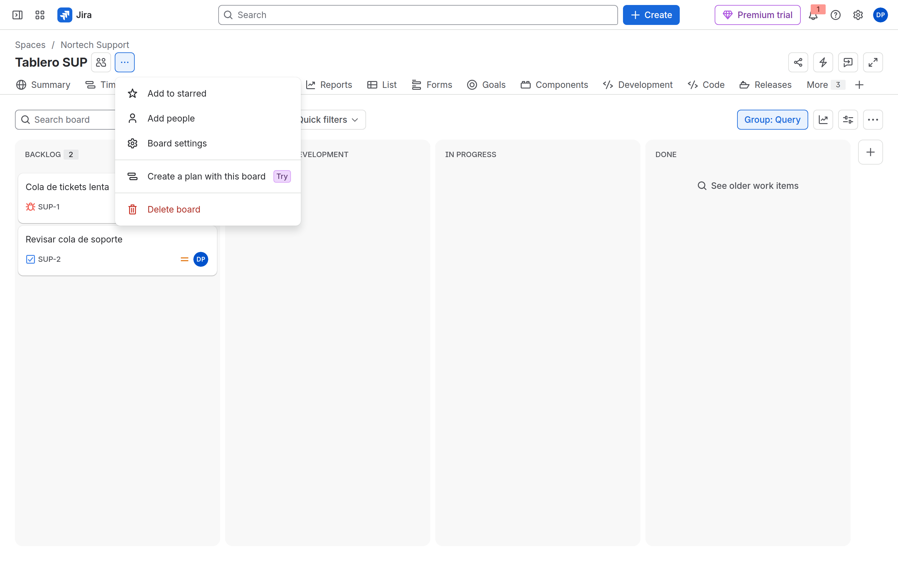
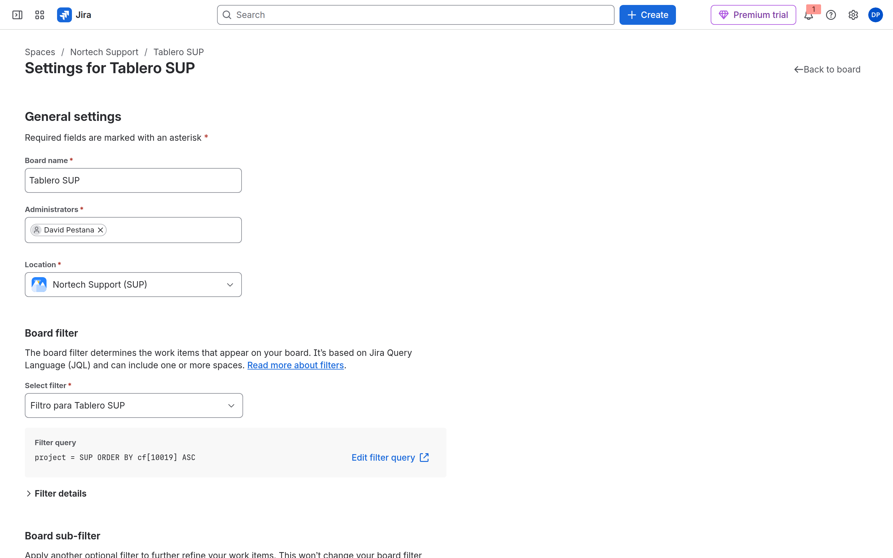
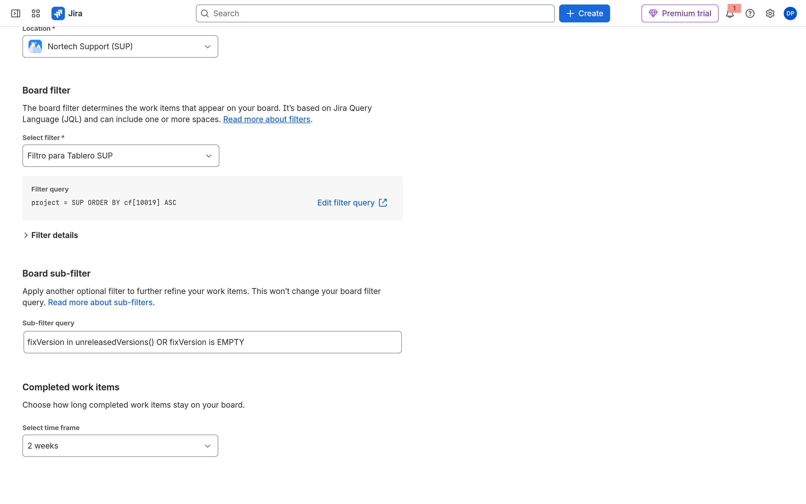
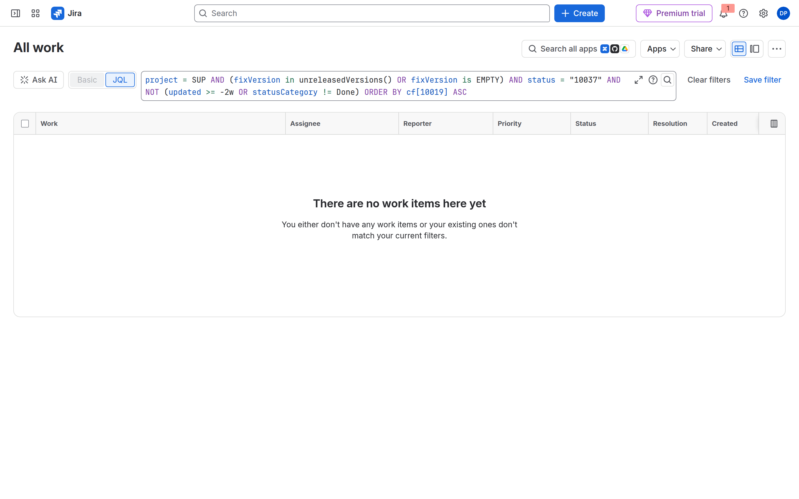

# M07-02 — Columnas, filtros y swimlanes

[← Página anterior](M07-01-scrum-kanban.md) · [Siguiente página →](M07-preparacion-examen.md)

### Objetivo

Columnas alineadas al workflow de M05, dos quick filters, swimlanes por assignee, y **entender los tres recortes** del Kanban (filtro, subfiltro, Done antiguo).

### Prerrequisitos

- [M07-01](M07-01-scrum-kanban.md) y estado `In Review` en DEV.

### En qué consiste

Configuración del tablero de DEV y SUP. El menú **Board settings** se abre con el **••• junto al nombre del tablero**, no con el **••• de la barra** (ese es standup / release). El gesto está en el paso 4.

### 1 — Columnas = estados

**Acción:** DEV Scrum → **•••** junto a `Tablero DEV` (o el nombre que tenga) → **Board settings** → **Columnas**. Arrastra `In Review` a su propia columna. Ningún estado del workflow debe quedar en «Sin asignar» / *Unmapped*. El subfiltro Kanban **no** está en esta página.

**Por qué:** Unmapped = desaparece del board.

**Resultado esperado:** Columna Review visible.


### 2 — Quick filters

**Acción:** **Filtros rápidos** → añade:

- `Mis issues` → `assignee = currentUser()`
- `Bugs` → `issuetype = Bug`

**Por qué:** No sustituyen al board filter; son vistas temporales.

**Resultado esperado:** Botones en el tablero.


### 3 — Swimlanes y card layout

**Acción:** Calles (*swimlanes*) → **Asignatario** (o Stories). Diseño de tarjeta: muestra Story points y Asignatario.

**Por qué:** ACP-620 cubre swimlanes, card colors, card layout, working days, issue detail view.

**Resultado esperado:** El tablero se parte en filas por persona.


### 4 — Kanban: tres recortes (no busques el subfiltro en Columnas)

En SUP la columna **DONE** sale vacía y pone **See older work items**. Eso no significa que no haya tickets cerrados. El Kanban recorta el universo **tres veces**. Scrum (DEV) no tiene la segunda.

```
Board filter              →  qué entra en el tablero
Board sub-filter          →  recorte extra, solo Kanban
Completed work items      →  oculta Done antiguo (~2 semanas)
Quick filter              →  botón temporal; no es la definición
```

Fuente: [Add a sub-filter to a company-managed kanban board](https://support.atlassian.com/jira-software-cloud/docs/add-a-sub-filter-to-a-company-managed-kanban-board/). Atlassian: *Next to your board’s name … More actions (•••), then Board settings. On the General page under the Filter subheading, find … Kanban board sub-filter.* En la UI de 2026 el bloque se llama **Board sub-filter** y está en **General settings**, **no en Columnas**.



#### 4.1 — El menú equivocado

**Acción:** En el Kanban de SUP, pulsa el **••• de la derecha** de la barra del tablero (junto a *Group*).

**Por qué:** Ese menú es **Start standup** / **Release**. No abre la configuración. Es el clic que deja a media clase sin subfiltro.

**Resultado esperado:** Solo standup y release. Ciérralo.



#### 4.2 — El menú correcto

**Acción:** **•••** **junto al nombre** `Tablero SUP` (a la derecha del título, a veces el aria-label es *Board actions for Tablero SUP*). **Board settings**.

**Por qué:** Es el gesto de Support. Columnas, Filtros rápidos y el subfiltro salen de aquí.

**Resultado esperado:** Menú con *Board settings* (y *Delete board* en rojo). Tras el clic: página *Settings for Tablero SUP*.



#### 4.3 — Board filter (primer recorte)

**Acción:** Quédate en **General settings**. Bloque **Board filter**. Anota el filtro guardado y el JQL.

**Por qué:** El filtro *es* el tablero. Si Search con ese JQL no devuelve el ticket, el tablero tampoco.

**Resultado esperado:** *Filtro para Tablero SUP* (o similar) y un JQL tipo `project = SUP ORDER BY cf[10019] ASC`. `cf[10019]` es **Rank**. No lo borres.



#### 4.4 — Board sub-filter (segundo recorte, solo Kanban)

**Acción:** Baja al bloque **Board sub-filter**. Copia el JQL de **Sub-filter query**. No lo cambies todavía. Abre también el Scrum de DEV → Board settings → General: **no hay** este bloque.

**Por qué:** El subfiltro recorta *después* del board filter y no modifica el filtro guardado. Atlassian de fábrica no pone `status != Done`. Pone versiones:

```
fixVersion in unreleasedVersions() OR fixVersion is EMPTY
```

Eso **saca del tablero** todo lo que ya tiene una Fix version **released**. Lo confirma el KB: *[the default Kanban subfilter will remove any work belonging to a Fix version that has been Released](https://support.atlassian.com/jira/kb/kanban-board-shows-or-hides-completed-work-unexpectedly-in-jira-cloud/)*. En ACP-620 el ejemplo clásico sigue siendo `status != Done` (vacía Done a propósito). En el trial verás el de versiones; anótalo.

**Resultado esperado:** El campo *Sub-filter query* con el JQL de `fixVersion`. Si tu site aún muestra el subfiltro **encima de Columnas** (UI anterior), es la **misma caja**, no un cuarto recorte.



#### 4.5 — Completed work items (tercer recorte)

**Acción:** En la misma página, bloque **Completed work items** → **Select time frame**. Anota el valor (de fábrica **2 weeks**).

**Por qué:** Independiente del subfiltro. Oculta elementos en categoría **Done** cuyo *Updated* es más antiguo que esa ventana. No usa *Resolved*. Un comentario en un ticket cerrado **reinicia el reloj**. Opciones típicas: 1 / 2 / 4 semanas, o quitar el recorte. Fuente: el mismo [KB de hide completed](https://support.atlassian.com/jira/kb/kanban-board-shows-or-hides-completed-work-unexpectedly-in-jira-cloud/).

**Resultado esperado:** *2 weeks* (o el que tenga tu trial). La columna DONE del tablero muestra **See older work items** cuando este recorte (o el subfiltro) está escondiendo tarjetas.

#### 4.6 — See older work items

**Acción:** **Back to board**. En DONE, pulsa **See older work items**. Mira el JQL de la búsqueda.

**Por qué:** Jira abre Issue Search con el **inverso** de lo que el tablero está mostrando. En un trial recién creado suele salir vacío: no hay Done antiguo que revelar. El JQL sigue siendo la lección. Ejemplo real:

```
project = SUP
AND (fixVersion in unreleasedVersions() OR fixVersion is EMPTY)
AND status = "10037"
AND NOT (updated >= -2w OR statusCategory != Done)
ORDER BY cf[10019] ASC
```

Ahí se ven los tres recortes encadenados: filtro del espacio, subfiltro de versiones, y la ventana de 2 semanas sobre Done.

**Resultado esperado:** Búsqueda avanzada con ese JQL (los IDs de estado cambian por site). Lista vacía = no hay Done oculto; no es un error.



**Acción (cierre):** Vuelve a Board settings. Deja el subfiltro de fábrica **o**, si quieres el ejemplo de examen en el tablero, cámbialo a:

```
statusCategory != Done OR updatedDate >= -14d
```

Eso mantiene Done reciente y **sustituye** el recorte por versión. No lo dejes en `status != Done` al acabar: vacía DONE entero. Si cambias *Completed work items*, restáuralo a **2 weeks**.

**Resultado esperado:** Sabes dónde está cada recorte. El tablero no queda roto.

## Comprueba tu entendimiento

**Unmapped**
Mueve un estado a Unmapped, mira el board, **devuélvelo**.
→ Las issues de ese estado desaparecen y vuelven.

**Subfiltro de examen**
En SUP, pon el subfiltro a `status != Done`, mira DONE, **restáuralo** al JQL de fábrica.
→ DONE se vacía aunque Search con `project = SUP` siga mostrando esos tickets.

## Reto

### 1 — Card colors

Colorea Bugs en rojo (Queries: `issuetype = Bug`).

<details>
<summary>Ver solución</summary>

Board settings → Card colors → Queries. No es un permission scheme: solo visual.

</details>

## Errores frecuentes

| Síntoma | Causa probable | Cómo arreglarlo |
|---------|----------------|-----------------|
| No encuentro el subfiltro | Estás en **Columnas** o en el **••• de la barra** | **••• junto al nombre** → Board settings → **General settings** → *Board sub-filter* |
| Menú con Standup / Release | **•••** de la derecha del tablero | Cierra. El de settings está **al lado del título** |
| Tablero vacío | Filter, sub-filter, hide-completed, permisos, columnas | En ese orden. Search con el JQL del filtro |
| DONE vacío con *See older work items* | Subfiltro de versiones **o** *Completed work items* = 2 weeks | Abre el enlace; lee el JQL inverso |
| Scrum sin subfiltro | Es Kanban-only | Normal. DEV no tiene ese bloque |
| Quick filter no hace nada | JQL inválido | Testea en la búsqueda avanzada |
