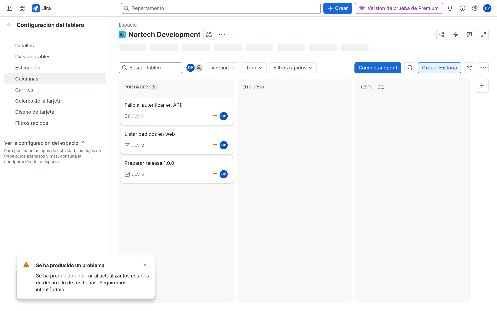

# M07 — Tableros ágiles

[← Página anterior](../M06-campos-pantallas/M06-autoescuela.md) · [Siguiente página →](M07-01-scrum-kanban.md)

> [!NOTE]
> **Cómo funciona este módulo.** Primero la **teoría**, luego la **demostración guiada** del
> formador, y después **practicas tú** en el/los laboratorio(s).

## Qué aprenderás

- Elegir Scrum, Kanban o Kanban con backlog.
- Entender que el board es un **filtro JQL** + columnas.
- Mapear columnas a estados, quick filters, swimlanes, estimación.

Este es el dominio más pesado de **ACP-620** (25–35 %).

## Teoría

| Tipo | Cuándo |
|------|--------|
| **Scrum** | Sprints, backlog, estimación, velocity |
| **Kanban** | Flujo continuo; WIP |
| **Kanban + backlog** | Kanban con una bandeja de compromiso |

| Pieza | Qué es |
|-------|--------|
| **Board filter** | JQL que alimenta el tablero (`project = DEV`) |
| **Sub-filter** (Kanban) | JQL extra (a menudo oculta Done antiguo) |
| **Quick filter** | Botones temporales (`assignee = currentUser()`) |
| **Columnas** | Una o más **estados** por columna |
| **Swimlanes** | Filas (assignee, stories, queries) |

> [!WARNING]
> Un sub-filter `status != Done` mal pensado vacía el tablero. Troubleshoot: Board settings → Filter + Columns + permisos Browse.

Boards **multi-proyecto**: el filtro `project in (DEV, SUP)` y permisos en ambos. Rendimiento y fugas de datos si el filtro es `OR` demasiado amplio.

## Demostración guiada

1. En DEV se abre el backlog Scrum. En SUP, el Kanban.

2. Board settings → Columns muestra el mapeo con `In Review` (M05) en su propia columna.

## Ahora practica tú

| Lab | Título | Qué harás |
|-----|--------|-----------|
| M07-01 | [Scrum y Kanban](M07-01-scrum-kanban.md) | Tableros DEV y SUP |
| M07-02 | [Columnas y filtros](M07-02-columnas-filtros.md) | Mapping, quick filters, swimlanes |
| — | [Autoescuela M07](M07-autoescuela.md) | El bloque más denso del examen |

→ Empieza por **[M07-01](M07-01-scrum-kanban.md)**.
