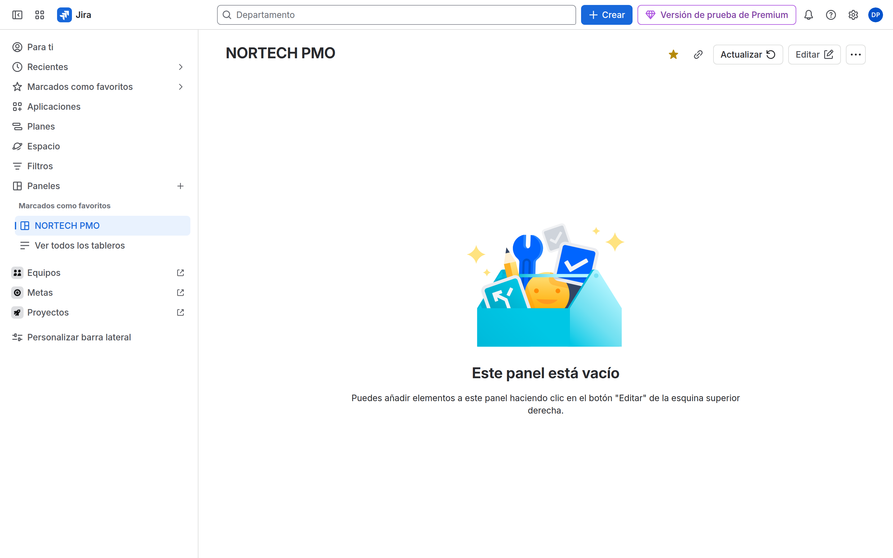

# M08-02 — Dashboards y gadgets

[← Página anterior](M08-01-jql-filtros.md) · [Siguiente página →](M08-03-reports.md)

> Práctica del módulo. La teoría y la demo están en el [README del módulo](README.md).

### Objetivo

Un dashboard `NORTECH PMO` compartido con gadgets alimentados por filtros NORTECH.

### Prerrequisitos

- Filtro compartido `NORTECH DEV Abiertas`.

### En qué consiste

**Paneles** → **Crear panel** → añadir gadget.

### 1 — Crear dashboard

**Acción:** **Paneles** → **Crear panel**. Nombre `NORTECH PMO`. Visualizadores: grupo `nortech-pmo` o espacio PMO. Diseño de dos columnas.

**Por qué:** El dashboard es la pared de monitores, no el informe de sprint.

**Resultado esperado:** Dashboard vacío compartido.

### 2 — Gadgets

**Acción:** Añadir gadget:

| Gadget | Config |
|--------|--------|
| Filter Results | Filtro `NORTECH DEV Abiertas`, columnas Key, Summary, Assignee, Status |
| Pie Chart | Mismo filtro, Statistic type: Status (o Priority) |
| Assigned to Me | Default |
| Activity Stream | Opcional, filtrado si existe |

**Por qué:** ACP-620 pide elegir gadget según la pregunta de negocio («lista» vs «distribución» vs «mis cosas»).

**Resultado esperado:** Tres gadgets con datos.

### 3 — Permiso del filtro

**Acción:** Si un gadget muestra error de permisos, vuelve al filtro y amplía Viewers.

**Por qué:** El síntoma parece «gadget roto» y es el filtro.

**Resultado esperado:** El invitado con Browse ve el dashboard sin error.

## Comprueba tu entendimiento

**Gadget vs report**
En el dashboard **no** busques Velocity. 
→ Velocity está en Reports del board Scrum.

## Reto

### 1 — Two Dimensional Filter Statistics

Añade el gadget: eje X Status, eje Y Assignee, filtro DEV Abiertas.

Ver solución

Add gadget → Two Dimensional Filter Statistics. Es el «quién tiene qué en cada estado» de PMO.

## Errores frecuentes

| Síntoma | Causa probable | Cómo arreglarlo |
|---------|----------------|-----------------|
| Gadget: no permission | Filtro privado | Share filter |
| Dashboard no sale en el menú | Favorite / viewers | Star + share |
