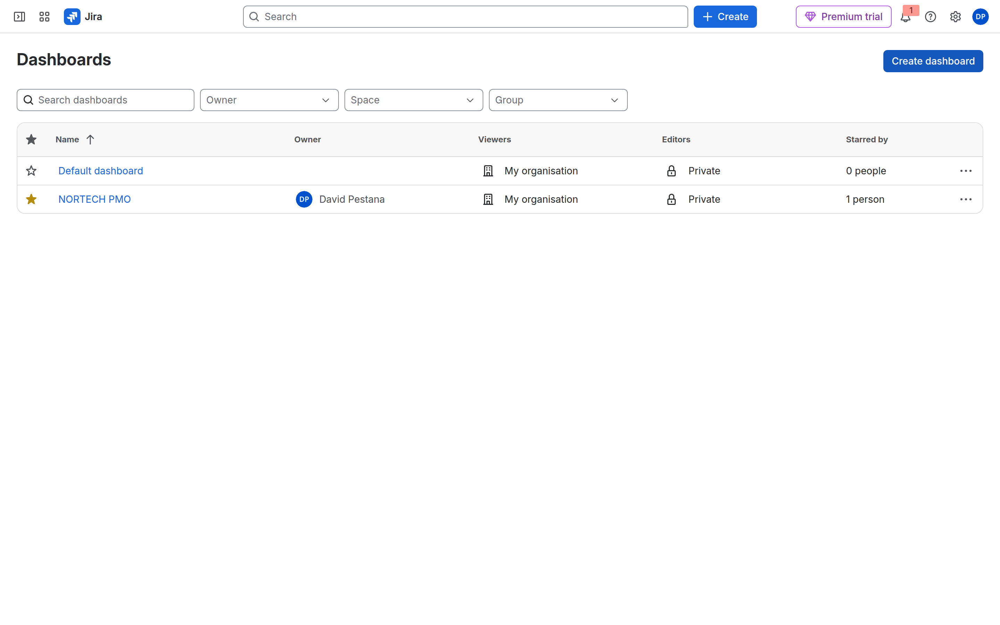
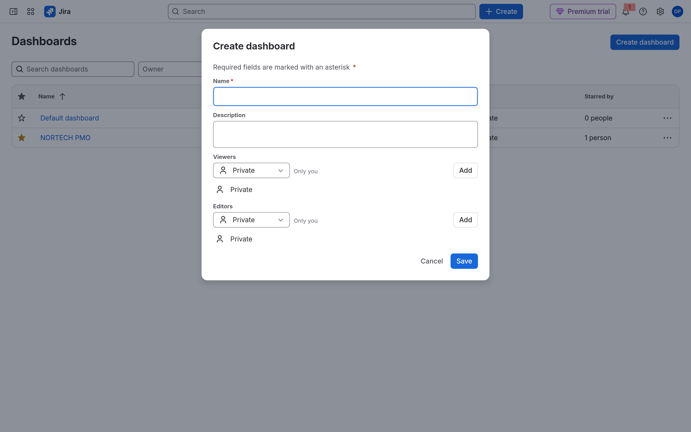
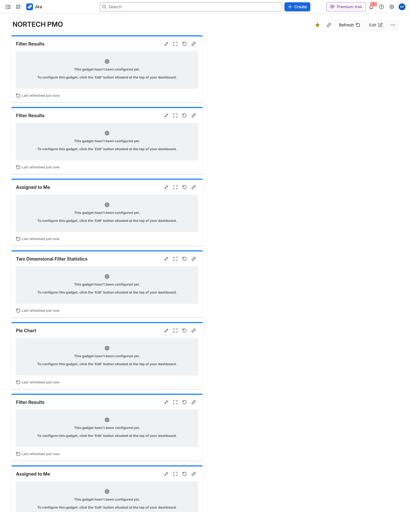
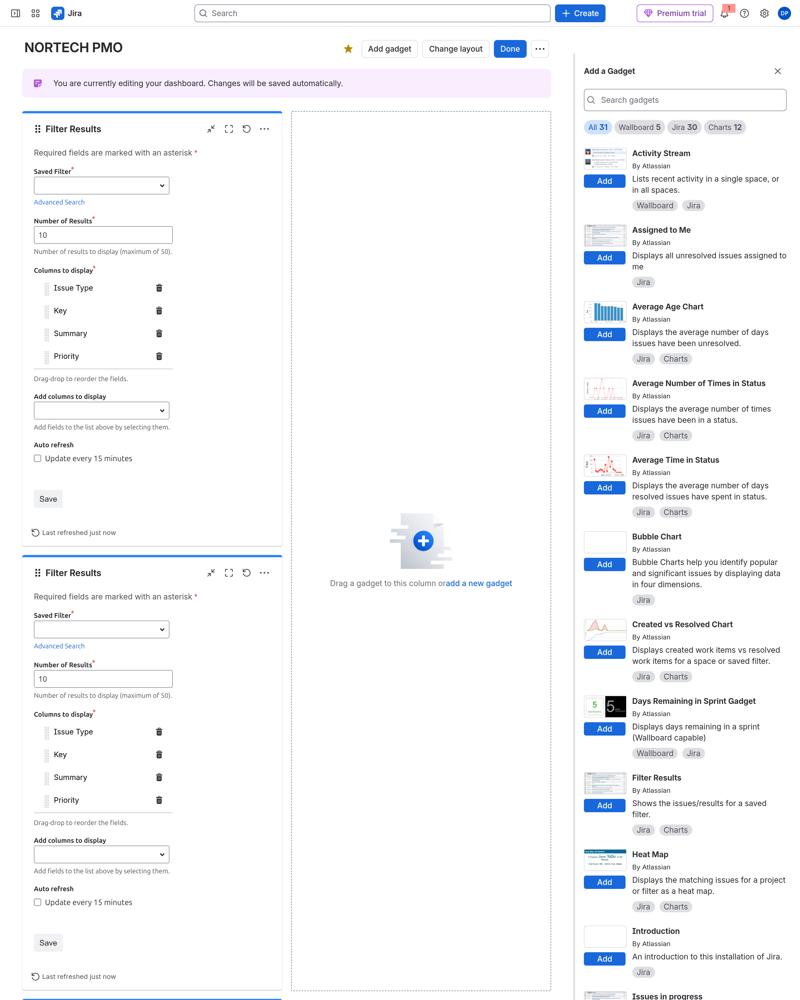
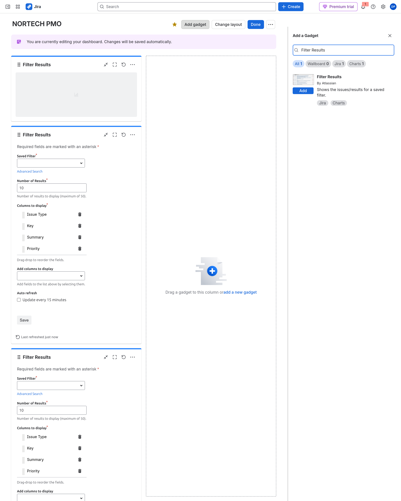
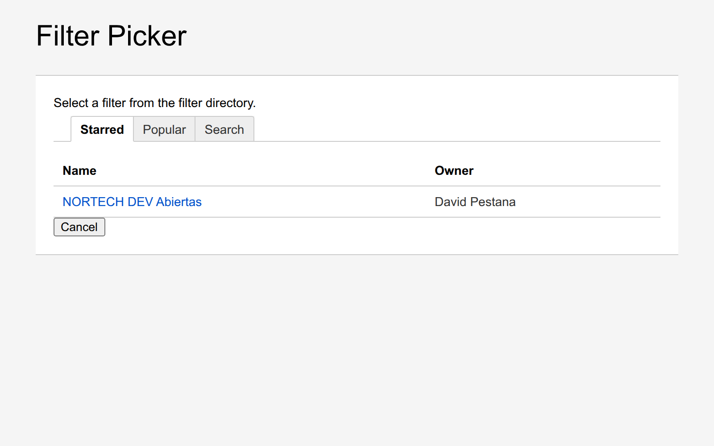
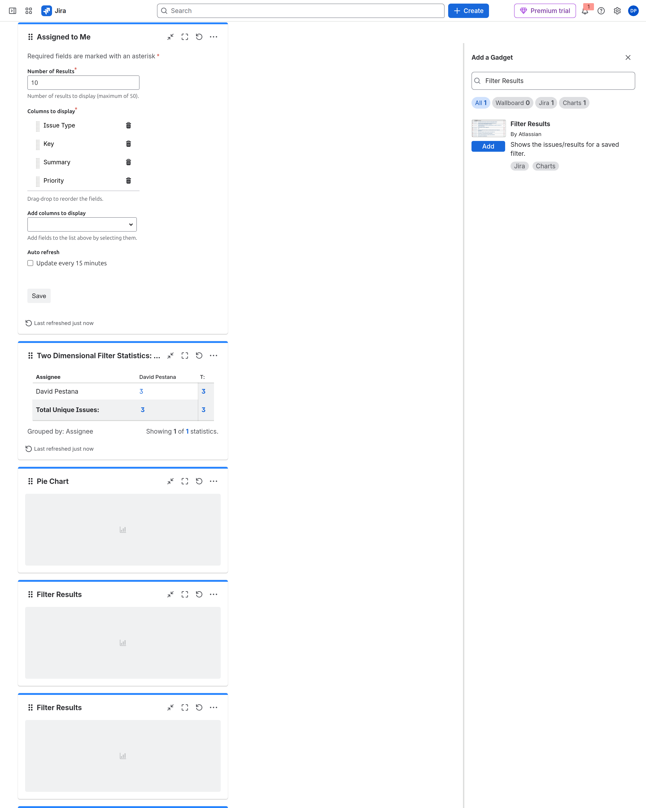
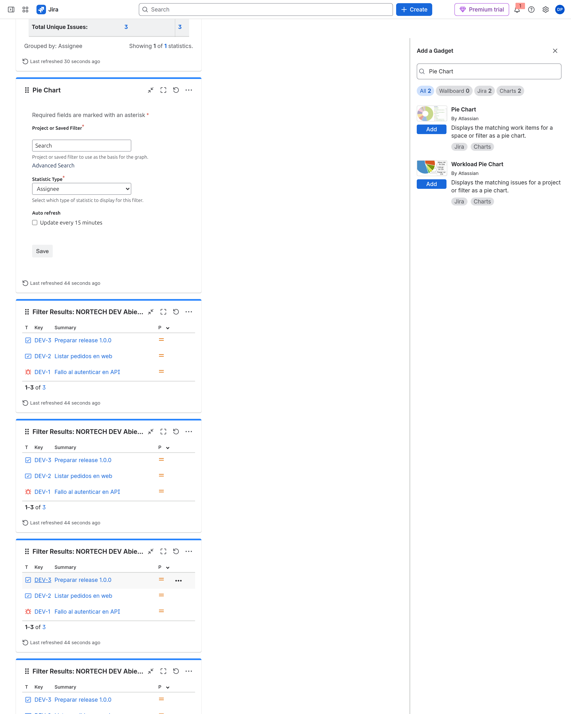
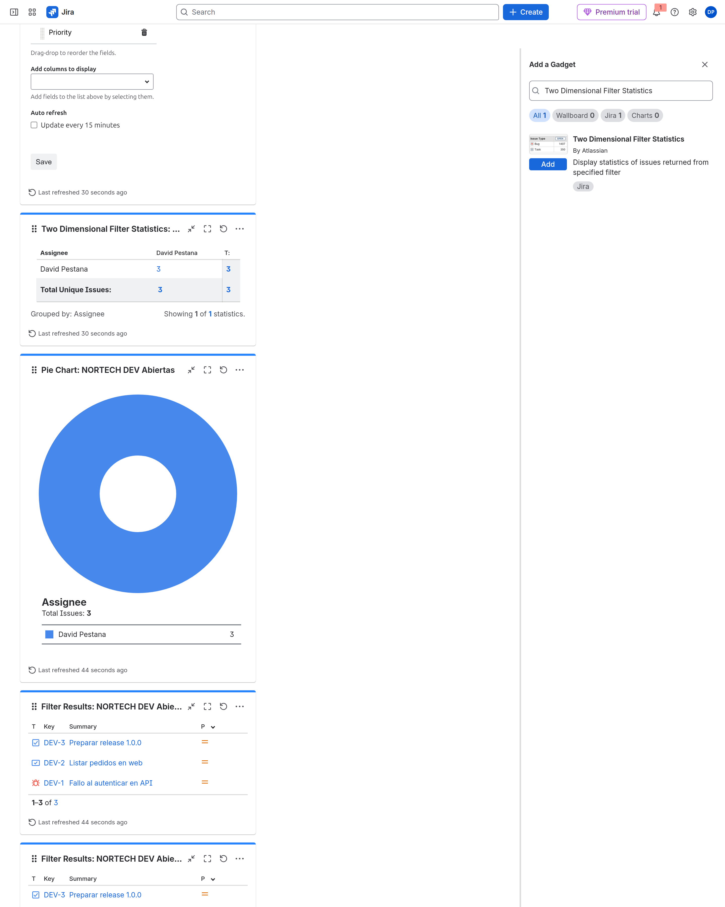
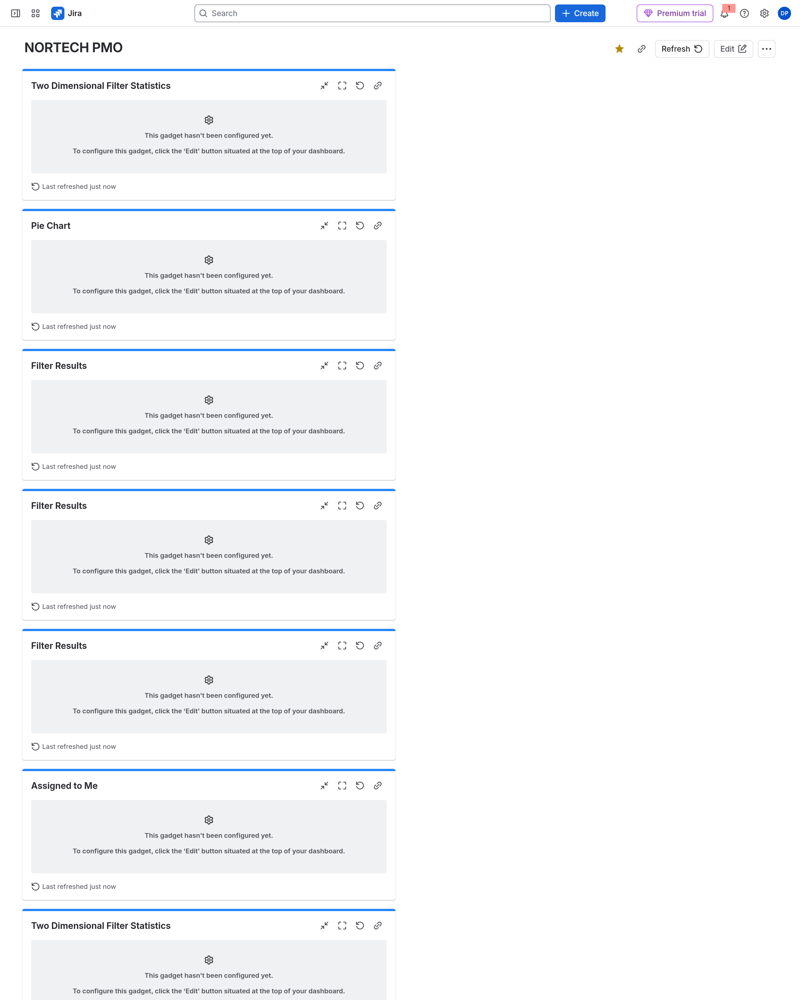

# M08-02 — Dashboards y gadgets

[← Página anterior](M08-01-jql-filtros.md) · [Siguiente página →](M08-03-reports.md)

### Objetivo

Montar el **tablero de la PMO** `NORTECH PMO`: tres gadgets alimentados por el **mismo filtro JQL** (`NORTECH DEV Abiertas`) y uno personal (`Assigned to Me`). Al terminar, la PMO abre una URL y ve lista + tarta + matriz sin buscar en Jira.

### Prerrequisitos

- Filtro `NORTECH DEV Abiertas` guardado y **compartido** (M08-01 o paso 6 de [M08-03](M08-03-reports.md)). Si el filtro es *Private*, los gadgets fallan para el resto.

### En qué consiste

Un dashboard no es un informe de sprint. Es una **pared** que se refresca con gadgets. Casi todos los gadgets «serios» piden un **filtro guardado** (JQL), no JQL suelto. El gesto es: **Dashboards → Edit → Add gadget → Advanced Search → el filtro → Save**.

```
JQL  →  Save filter  →  Gadget: Saved Filter  →  Advanced Search  →  NORTECH DEV Abiertas
```

| Pregunta de negocio | Gadget |
|---------------------|--------|
| ¿Qué tickets abiertos hay? (lista) | **Filter Results** |
| ¿Cómo se reparten por estado? (tarta) | **Pie Chart** |
| ¿Quién tiene qué en cada estado? (matriz) | **Two Dimensional Filter Statistics** |
| ¿Qué tengo yo pendiente? | **Assigned to Me** (no usa filtro compartido) |

---

### 1 — Entra en Dashboards

**Acción:** Barra izquierda → **Dashboards** (icono de cuadrícula). Arriba a la derecha: **Create dashboard** si aún no tienes `NORTECH PMO`.

**Por qué:** Los dashboards viven fuera del espacio DEV. Un mismo panel puede mezclar filtros de varios espacios si el usuario tiene permiso.

**Resultado esperado:** Lista con *Default dashboard* y, si ya lo creaste, *NORTECH PMO*.



---

### 2 — Crear y compartir el panel

**Acción:** **Create dashboard**. Rellena:

| Campo | Valor |
|-------|--------|
| **Name** | `NORTECH PMO` |
| **Description** | `Seguimiento diario DEV abiertas` |
| **Viewers** | No dejes *Private*. **Add** → **My organisation** (o el grupo `nortech-pmo` / espacio PMO si existe). |
| **Editors** | Puedes dejar *Private* (solo tú editas). |

**Save**. Luego **Star** (estrella) en la fila del dashboard para que salga en *Starred*.

**Por qué:** Viewers = quién **ve** la pared. Editors = quién **añade gadgets**. Un panel compartido con filtro privado sigue fallando: comparte **ambos**.

**Resultado esperado:** Diálogo *Create dashboard* con Viewers ≠ solo tú.



---

### 3 — Panel vacío → Edit

**Acción:** Abre `NORTECH PMO`. Verás *This dashboard is empty*. Arriba a la derecha: **Edit** (enlace, no botón azul de Create).

**Por qué:** Sin **Edit** no hay catálogo de gadgets ni arrastrar columnas.

**Resultado esperado:** Mensaje vacío + **Edit** visible.



---

### 4 — Modo edición y catálogo

**Acción:** Pulsa **Edit**. Banner morado: *You are currently editing your dashboard*. Arriba: **Add gadget**, **Change layout**, **Done**. A la derecha se abre **Add a Gadget** con ~31 gadgets.

**Por qué:** **Change layout** → dos columnas (lista a la izquierda, gráficos a la derecha). **Done** guarda y sales de edición.

**Resultado esperado:** Columnas punteadas *Drag a gadget…* y panel *Add a Gadget*.



---

### 5 — Gadget 1: Filter Results (lista)

**Acción:** En el buscador del catálogo escribe `Filter Results`. **Add** en la tarjeta *Shows the issues/results for a saved filter*.

Se abre la configuración del gadget:

1. **Saved Filter** (obligatorio) → enlace azul **Advanced Search** (no la lupa global de Jira).
2. Se abre **otra ventana** *Filter Picker*. Pestaña **Search** o **Starred** → clic en **`NORTECH DEV Abiertas`**. La ventana se cierra sola.
3. **Number of Results:** `15`.
4. **Columns to display:** deja Key, Summary, Priority; en *Add columns to display* añade **Assignee** y **Status**.
5. Pulsa **Save** al pie del gadget (gris). Espera a ver la tabla con DEV-1, DEV-2, DEV-3.

**Por qué:** Este gadget es la respuesta ACP-620 a «lista matinal de abiertas». El JQL vive en el filtro; el gadget solo lo **referencia**.

**Resultado esperado:** Formulario con *Saved Filter required* y enlace *Advanced Search*.







---

### 6 — Gadget 2: Pie Chart (distribución)

**Acción:** **Add gadget** → busca `Pie Chart` (no *Workload Pie Chart*). **Add**.

1. **Project or Saved Filter** → **Advanced Search** → mismo filtro `NORTECH DEV Abiertas`.
2. **Statistic Type:** **Status** (o Priority si la PMO pregunta por urgencia).
3. **Save**.

**Por qué:** Misma fuente de datos que la lista; otra **forma** de leerla. En examen: lista = Filter Results, reparto = Pie Chart.

**Resultado esperado:** Tras Save, tarta (en trial suele ser 100 % To Do) o leyenda *To Do = 3*.



---

### 7 — Gadget 3: Two Dimensional (matriz PMO)

**Acción:** **Add gadget** → `Two Dimensional Filter Statistics` → **Add**.

1. **Filter** → **Advanced Search** → `NORTECH DEV Abiertas`.
2. **X-axis / primera dimensión:** **Status**.
3. **Y-axis / segunda dimensión:** **Assignee**.
4. **Save**.

**Por qué:** Es el «quién tiene qué en cada estado» sin exportar a Excel. Con un solo assignee la matriz sale en una fila; sigue siendo válida en el trial.

**Resultado esperado:** Tabla cruzada Status × Assignee con los 3 DEV.



---

### 8 — Gadget 4: Assigned to Me

**Acción:** **Add gadget** → `Assigned to Me` → **Add**. No pide filtro: usa `assignee = currentUser()` por dentro. **Save** si lo pide.

**Por qué:** Cada viewer ve **sus** issues. Demuestra la diferencia entre filtro compartido fijo y gadget dinámico por usuario.

**Resultado esperado:** Lista de issues tuyas sin resolver (puede coincidir con DEV si eres el único usuario).

---

### 9 — Done: la pared lista

**Acción:** **Done** (arriba). Comprueba en modo lectura:

- **Refresh** actualiza gadgets.
- Estrella = favorito en el menú.
- Enlace **Share** copia la URL para la PMO.

Si un gadget dice *hasn't been configured yet*, volviste a **Edit**, abre el engranaje del gadget y repite **Advanced Search** + **Save**.

**Por qué:** Sin **Save** en cada gadget, **Done** deja cajas vacías. Es el error más común de este lab.

**Resultado esperado:** Al menos Filter Results muestra DEV-1…DEV-3. Pie y matriz con datos del mismo filtro.



---

## Comprueba tu entendimiento

**Mismo filtro, tres formas**
Los tres gadgets de PMO usan el mismo JQL guardado. ¿Cuál responde «cuántos Bugs vs Stories»?
→ Pie Chart (Statistic Type = Issue Type).

**Permisos**
Compartes el dashboard con PMO pero el filtro sigue *Private*. ¿Qué ve el compañero?
→ Error de permisos en el gadget; amplía **Viewers** del filtro.

## Reto

### 1 — Created vs Resolved en el panel

**Add gadget** → **Created vs Resolved Chart** → elige el filtro o espacio DEV → intervalo semanal.

<details>
<summary>Ver solución</summary>

Es un **gadget** de dashboard (Charts), no el informe *Created vs Resolved Issues Report* de More reports. Sirve para tendencia en la pared; el informe nativo vive en Reports → More reports.

</details>

## Errores frecuentes

| Síntoma | Causa probable | Cómo arreglarlo |
|---------|----------------|-----------------|
| Panel vacío tras Done | No pulsaste **Save** en cada gadget | Edit → Configure → Save |
| No encuentro Advanced Search | Estás en la lupa global | Solo dentro del formulario del gadget |
| Filter Picker no aparece | Popup detrás del navegador | Alt+Tab; busca *Filter Picker* |
| Gadget: no permission | Filtro privado | Filtro → Viewers → Add espacio/grupo |
| No veo Dashboards | Menú colapsado | Sidebar → Dashboards o `/jira/dashboards` |
| Pie Chart sin datos | Filtro vacío o mal elegido | Advanced Search → `NORTECH DEV Abiertas` |
| Busco Velocity aquí | Es informe ágil | More reports en el tablero Scrum (M08-03) |
