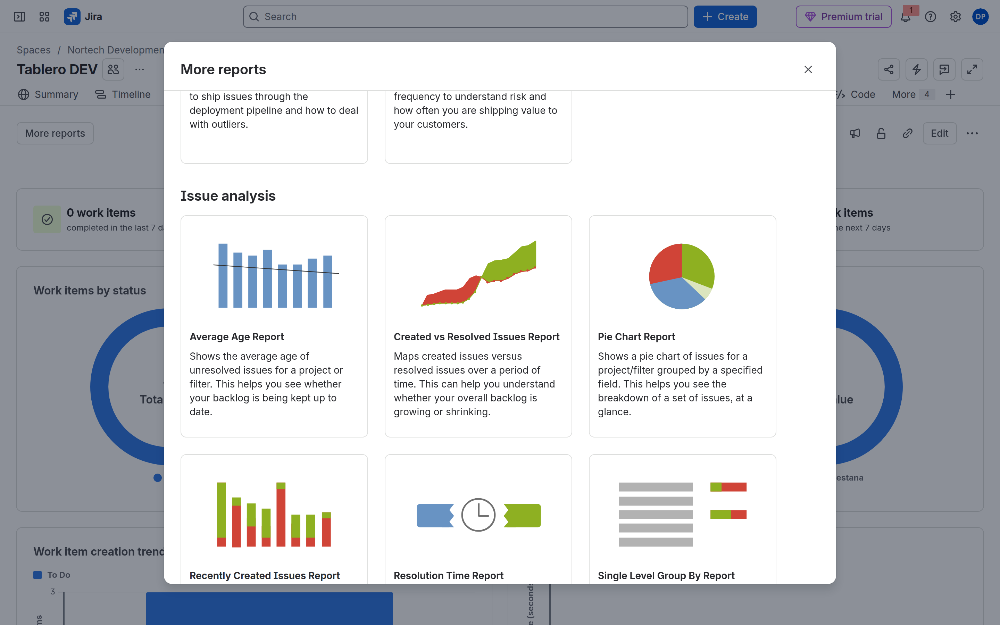
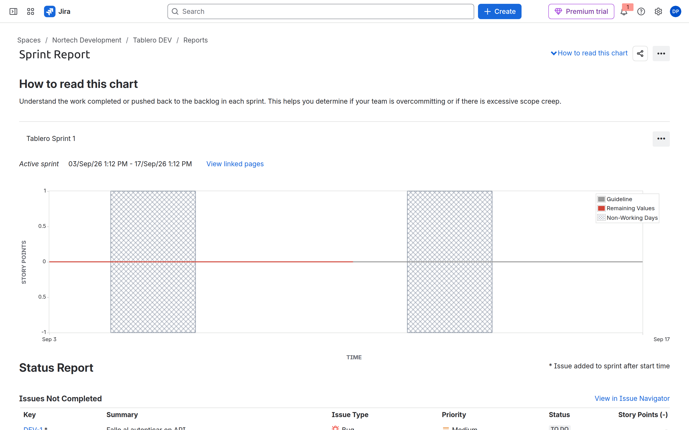
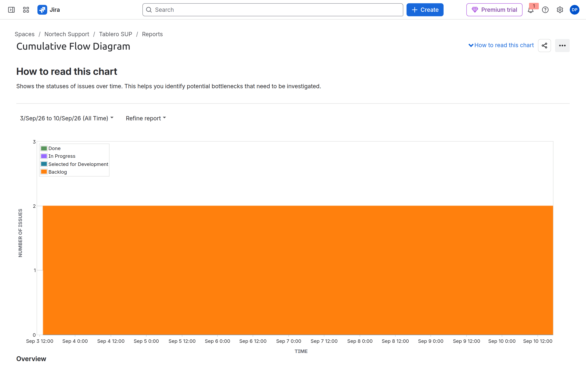
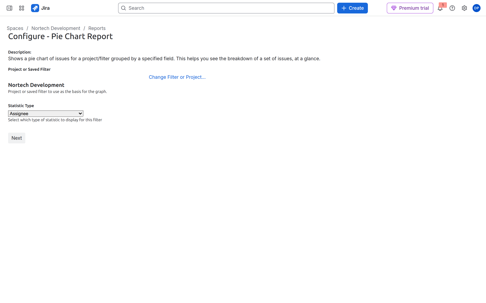
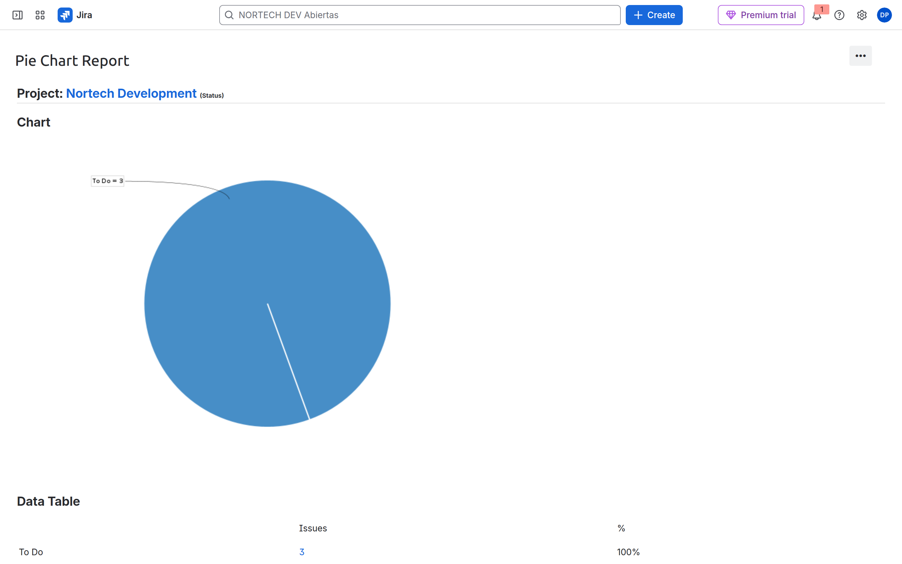
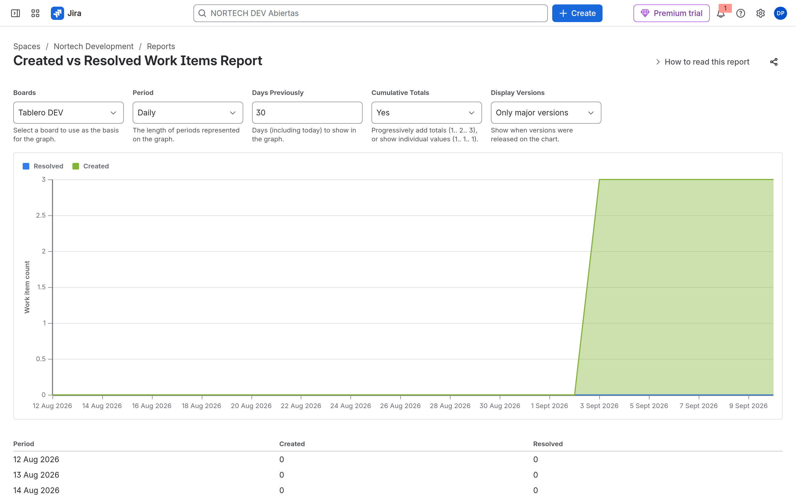

# M08-03 — Reports nativos

[← Página anterior](M08-02-dashboards-gadgets.md) · [Siguiente página →](M08-preparacion-examen.md)

### Objetivo

Abrir los informes de 2026 **sin perderte**: la pestaña Reports ya no es el Sprint report. Guardar un JQL como filtro y **engancharlo** a un informe que sí acepta filtro (Pie Chart). Distinguir eso de los informes ágiles, que comen el **filtro del tablero**.

### Prerrequisitos

- Espacios DEV (Scrum) y SUP (Kanban) con algún trabajo. Un sprint iniciado en DEV (M07) ayuda al Sprint report.

### En qué consiste

Tres puertas distintas. El JQL **no** se pega dentro del Sprint report.

| Quieres… | Dónde | Cómo entra el JQL |
|----------|--------|-------------------|
| Donuts de estado / tipo / asignatario | Pestaña **Reports** (Space Insights) | No hay JQL. Filtros de página/widget, o **Edit** si eres admin del espacio |
| Sprint, Burndown, Velocity, CFD, Control chart | **More reports** → bloque **Agile** | El **board filter** (M07). No hay caja JQL en el informe |
| Tarta / grupos por campo con **tu** consulta | **More reports** → **Issue analysis** → **Pie Chart Report** | **Change Filter or Project…** y eliges un **filtro guardado** |
| Created vs Resolved (UI 2026) | **More reports** → **Created vs Resolved Issues Report** | Desplegable **Boards** (el JQL es el del tablero) |
| Lista o tarta que se queda en la pared | **Paneles** (M08-02) | Gadget → **Saved filter** |

Fuente: [What are space insights?](https://support.atlassian.com/jira-software-cloud/docs/what-are-space-insights/) — *When you select Reports in Jira, the Team overview dashboard opens by default. To access classic Jira reports, select More reports at the top of the page.* Sprint report: [View and understand the sprint report](https://support.atlassian.com/jira-software-cloud/docs/view-and-understand-the-sprint-report/) — *The sprint report is board-specific — that is, it will only include work items that match your board's saved filter.*

---

### 1 — La pestaña Reports no es el Sprint report

**Acción:** Entra en **Nortech Development**. Abre el **Tablero DEV**. En la barra del tablero (Summary, Timeline, Backlog, Active sprints…) pulsa **Reports**.

**Por qué:** Desde ~julio 2026 esa pestaña abre **Space Insights** (donuts *Work items by status / type / assignee*). El lab antiguo decía «Informes → Informe de sprint» como si esa lista estuviera aquí. No está.

**Resultado esperado:** Arriba a la izquierda, botón **More reports**. Donuts, no un burndown.


---

### 2 — More reports: informes ágiles

**Acción:** Pulsa **More reports**. No cierres el modal. Mira el bloque **Agile**.

**Por qué:** Aquí están Burndown, Burnup, **Sprint Report**, Velocity, **Cumulative Flow Diagram**, Version Report. Cada tarjeta **abre una pestaña nueva**. Si no pasa nada en esta ventana, mira la otra pestaña.

**Resultado esperado:** Modal *More reports* con las seis tarjetas Agile.


---

### 3 — Baja hasta Issue analysis (aquí sí hay filtro)

**Acción:** En el **mismo modal**, baja con la rueda. Pasa DevOps y para en **Issue analysis**. Localiza **Pie Chart Report** y **Created vs Resolved Issues Report**.

**Por qué:** El Pie Chart Report es el informe clásico que pide **Project or Saved Filter**. Es el sitio donde tu JQL (convertido en filtro) alimenta un gráfico. Created vs Resolved, en esta UI, ya no pide filtro: pide **tablero**.

**Resultado esperado:** Ves Average Age, Created vs Resolved, Pie Chart Report, Recently Created, Resolution Time, Single Level Group By.



---

### 4 — Sprint Report (el JQL es el del tablero)

**Acción:** En Agile, pulsa **Sprint Report**. Cambia a la pestaña nueva. En el desplegable elige tu sprint (`Tablero Sprint 1` o el que hayas iniciado). Mira la lista **Issues Not Completed** debajo del gráfico.

**Por qué:** Atlassian: el sprint report **solo** incluye lo que cumple el **board filter**. No hay campo JQL en esta pantalla. Si falta un ticket, el problema está en Board settings → General → Board filter (M07), no aquí.

**Resultado esperado:** Título *Sprint Report*, sprint activo o cerrado, gráfico (aunque salga plano si no hay puntos) y tabla de issues. Un `*` = añadida después de empezar el sprint (scope change).



---

### 5 — Cumulative Flow en Kanban (SUP)

**Acción:** Espacio **Nortech Support** → Tablero SUP → **Reports** → **More reports** → **Cumulative Flow Diagram**. Si el rango es corto, ábrelo (en la captura: *All Time*). Opcional: **Refine report** para quitar columnas.

**Por qué:** El CFD es de **flujo**, no de sprint. En Scrum también existe, pero el examen lo asocia a Kanban. Una banda que se ensancha = trabajo acumulado en ese estado. Si está plano, mueve 4–5 tickets entre columnas y recarga.

**Resultado esperado:** Áreas apiladas por columna/estado. En un trial nuevo suele dominar Backlog.



---

### 6 — El JQL se escribe en la búsqueda, no en el informe

**Acción:** Barra izquierda → **Filters** → **View all work items** / **All work** (o el icono de lupa de filtros). Junto a *Ask AI* y **Basic**, pulsa **JQL**. Pega esto y pulsa el icono de buscar (o Enter):

```jql
project = DEV AND statusCategory != Done ORDER BY priority DESC
```

**Por qué:** `statusCategory != Done` sobrevive si mañana renombras *To Do*. Esta lista **es** el universo que luego vas a guardar. Si dejas **Basic**, ves chips (*Space*, *Status Category*) y no el texto JQL; el examen y PMO trabajan en JQL.

**Resultado esperado:** Pestaña **JQL** resaltada, la consulta en color, y las issues abiertas de DEV.


---

### 7 — Guardar el filtro (si no, el informe no puede elegir tu JQL)

**Acción:** **Save filter** (arriba a la derecha de la consulta).

1. **Name:** `NORTECH DEV Abiertas`.
2. **Viewers:** no lo dejes en *Private / Only you* si el informe o un dashboard lo va a ver otra persona. Pulsa **Add** → elige el espacio **Nortech Development** (o el grupo `nortech-pmo`).
3. **Save**.

Si el nombre ya existe, añade tus iniciales (`NORTECH DEV Abiertas DP`) o reutiliza el filtro que ya tenías.

**Por qué:** Un informe y un gadget no tragan un JQL suelto. Tragan un **filtro guardado**. Filtro privado + panel compartido = error de permisos (trampa ACP-620).

**Resultado esperado:** Diálogo *Save filter* con el nombre NORTECH. Tras Save, el filtro aparece en *View all filters*.


---

### 8 — Pie Chart Report: el formulario *Project or Saved Filter*

**Acción:** Vuelve al Tablero DEV → **Reports** → **More reports**. Baja a **Issue analysis** → **Pie Chart Report** (pestaña nueva).

Lee el formulario **Configure - Pie Chart Report**:

- **Project or Saved Filter** vale de fábrica el **espacio** (*Nortech Development*), no tu filtro.
- El enlace azul **Change Filter or Project…** es el gesto. No uses la lupa global de la barra superior (esa busca issues, no este campo).

**Por qué:** Sin cambiar el filtro, la tarta es «todo DEV». Tu JQL `statusCategory != Done` no aplica hasta que elijas el filtro guardado.

**Resultado esperado:** Título *Configure - Pie Chart Report*, *Nortech Development*, enlace *Change Filter or Project…*, desplegable *Statistic Type*, botón **Next**.



---

### 9 — Change Filter or Project (popup)

**Acción:** Pulsa **Change Filter or Project…**. Se abre **otra ventana** (*Filter or Project Picker*). Si no la ves, está detrás del navegador: mira la barra de tareas.

1. Pestaña **Search**: busca `NORTECH` o `Abiertas` → **Search**.
2. O pestaña **Projects** si quieres el espacio entero, no el JQL.
3. Pestaña **Starred** / **Popular** si ya marcaste el filtro con estrella.
4. Selecciona la fila del filtro → confirma (Select / el nombre).

Vuelves al formulario. **Statistic Type:** **Status** (o Assignee). **Next**.

**Por qué:** Esta ventana clásica es el único sitio de este informe donde enganchas el filtro. *Search* busca en **nombre y descripción del filtro**, no ejecuta JQL.

**Resultado esperado:** Popup con pestañas Starred, Popular, Search, Projects.


---

### 10 — La tarta ya usa el universo elegido

**Acción:** Tras **Next**, lee la línea bajo el título: `Project: Nortech Development (Status)` o `Filter: NORTECH DEV Abiertas (Status)`.

**Por qué:** Esa línea te dice **qué** alimentó el gráfico. Si sigue diciendo *Project* y no *Filter*, no elegiste el filtro en el paso 9.

**Resultado esperado:** Tarta + tabla. En un DEV de práctica suele ser 100 % To Do.



---

### 11 — Created vs Resolved: tablero, no caja JQL

**Acción:** **More reports** → **Created vs Resolved Issues Report**. Mira los controles de arriba: **Boards**, Period, Days Previously, Cumulative Totals, Display Versions.

**Por qué:** En 2026 este informe ya no es el formulario *Project or Saved Filter*. El universo es el **tablero** del desplegable. Para cambiar qué entra, cambias el board filter de ese tablero, o eliges otro board. Created (verde) vs Resolved (azul): si Created gana siempre, el backlog crece. Resolved exige **Resolution** al cerrar (M05).

**Resultado esperado:** Gráfico de dos series y tabla por día. En el trial, un pico de Created el día que creaste los tickets y Resolved a 0 si nadie cerró con resolución.



---

### 12 — Localiza el resto (sin rellenar todos)

**Acción:** En **More reports**, sin configurar cada uno, señala con el ratón: Burndown, Velocity, Control chart, Average Age, Resolution Time. Scrum: Sprint/Velocity existen. Kanban: no busques Velocity.

**Por qué:** El examen enseña una captura y pregunta *qué report es*.

**Resultado esperado:** Sabes en qué bloque (Agile vs Issue analysis) vive cada uno y si come **tablero** o **filtro**.

## Comprueba tu entendimiento

**Dónde**
Velocity: More reports → Agile, tablero Scrum. CFD: igual, Kanban o Scrum. Filter Results: dashboard. Pie Chart Report: More reports → Issue analysis → Change Filter.

**Popup**
Pulsa *Change Filter or Project…* y minimiza el popup. El formulario no cambia hasta que eliges algo. Recupera la ventana.

## Reto

### 1 — Scope change

En un sprint activo, añade una issue a mitad. Mira el Sprint report.

<details>
<summary>Ver solución</summary>

Aparece con `*` (añadida después del start). El burndown puede «subir». Eso es scope change (dominio Managing projects).

</details>

## Errores frecuentes

| Síntoma | Causa probable | Cómo arreglarlo |
|---------|----------------|-----------------|
| No veo Sprint report ni CFD | Estás en Space Insights | **More reports** (arriba izquierda) |
| Clic en la tarjeta y «no pasa nada» | Abrió **otra pestaña** | Mira las pestañas del navegador |
| No encuentro dónde pegar el JQL | Los informes Agile no tienen caja JQL | Búsqueda → pestaña **JQL** → **Save filter** → Pie Chart **Change Filter** |
| *Change Filter* no abre nada | Popup detrás de la ventana | Alt+Tab / barra de tareas. No uses la lupa global |
| La tarta ignora tu JQL | Sigue seleccionado el **proyecto**, no el filtro | Paso 9; la línea del resultado debe decir *Filter:* |
| Gadget o tarta vacíos para un compañero | Filtro **Private** | Save filter → Viewers → Add espacio/grupo |
| No hay Sprint / Velocity | Estás en Kanban (SUP) | Usa DEV Scrum |
| CFD plano | Casi no hay transiciones | Mueve tickets entre columnas y recarga |
| Velocity vacío | Ningún sprint cerrado | Completa y cierra un sprint, inicia otro |
| Created vs Resolved sin «resueltos» | Done sin **Resolution** | Transición de cierre de M05 |
