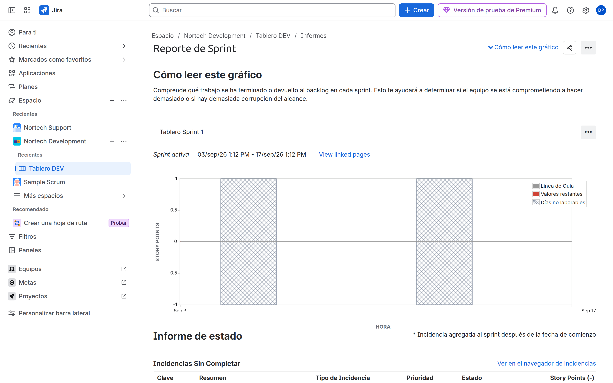
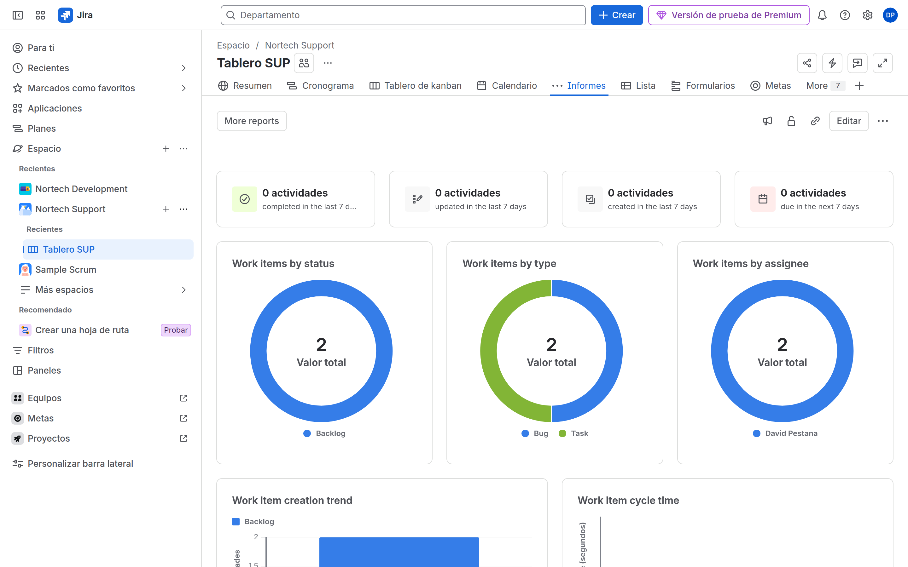
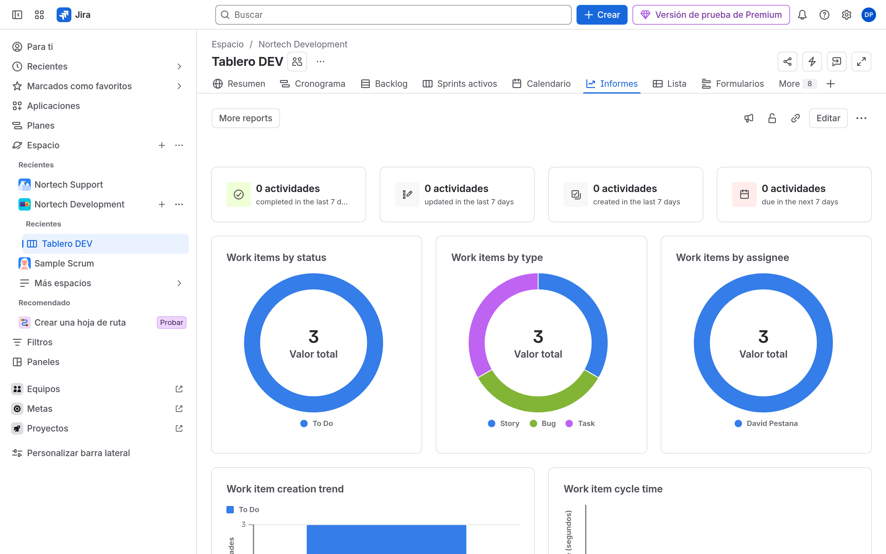

# M08-03 — Reports nativos

[← Página anterior](M08-02-dashboards-gadgets.md) · [Siguiente página →](M08-preparacion-examen.md)

### Objetivo

Abrir y leer tres informes: Sprint (Scrum), Cumulative Flow (Kanban) y Created vs Resolved.

### Prerrequisitos

- Sprint activo o cerrado en DEV. Movimiento de issues en SUP.

### En qué consiste

Reports en la barra del proyecto/board — no en el dashboard.

### 1 — Sprint report

**Acción:** DEV → tablero Scrum → **Informes** → **Informe de sprint**. Elige el sprint de M07.

**Por qué:** Completadas vs no completadas; scope change (issues añadidas a mitad).

**Resultado esperado:** Informe del sprint con lista de issues.

### 2 — Cumulative flow

**Acción:** SUP → **Informes** → **Diagrama de flujo acumulativo**. Rango de 2 semanas.

**Por qué:** Ensanchamiento = cuello de botella en un estado. ACP-620 muestra capturas de CFD.

**Resultado esperado:** Áreas apiladas por estado/columna.

### 3 — Created vs Resolved

**Acción:** DEV o SUP → **Informes** → **Creados frente a resueltos** (análisis).

**Por qué:** No es un gadget de dashboard por defecto; es report de proyecto. Saber **dónde** se abre es pregunta de examen.

**Resultado esperado:** Dos series en el tiempo.

### 4 — Otros que debes localizar (sin rellenar)

**Acción:** Abre el menú Reports y localiza: Burndown, Velocity, Control chart, Average age, Resolution time, Pie chart report. No hace falta configurar todos.

**Por qué:** El examen enseña una captura y pregunta *qué report es*.

**Resultado esperado:** Sabes en qué board/proyecto vive cada uno.

## Comprueba tu entendimiento

**Dónde**
Velocity: board Scrum. CFD: Kanban o Scrum. Filter Results: dashboard.
→ Si los buscas todos en el mismo menú, los vas a fallar.

## Reto

### 1 — Scope change

En un sprint activo, añade una issue a mitad. Mira el Sprint report.

Ver solución

Aparece como scope change (añadida). El burndown puede «subir». Eso predice el impacto de cambiar el alcance (dominio Managing projects).

## Errores frecuentes

| Síntoma | Causa probable | Cómo arreglarlo |
|---------|----------------|-----------------|
| No hay Sprint report | Estás en Kanban | Usa DEV Scrum |
| CFD plano | Pocas transiciones | Mueve 4–5 issues entre columnas |
| Velocity vacío | Menos de un sprint cerrado | Close sprint y Start otro |
