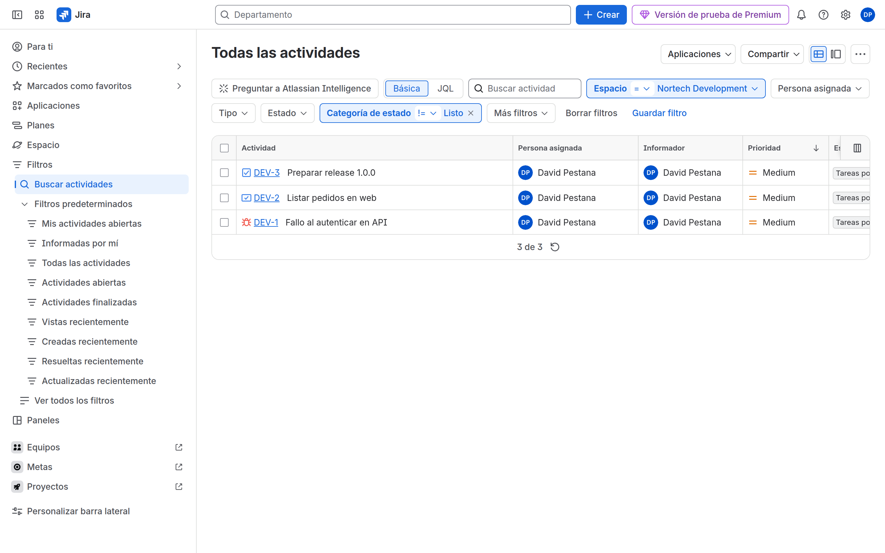
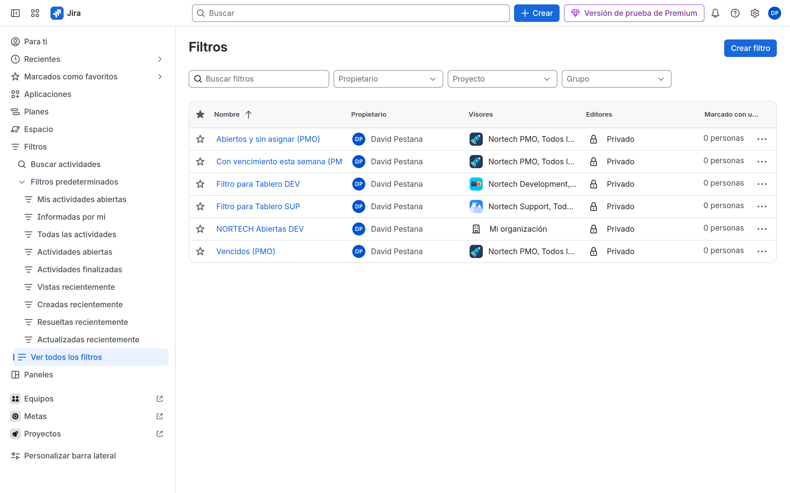

# M08 — JQL, dashboards y reports

[← Página anterior](../M07-tableros-agiles/M07-preparacion-examen.md) · [Siguiente página →](M08-01-jql-filtros.md)

## Qué aprenderás

- Escribir **JQL** útil (no solo `project = DEV`).
- Guardar **filtros** personales y compartidos.
- Montar un **dashboard** con gadgets.
- Distinguir gadgets de **reports** ágiles y de análisis.

Este bloque cubre el dominio **Reporting** de ACP-620 (15–20 %) y lo que Atos pidió explícito en el temario.

## Explicación

| Artefacto | Qué es |
|-----------|--------|
| **JQL** | Pregunta (`statusCategory != Done AND priority = Highest`) |
| **Filtro** | JQL guardado; se comparte con roles/grupos |
| **Gadget** | Widget de dashboard (Filter Results, Pie Chart, Assigned to Me) |
| **Agile report** | Burndown, Velocity, CFD, Control chart — viven en el **board** |
| **Issue analysis** | Created vs Resolved, Average age, Pie chart report — viven en **Informes** del espacio |

> [!WARNING]
> Un panel **compartido** con un filtro **privado** muestra error a los demás. Comparte el filtro primero.

JQL que sale en examen: `currentUser()`, `endOfDay()`, `WAS`, `CHANGED`, `sprint in openSprints()`, `fixVersion`, `component`, `statusCategory`.

## Demostración

1. **Filtros** → búsqueda avanzada → modo **JQL**:

```jql
project = DEV AND statusCategory != Done ORDER BY priority DESC
```



2. Guarda como `NORTECH DEV Abiertas` y comparte con el espacio DEV (o el grupo PMO).



3. **Paneles** → crea `NORTECH PMO` y añade Filter Results sobre ese filtro.


## Laboratorio

Te toca a ti.

| Lab | Título |
|-----|--------|
| M08-01 | [JQL y filtros](M08-01-jql-filtros.md) |
| M08-02 | [Dashboards](M08-02-dashboards-gadgets.md) |
| M08-03 | [Reports](M08-03-reports.md) |
| — | [Preparación para el examen ACP-620](M08-preparacion-examen.md) |

→ **[M08-01](M08-01-jql-filtros.md)**
