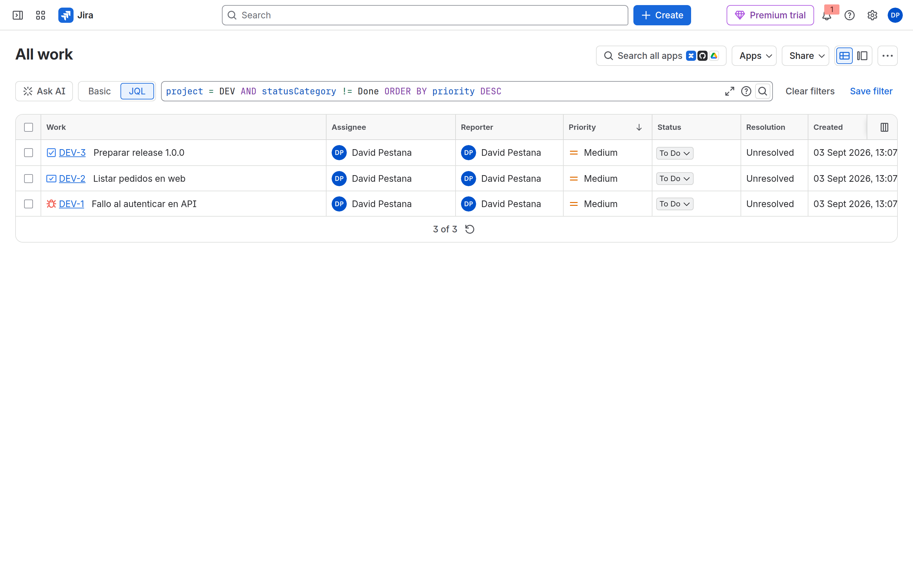
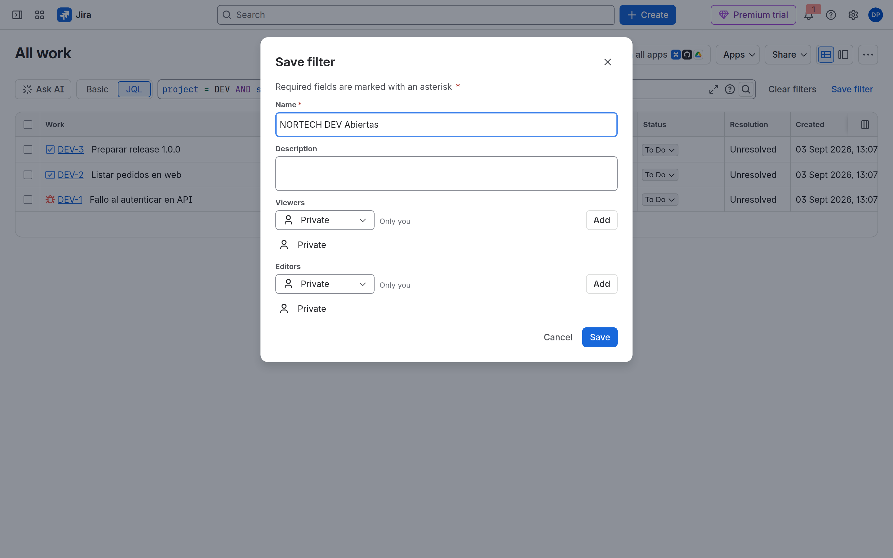
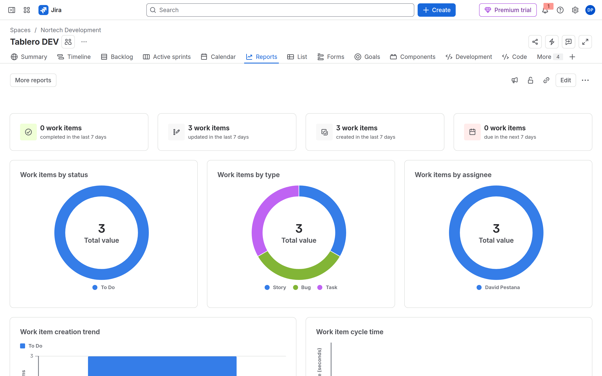
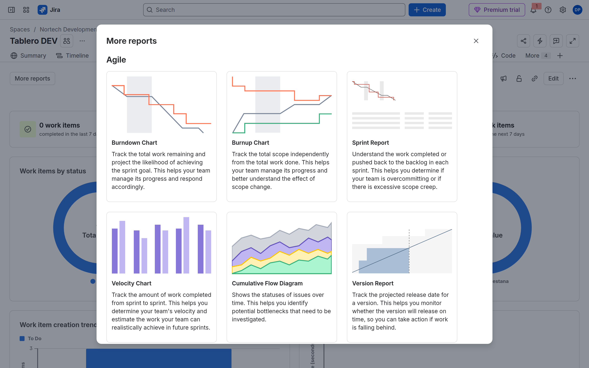
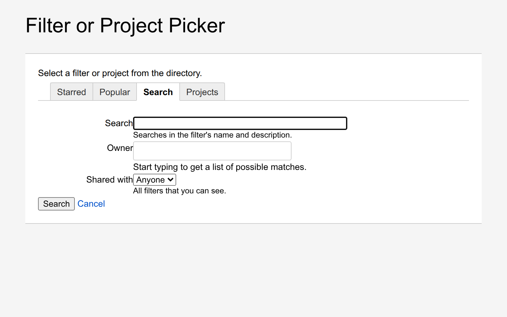
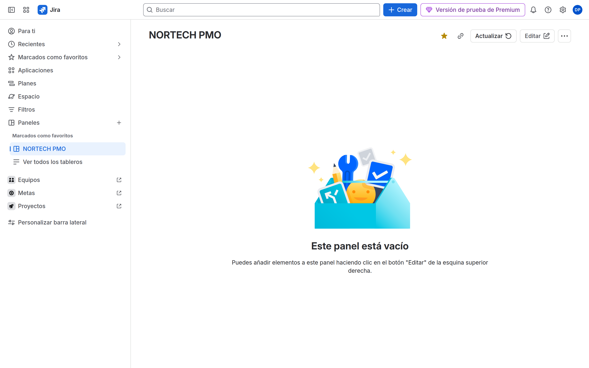

# M08 — JQL, dashboards y reports

[← Página anterior](../M07-tableros-agiles/M07-preparacion-examen.md) · [Siguiente página →](M08-01-jql-filtros.md)

## Qué aprenderás

- Escribir **JQL** útil (no solo `project = DEV`).
- Guardar **filtros** personales y compartidos.
- Montar un **dashboard** con gadgets.
- Distinguir gadgets de **reports** ágiles y de análisis.

Este bloque cubre el dominio **Reporting** de ACP-620 (15–20 %) y lo que Atos pidió explícito en el temario.

## Explicación

| Artefacto | Qué es |
|-----------|--------|
| **JQL** | Pregunta (`statusCategory != Done AND priority = Highest`) |
| **Filtro** | JQL **guardado**; es lo que informes y gadgets pueden elegir |
| **Gadget** | Widget de dashboard (Filter Results, Pie Chart, Assigned to Me) |
| **Space Insights** | Lo que abre la pestaña **Reports** (donuts). No es el Sprint report |
| **Agile report** | Burndown, Velocity, CFD, Sprint — **More reports** → Agile. Comen el **board filter** |
| **Issue analysis** | Pie Chart Report (filtro guardado), Created vs Resolved (tablero), Average age |

> [!WARNING]
> La pestaña **Reports** abre Space Insights. Sprint, CFD y Pie Chart están en **More reports**. El JQL se escribe en la búsqueda, se **guarda como filtro**, y solo entonces *Change Filter or Project…* (popup) o un gadget lo usan. Un panel compartido con un filtro **privado** falla.

JQL que sale en examen: `currentUser()`, `endOfDay()`, `WAS`, `CHANGED`, `sprint in openSprints()`, `fixVersion`, `component`, `statusCategory`.

## Demostración

Hazla en este orden. El detalle de cada clic está en [M08-03](M08-03-reports.md).

1. **Filtros** → All work. Pulsa **JQL** (junto a Basic; no te quedes en chips). Ejecuta:

```jql
project = DEV AND statusCategory != Done ORDER BY priority DESC
```

**Save filter** → nombre `NORTECH DEV Abiertas` → Viewers: **Add** el espacio DEV. Sin este filtro, ningún informe ni gadget puede «tragar» tu JQL.





2. Tablero DEV → pestaña **Reports**. Esto es Space Insights (donuts). El Sprint report **no** está aquí. **More reports** → Agile (Sprint, CFD…) o baja a **Issue analysis**.





3. **More reports** → **Pie Chart Report**. **Change Filter or Project…** (popup; no la lupa global) → elige `NORTECH DEV Abiertas`. Statistic Type: Status → **Next**.



4. **Paneles** → crea `NORTECH PMO` y añade Filter Results sobre el mismo filtro (M08-02). Velocity no vive en el panel: vive en More reports → Agile.



## Laboratorio

Te toca a ti.

| Lab | Título |
|-----|--------|
| M08-01 | [JQL y filtros](M08-01-jql-filtros.md) |
| M08-02 | [Dashboards](M08-02-dashboards-gadgets.md) |
| M08-03 | [Reports](M08-03-reports.md) |
| — | [Preparación para el examen ACP-620](M08-preparacion-examen.md) |

→ **[M08-01](M08-01-jql-filtros.md)**
