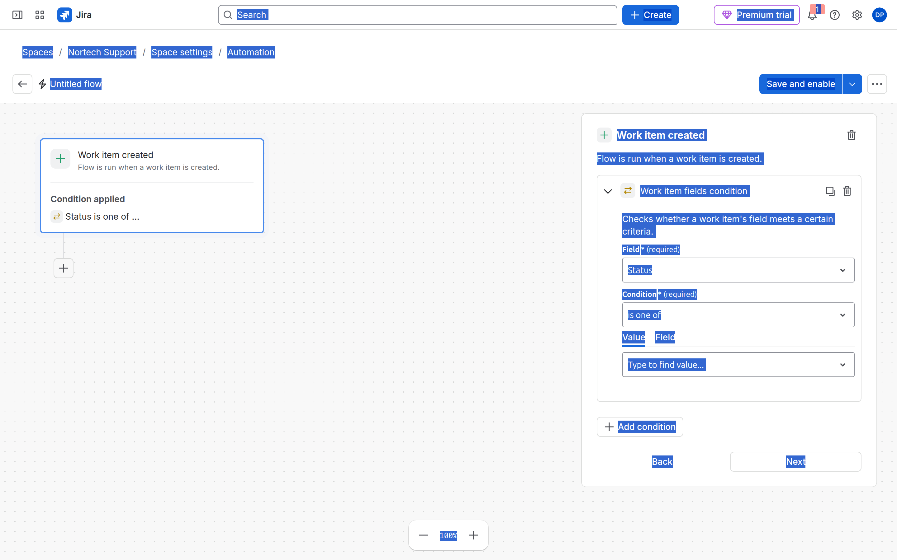
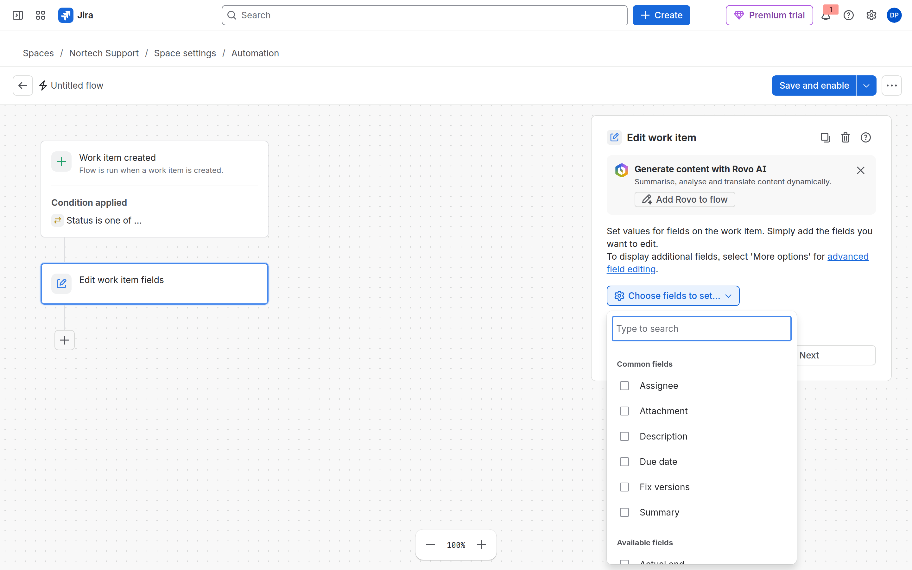
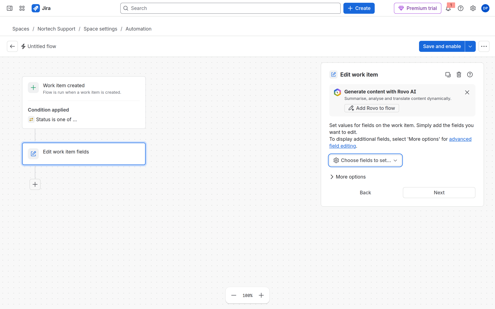
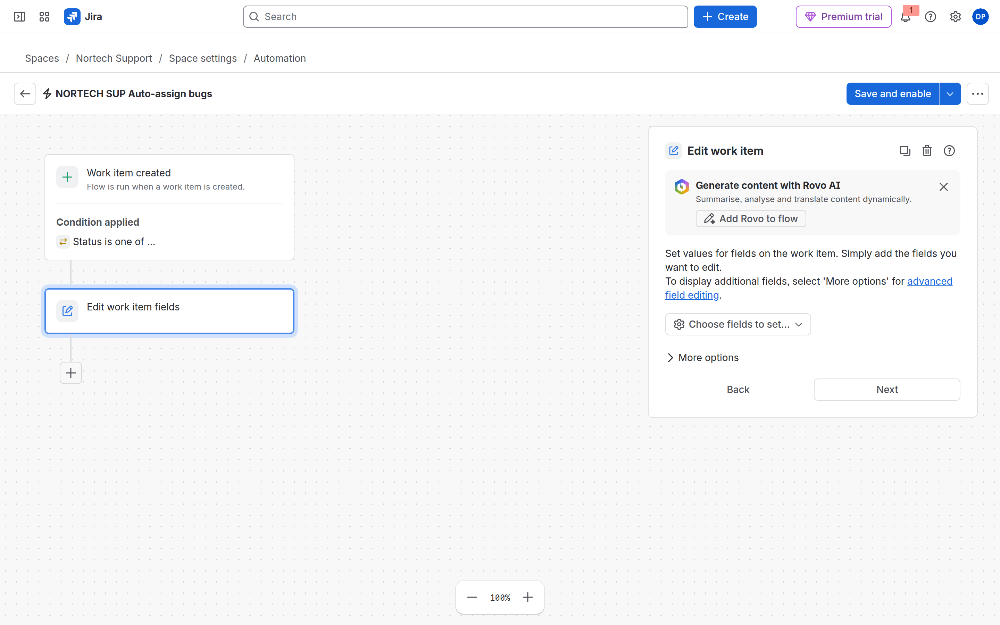
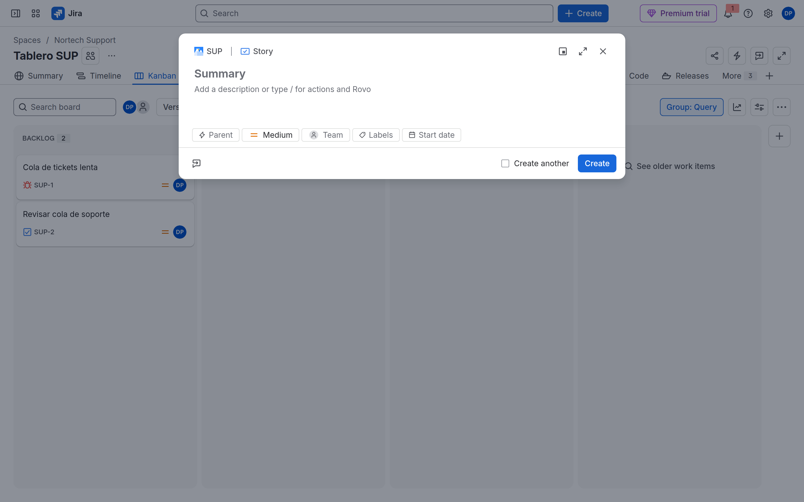

# M09-01 — Asignación automática de incidencias

[← Página anterior](README.md) · [Siguiente página →](M09-02-aprobaciones-escalados.md)

### Objetivo

Un flujo en **SUP** que, al crear un **Bug**, añade la etiqueta `auto-triaged`, asigna al component lead (o a un usuario fijo) y queda registrado en el **Audit log**.

### Prerrequisitos

- SUP (CMP) con componentes o un usuario asignable. Jira admin o space admin con Automation.
- Sabes abrir **Space settings → Automation** (`…/projects/SUP/settings/automate`).

### En qué consiste

Crear un flujo **de espacio** (no global) para no consumir cuota innecesaria en todo el site.

| Paso | Qué montas |
|------|------------|
| Trigger | **Work item created** |
| Condition | **Work item fields** → Work type = **Bug** |
| Actions | **Edit work item** (Labels) + **Assign work item** |
| Prueba | Crear Bug + leer **Audit log** |

---

### 1 — Abrir Automation en SUP

**Acción:** **Nortech Support** → **Space settings** → **Automation**. Comprueba que la pestaña activa es **Flows** y que el ámbito es *This space* / flujos del espacio.

**Por qué:** Un flujo global se ejecuta en todos los espacios; aquí solo quieres la cola de soporte.

**Resultado esperado:** Pantalla como la demo del README.

---

### 2 — Create flow → Create from scratch

**Acción:** **Create flow** → **Create from scratch**. **Skip tour** si aparece.

**Por qué:** Las plantillas no traen tu condición Bug + label concreta.

**Resultado esperado:** Lienzo con **Add a trigger**.

---

### 3 — Trigger: Work item created

**Acción:** **Add a trigger** → categoría **Work item triggers** → **Work item created**.

**Por qué:** Solo al **crear**; no al editar ni al transitar. Así no reasignas Tasks ni Stories de la misma cola.

**Resultado esperado:** Bloque *Work item created — Flow is run when a work item is created* y botón **Add condition** debajo.

---

### 4 — Condition: Work type = Bug

**Acción:** Pulsa **Add condition** → **Work item fields condition**.

1. **Field:** `Work type` (no confundir con Status).
2. **Condition:** `equals` / `is`.
3. **Value:** `Bug`.

**Por qué:** Sin esto, cualquier tipo creado en SUP dispararía el flujo.

**Resultado esperado:** Texto tipo *Condition applied* / *Work type equals Bug* en el lienzo.

---

### 5 — Action 1: Edit work item (Labels)

**Acción:** **Add step** → **Action** → busca **Edit work item** (antes *Edit issue fields*).

- Campo **Labels** → añade `auto-triaged` (sin borrar labels existentes si la UI lo permite).

**Por qué:** Clasificación automática para filtros y dashboards (M08).

**Resultado esperado:** Bloque de acción con el campo Labels.

---

### 6 — Action 2: Assign work item

**Acción:** **Add step** → **Action** → **Assign work item**.

- **Assignee:** *Component lead* si el Bug tiene componente; si no, elige un usuario del grupo `nortech-soporte` o el **Space owner**.

Opcional: otra condición **Advanced compare** / summary contains `DOWN` → **Edit work item** Priority = Highest.

**Por qué:** Triaje + propietario claro. El examen pregunta por **actor** y permisos de asignación.

**Resultado esperado:** Dos acciones bajo el trigger/condición.

---

### 7 — Nombre y publicación

**Acción:** Arriba, sustituye *Untitled flow* por `NORTECH SUP Auto-assign bugs`. Pulsa **Save and enable** (o **Turn on flow**).

**Por qué:** Un flujo guardado pero desactivado no corre; uno sin guardar se pierde al salir.

**Resultado esperado:** Flujo **enabled** en la lista **Flows**.

---

### 8 — Probar: crear Bug y leer Audit log

**Acción:** Abre el **Tablero SUP** → **Create**. Tipo **Bug**, summary `Prueba auto-assign M09`. Crea.

1. Abre el Bug creado: comprueba **Assignee** y label `auto-triaged`.
2. **Space settings → Automation → Flows** → abre `NORTECH SUP Auto-assign bugs` → pestaña **Audit log**.

**Por qué:** Si ves **FAIL**, el mensaje indica permiso, campo o actor. No reescribas el flujo a ciegas.

**Resultado esperado:** Entrada **SUCCESS** reciente; Bug asignado y etiquetado.

---

## Comprueba tu entendimiento

**Actor**
Rule details / Flow details → **Actor**.
→ Automation for Jira debe tener **Assign Issues** en el scheme NORTECH (a menudo vía rol atlassian-addons o permiso para logged-in users).

## Reto

### 1 — No pises el component lead nativo

Si ya usas Default assignee = component lead (M03), ¿hace falta este flujo?

Ver solución

No para la asignación simple. El flujo aporta label, prioridad por texto y ramas. En examen: elige el mecanismo más simple que cumpla el requisito.

## Errores frecuentes

| Síntoma | Causa probable | Cómo arreglarlo |
|---------|----------------|-----------------|
| No corre | Scope, trigger, work type condition | Audit log del flujo |
| FAIL assign | Actor sin permiso / usuario no Assignable | Permission scheme SUP |
| Cuota agotada | Plan Free + muchos flujos **Scheduled** | Pestaña **Usage**; desactiva demos |
| UI en inglés | Preferencia de usuario/site | Misma ruta; *Work item* = elemento de trabajo |
