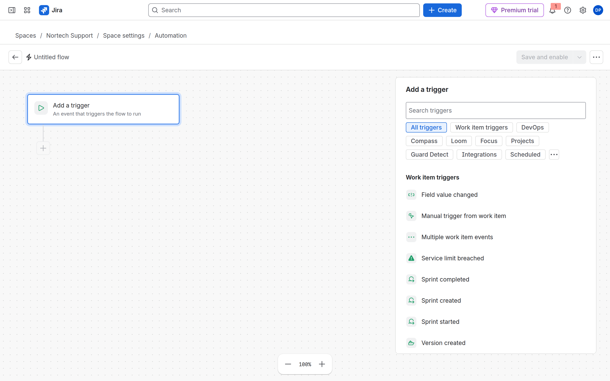
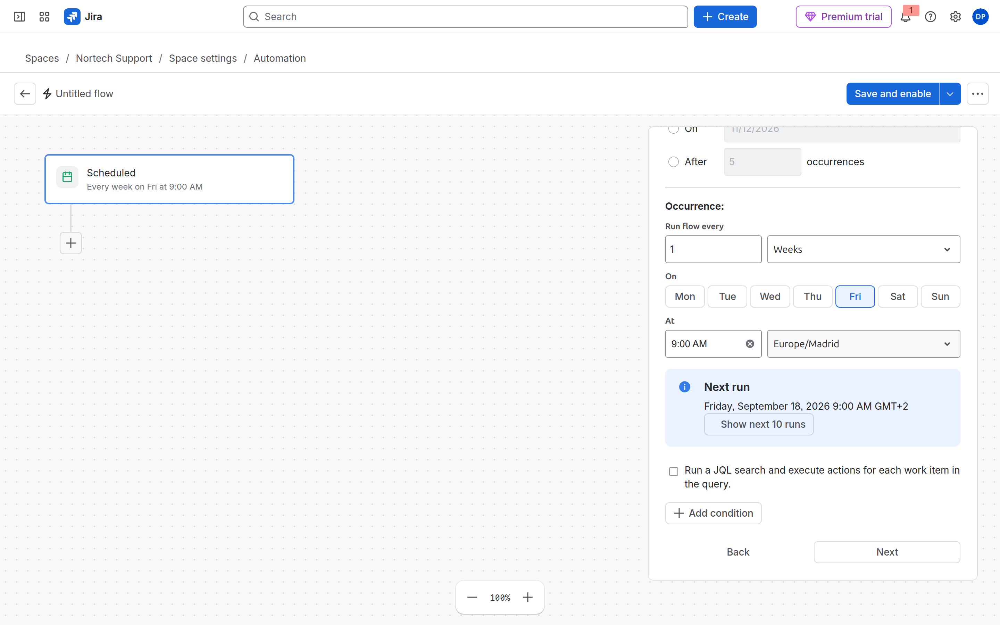
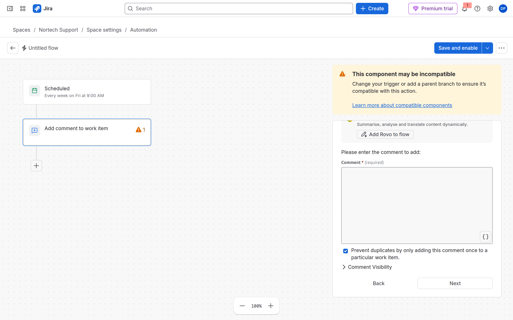
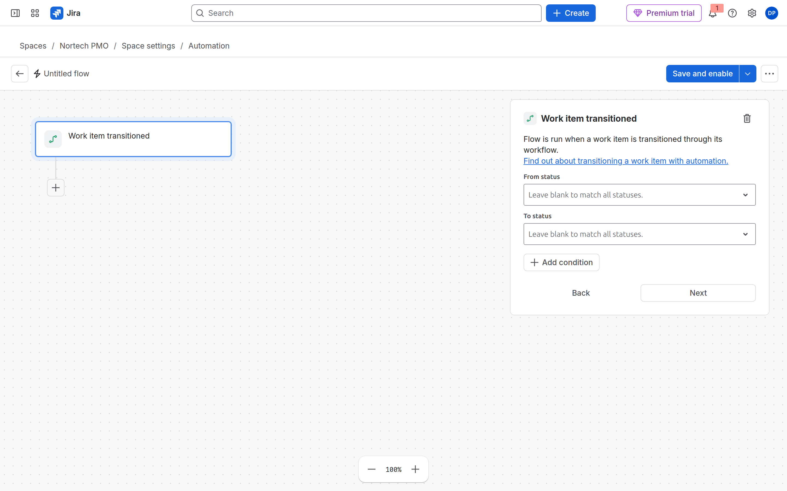
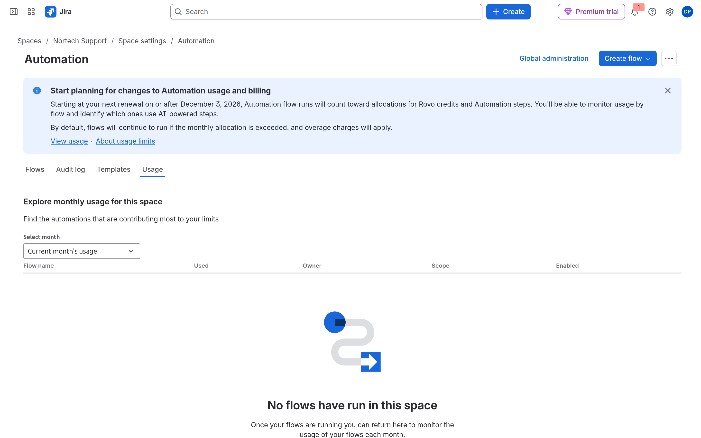

# M09-02 — Automatización de aprobaciones y escalados

[← Página anterior](M09-01-asignacion-automatica.md) · [Siguiente página →](M09-03-tareas-derivadas.md)

### Objetivo

Dos flujos:

1. **SUP** — escalado de tickets **Highest** sin actualizar (comentario automático).
2. **PMO** — comentario al pasar a **In Review** (aviso de aprobación).

### Prerrequisitos

- M09-01 (sabes crear y publicar flujos). PMO con transición hacia *In Review* si la configuraste en M05.

### En qué consiste

| Flujo | Trigger | Acción principal |
|-------|---------|------------------|
| `NORTECH SUP Escalate stale highest` | **Scheduled** + JQL | **Comment on work item** |
| PMO aprobación | **Work item transitioned** → In Review | **Comment** + opcional assign |

---

### 1 — Flujo de escalado en SUP (Scheduled)

**Acción:** **SUP → Space settings → Automation → Create flow → Create from scratch**.

**Acción (trigger):** **Add a trigger** → pestaña o categoría **Scheduled** → elige el trigger **Scheduled** (icono JQL / reloj).

**Por qué:** **Scheduled** barre JQL periódicamente. **Work item commented** aquí provocaría bucles si la acción comenta.

**Resultado esperado:** Panel de configuración con campo JQL y frecuencia.





---

### 2 — JQL del escalado

**Acción:** En el trigger **Scheduled**, pega:

```jql
project = SUP AND priority = Highest AND statusCategory != Done AND updated <= -1d
```

- **Frecuencia:** diaria (o la mínima que permita tu plan).
- **En el lab:** si el scheduler tarda o está limitado en trial, usa **Run now** / ejecución manual desde el flujo para la foto de **Audit log**.

**Por qué:** «Sin actualización reciente» = `updated <= -1d`. `statusCategory != Done` sobrevive a renombres de estado.

**Resultado esperado:** JQL válido sin error rojo en el editor.

---

### 3 — Action: comentario de escalado

**Acción:** **Add step** → **Action** → **Comment on work item** (o *Add comment*).

Texto del comentario:

```text
Escalado automático: sin actualización reciente.
```

Opcional (segundo **Add step**): **Edit work item** → reafirma Priority **Highest**, o **Assign work item** → project lead.

**Por qué:** El escalado visible para el equipo va en el ticket; el workflow no sustituye este aviso.

**Resultado esperado:** Acción de comentario en el lienzo.



---

### 4 — Publicar flujo SUP

**Acción:** Nombre: `NORTECH SUP Escalate stale highest`. **Save and enable**.

**Resultado esperado:** Flujo enabled en SUP.

---

### 5 — Flujo de aprobación en PMO

**Acción:** **Nortech PMO → Space settings → Automation → Create flow → Create from scratch**.

**Trigger:** **Work item transitioned**.

- Configura el destino **In Review** (o el nombre exacto de tu workflow PMO).
- **Condition (opcional):** **Work item fields** → Work type = *Task* / *Solicitud*.

**Action:** **Comment on work item** → `Pendiente de aprobación por PMO.`

Opcional: **Assign work item** → space owner.

**Por qué:** El workflow pone el estado; automation **avisa**. No sustituyas el workflow por el flujo.

**Resultado esperado:** Trigger de transición con estado destino visible.



---

### 6 — Probar PMO

**Acción:** Crea o abre una Task en PMO. Transita al estado que dispara **In Review** (p. ej. *Submit for review*). Recarga la issue.

**Resultado esperado:** Comentario automático visible en **Activity**.

---

### 7 — Audit log y Usage

**Acción:** En **SUP** y **PMO**, abre cada flujo → **Audit log**. Filtra por fecha reciente.

**Acción extra:** Pestaña **Usage** del espacio (o **Global administration** → `/jira/settings/automation` → **Usage**) para ver consumo del plan.

**Por qué:** «No disparó» vs «disparó y falló» se distinguen aquí. Gobierno: no dejes diez flujos **Scheduled** en trial.

**Resultado esperado:** Entradas recientes o mensaje claro de FAIL.




---

## Comprueba tu entendimiento

**Scheduled vs event**
Scheduled barre JQL; **Work item transitioned** reacciona al momento.
→ Para «cuando aprueban», usa transitioned. Para «llevan 2 días sin tocar», scheduled.

## Reto

### 1 — Evitar loop

Si la regla comenta y el trigger fuera **Work item commented**, ¿qué pasa?

<details>
<summary>Ver solución</summary>

Bucle. Mitigación: condition «comment no contiene Escalado automático», otro trigger, o regla «only once per issue» si la UI lo ofrece.

</details>

## Errores frecuentes

| Síntoma | Causa probable | Cómo arreglarlo |
|---------|----------------|-----------------|
| Scheduled no corre | Plan / retraso horas | Manual run + Audit log para el lab |
| Doble comentario | Dos flujos iguales | Desactiva duplicados en **Flows** |
| Transición no dispara | Nombre de estado distinto | Ajusta destino en el trigger |
| 404 en Automation | URL antigua `/settings/automation` del espacio | Usa `/settings/automate` |
