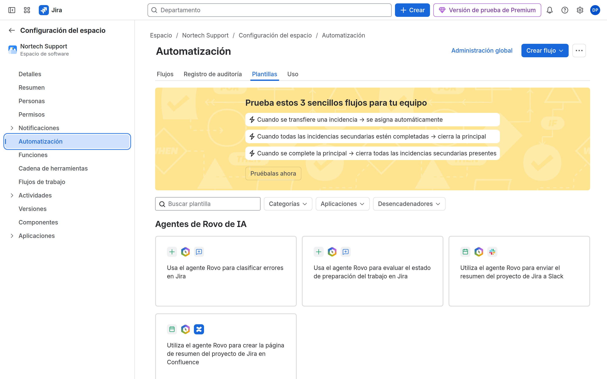

# M09-02 — Automatización de aprobaciones y escalados

[← Página anterior](M09-01-asignacion-automatica.md) · [Siguiente página →](M09-03-tareas-derivadas.md)

> Práctica del módulo. La teoría y la demo están en el [README del módulo](README.md).

### Objetivo

Regla que escala (comentario + prioridad) y otra que notifica al pasar a In Review en PMO.

### Prerrequisitos

- M09-01 (sabes publicar reglas). PMO con workflow de aprobación si lo hiciste.

### En qué consiste

Scheduled o Field value changed + Comment + Edit priority. Segunda regla: Issue transitioned.

### 1 — Escalado

**Acción:** Regla en SUP `NORTECH SUP Escalate stale highest`.

- Trigger: **Scheduled** (cada día) o, más fácil para el lab, **Issue commented** no. Usa **Field value changed** no. **Mejor para demo:** Trigger **Scheduled** con JQL:

```jql
project = SUP AND priority = Highest AND statusCategory != Done AND updated <= -1d
```

Si el scheduler está limitado en el trial, usa Trigger **Manual** para la prueba.

- Action: **Comment** `Escalado automático: sin actualización reciente.`
- Action: **Edit issue** Priority → Highest (ya lo es) o Assignee → project lead.

**Por qué:** Escalado + notificación, propuesta formativa.

**Resultado esperado:** Regla on. Ejecución manual SUCCESS.



### 2 — Aprobación (PMO)

**Acción:** PMO → **Automatización**. Disparador: **Transición** → destino `In Review`. Condición: tipo = Solicitud (o Task). Acción: **Comentar** `Pendiente de aprobación por PMO.` Acción opcional: asignar al responsable del espacio.

**Por qué:** El workflow pone el estado; automation avisa. No sustituyas el workflow por la regla.

**Resultado esperado:** Al transitar Submit, aparece el comentario.

### 3 — Audit log

**Acción:** Abre ambas reglas → **Registro de auditoría** tras la prueba.

**Por qué:** Troubleshoot: «no disparó» vs «disparó y falló».

**Resultado esperado:** Entradas recientes.


## Comprueba tu entendimiento

**Scheduled vs event**
Scheduled barre JQL; transitioned reacciona al momento.
→ Para «cuando aprueban», usa transitioned. Para «llevan 2 días», scheduled.

## Reto

### 1 — Evitar loop

Si la regla comenta y el trigger fuera Issue commented, ¿qué pasa?

<details>
<summary>Ver solución</summary>

Bucle. Mitigación: condition «comment no contiene Escalado automático», o trigger distinto, o «Only include issues that have not been recently updated by this rule».

</details>

## Errores frecuentes

| Síntoma | Causa probable | Cómo arreglarlo |
|---------|----------------|-----------------|
| Scheduled no corre | Plan / retraso | Manual trigger para el lab |
| Doble comentario | Dos reglas | Desactiva duplicados |
