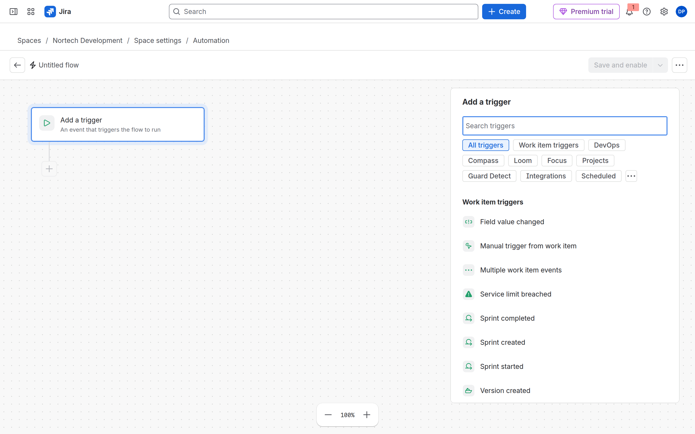
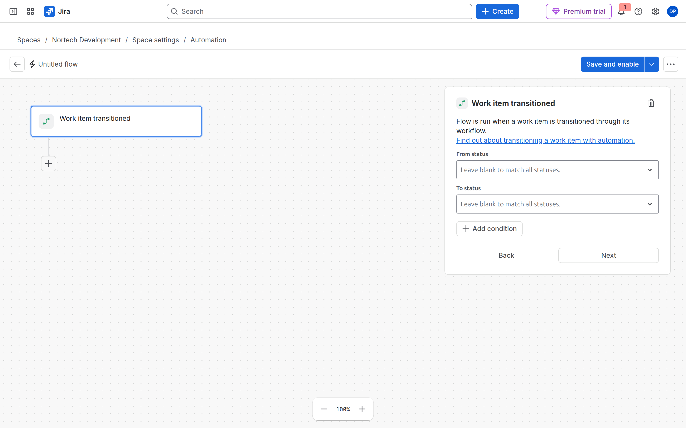
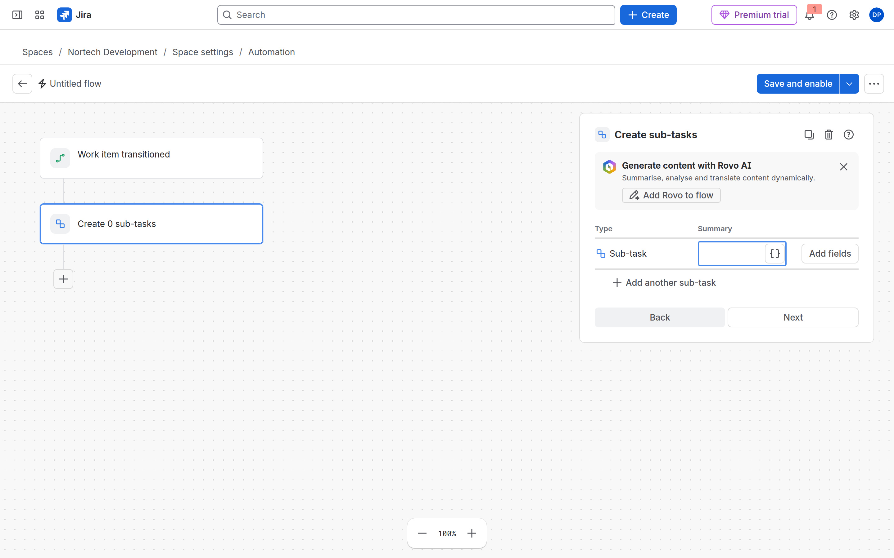
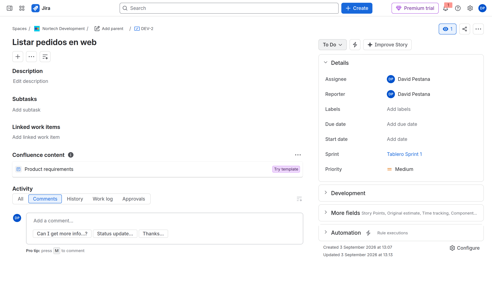

# M09-03 — Creación automática de tareas

[← Página anterior](M09-02-aprobaciones-escalados.md) · [Siguiente página →](M09-preparacion-examen.md)

### Objetivo

Al pasar una **Story** de **DEV** a **In Progress**, crear dos subtareas (**QA** y **Docs**) sin entrar en bucle infinito.

### Prerrequisitos

- DEV con tipos Story y Sub-task en el scheme (M04/M06). Automation en el espacio.

### En qué consiste

| Elemento | Valor |
|----------|--------|
| Trigger | **Work item transitioned** → **In Progress** |
| Condition | Work type = **Story** (+ opcional: subtasks empty) |
| Action | **Create sub-tasks** (×2 con smart values) |

---

### 1 — Abrir Automation en DEV

**Acción:** **Nortech Development → Space settings → Automation**. **Create flow → Create from scratch**.

**Por qué:** Las subtareas pertenecen al espacio DEV; el flujo debe ser de espacio, no global.

**Resultado esperado:** Editor vacío en DEV.

---

### 2 — Trigger: Work item transitioned → In Progress

**Acción:** **Add a trigger** → **Work item transitioned**.

- **Destination status / To status:** `In Progress` (o el nombre exacto de tu columna *In Progress* en el tablero).

**Por qué:** Dispara al **mover** la Story, no al crearla.

**Resultado esperado:** Bloque de transición con estado destino.

---

### 3 — Condition: solo Story

**Acción:** **Add condition** → **Work item fields condition** → **Work type** `equals` **Story**.

Opcional: **JQL condition** → `issue.subtasks is EMPTY` para no duplicar si alguien reabre la Story.

**Por qué:** Las **Sub-task** también transitan; sin condición, cada subtarea crearía nietos → cientos de issues.

**Resultado esperado:** Condición visible bajo el trigger.

---

### 4 — Action: Create sub-tasks

**Acción:** **Add step** → **Action** → **Create sub-tasks** (o crea dos acciones **Create work item** type Sub-task si tu UI no muestra sub-tasks).

| Sub-task | Summary |
|----------|---------|
| 1 | `QA — {{issue.key}}` |
| 2 | `Docs — {{issue.key}}` |

Smart value: escribe `{{issue.key}}` sin espacios raros; Atlassian lo sustituye por `DEV-42`, etc.

**Por qué:** Tareas derivadas de la propuesta formativa; el prefijo identifica el padre en listas.

**Resultado esperado:** Dos bloques de creación o un asistente de subtareas.

---

### 5 — Publicar y probar

**Acción:** Nombre: `NORTECH DEV Subtasks on start`. **Save and enable**.

**Prueba:** Abre una **Story** en *To Do* → transita a **In Progress** (*Start*). Abre la Story en el panel lateral o vista completa.

**Por qué:** Si ves 20 subtareas, **desactiva el flujo ya** y revisa la condition Work type.

**Resultado esperado:** Exactamente dos subtareas bajo la Story.

---

### 6 — Branch opcional (examen)

**Acción:** **Add step** → **Branch** → **Related work items** / **Sub-tasks** → **Assign work item** → current user.

**Por qué:** El ACP-620 pregunta por **branches** (For each sub-task…).

**Resultado esperado:** Subtareas asignadas al usuario que movió la Story.

---

## Comprueba tu entendimiento

**Por qué no explota**
La condition Work type = Story.
→ Las subtareas no vuelven a crear nietos.

## Reto

### 1 — Linked issue en vez de subtask

Crea un Task en OPS vinculado `blocks` al transitar a Done una Story.

Ver solución

Action **Create work item** (project OPS) + **Link work items** (blocks). Scope multi-espacio o global. Más cuota y más permisos.

## Errores frecuentes

| Síntoma | Causa probable | Cómo arreglarlo |
|---------|----------------|-----------------|
| Cientos de issues | Loop | Work type = Story; desactiva flujo |
| No crea subtask | Sub-task no en issue type scheme | Scheme NORTECH incluye Sub-task |
| Smart value literal | Mal escrito | `{{issue.key}}` en summary |
| Trigger no sale | Columna ≠ estado workflow | Usa nombre de **status**, no de columna si difieren |
