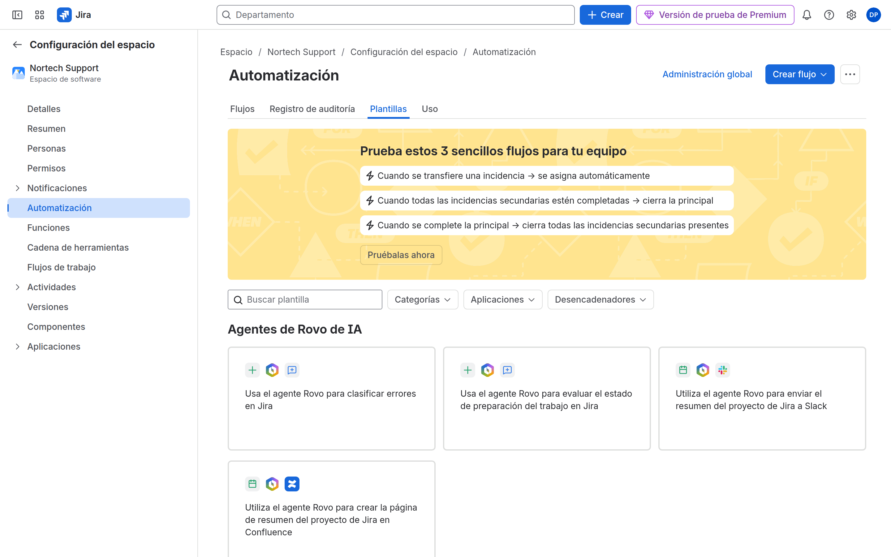
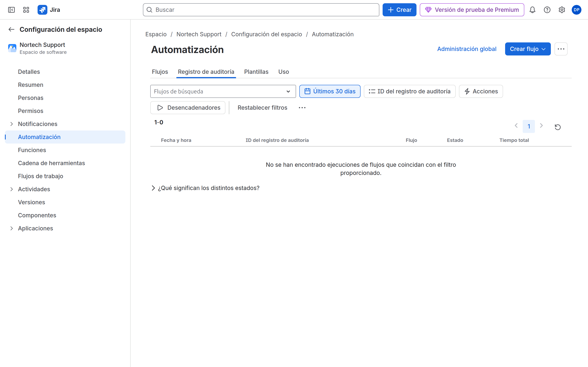

# M09 — Automatización

[← Página anterior](../M08-jql-dashboards-reports/M08-preparacion-examen.md) · [Siguiente página →](M09-01-asignacion-automatica.md)

## Qué aprenderás

- Elegir entre bulk change, workflow y **Automation**.
- Montar reglas: trigger, condition, action, branch, smart values.
- Leer el **registro de auditoría** de la regla y evitar bucles.
- Cubrir los tres labs de la propuesta: asignación, escalados, tareas derivadas.

## Explicación

| Vía | Cuándo |
|-----|--------|
| **Bulk change** | Una vez, muchas issues, humano al volante |
| **Workflow** (post function) | Siempre que se transita, sin ifs ricos |
| **Automation** | Eventos, JQL, branches, varios proyectos |
| **Apps** | Lo que nativo no cubre (gobierno Marketplace en M10) |

Anatomía: **When** (trigger) → **If** (conditions) → **Then** (actions). **For each** = branch (subtasks, linked issues). Smart values: `{{issue.key}}`, `{{issue.assignee.displayName}}`.

> [!WARNING]
> La regla se ejecuta como un **actor** (Automation for Jira o un usuario). Si el actor no tiene Assign Issues, la acción falla. El registro de auditoría lo dice.

Alcance: espacio vs múltiple vs global. En trial, respeta los **límites de ejecuciones** del plan.

## Demostración

1. SUP → **Configuración del espacio** → **Automatización** → crear regla. Disparador: trabajo creado.

2. Crea un Bug de prueba y abre el **registro de auditoría** de la regla: SUCCESS o el error de permiso.

## Laboratorio

Te toca a ti.

| Lab | Título |
|-----|--------|
| M09-01 | [Asignación automática](M09-01-asignacion-automatica.md) |
| M09-02 | [Aprobaciones y escalados](M09-02-aprobaciones-escalados.md) |
| M09-03 | [Tareas derivadas](M09-03-tareas-derivadas.md) |
| — | [Preparación para el examen ACP-620](M09-preparacion-examen.md) |

→ **[M09-01](M09-01-asignacion-automatica.md)**
