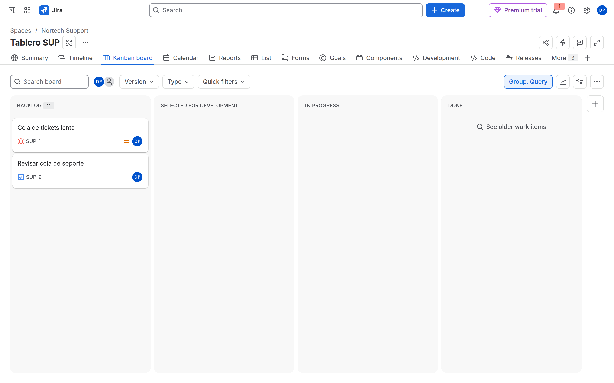
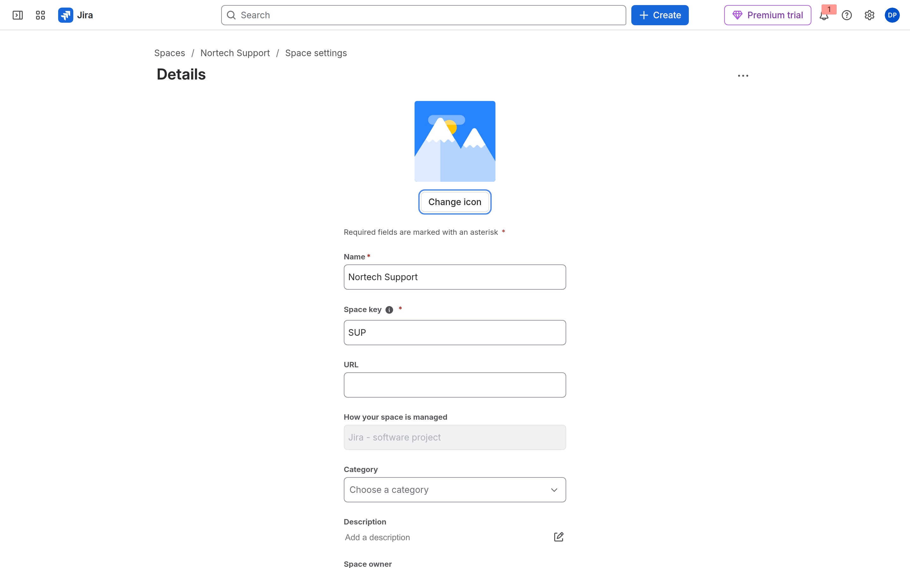
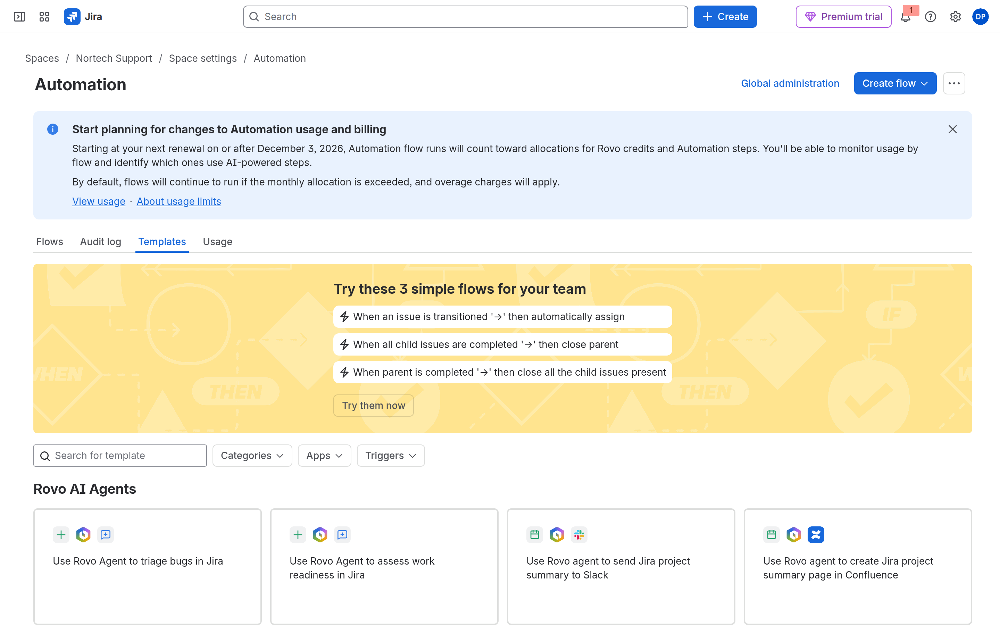
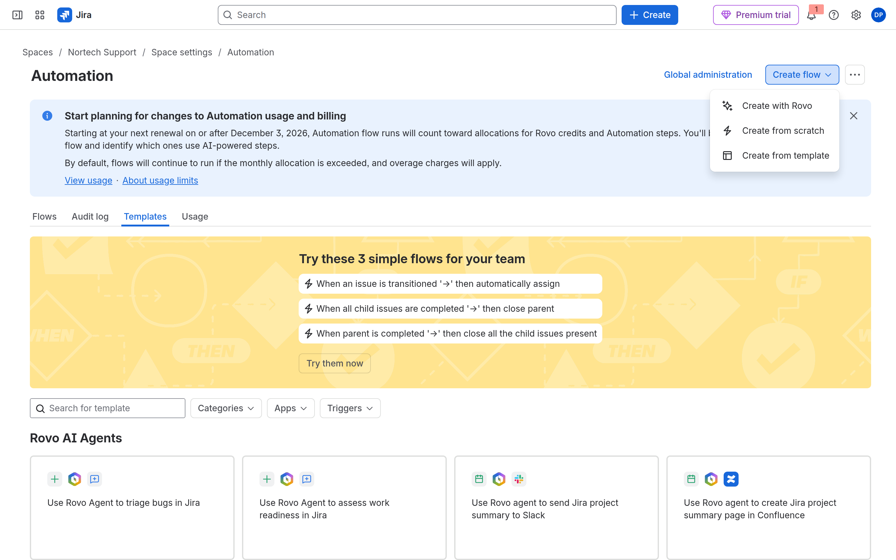
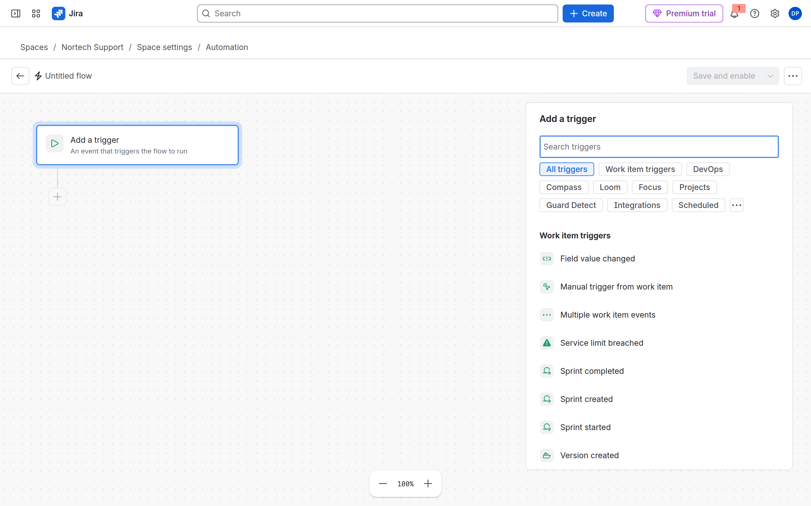
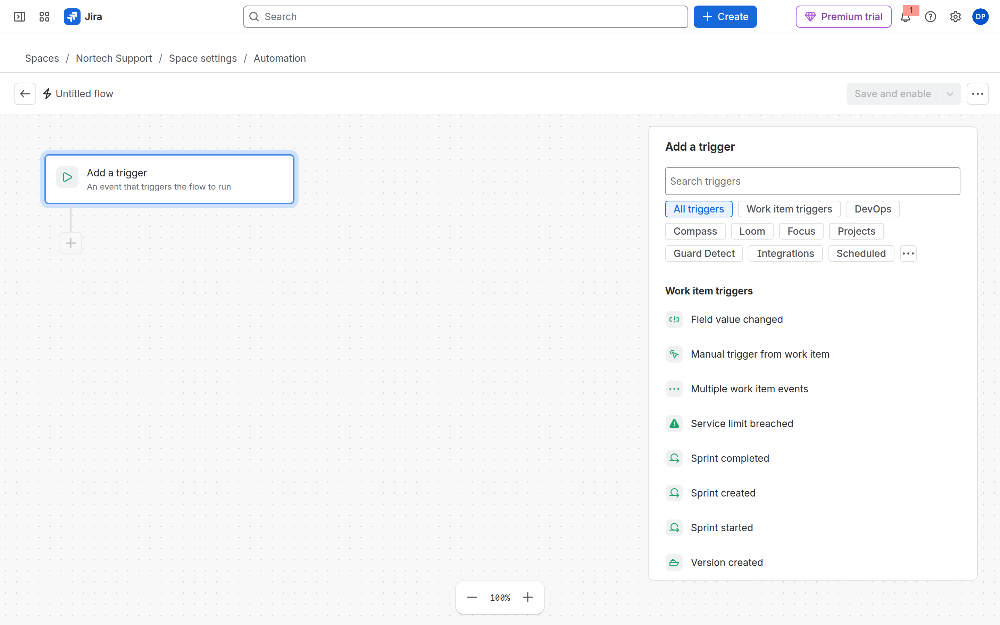
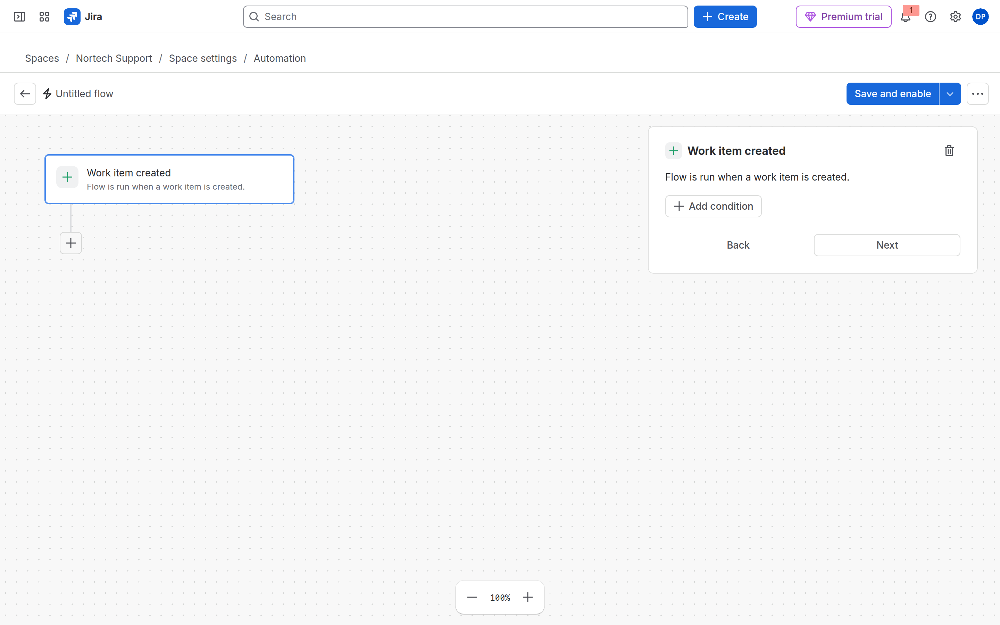
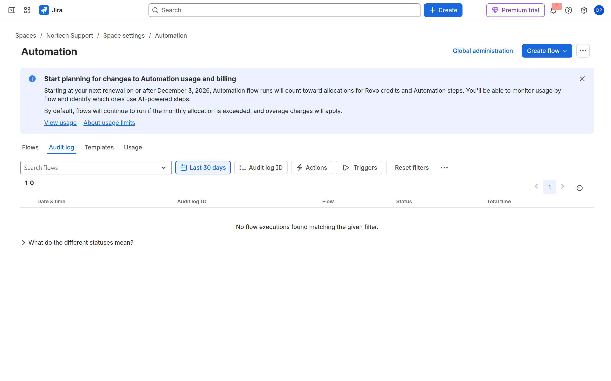

# M09 — Automatización

[← Página anterior](../M08-jql-dashboards-reports/M08-preparacion-examen.md) · [Siguiente página →](M09-01-asignacion-automatica.md)

## Qué aprenderás

- Elegir entre bulk change, workflow y **Automation**.
- Montar flujos: trigger → condition → action → branch → smart values.
- Leer el **Audit log** del flujo y evitar bucles.
- Cubrir los tres labs de la propuesta: asignación, escalados, tareas derivadas.

## Explicación

| Vía | Cuándo |
|-----|--------|
| **Bulk change** | Una vez, muchas work items, humano al volante |
| **Workflow** (post function) | Siempre que se transita, sin condiciones ricas |
| **Automation** | Eventos, JQL, branches, varios espacios |
| **Apps** | Lo que nativo no cubre (gobierno Marketplace en M10) |

Anatomía: **When** (trigger) → **If** (conditions) → **Then** (actions). **Branch** = ramas (subtasks, linked work items). Smart values: `{{issue.key}}`, `{{issue.assignee.displayName}}`.

> [!WARNING]
> El flujo se ejecuta como un **actor** (Automation for Jira o un usuario). Si el actor no tiene **Assign Issues**, la acción falla. El **Audit log** del flujo lo dice en FAIL.

**Alcance:** espacio (recomendado en el curso) vs global. En trial, respeta los **límites de ejecuciones** del plan (pestaña **Usage**).

### Ruta en Jira 2026 (no te pierdas)

La URL antigua `/settings/automation` redirige o da 404. La ruta correcta es:

**Nortech Support** → barra lateral del espacio → **Space settings** / **Configuración del espacio** → en el submenú izquierdo, **Automation** / **Automatización**.

URL directa (SUP): `…/jira/software/c/projects/SUP/settings/automate`

La UI puede estar en **inglés** aunque el curso esté en español: *Create flow*, *Work item created*, *Audit log*, *Save and enable*.

| Lo que buscas | Nombre en UI 2026 |
|---------------|-------------------|
| Regla | **Flow** / flujo |
| Issue | **Work item** / elemento de trabajo |
| Crear regla | **Create flow** → **Create from scratch** |
| Issue created | **Work item created** |
| Registro de auditoría | Pestaña **Audit log** (dentro del espacio o global) |

---

## Demostración

Sigue estos pasos en **Nortech Support (SUP)**. Cada número = un gesto + captura.

### 1 — Entra al tablero y abre configuración del espacio

**Acción:** Sidebar → **Spaces** → **Nortech Support**. Abre el **Tablero SUP** (Kanban). En la barra del espacio (Summary, Timeline, Kanban board…), localiza el acceso a **Space settings**. Si no lo ves, usa el menú **•••** junto al nombre del espacio.

**Por qué:** Automation vive en **configuración del espacio**, no en el menú global **Settings** (⚙️) de Jira.

**Resultado esperado:** Estás en el contexto SUP, no en otro espacio.

---

### 2 — Sidebar de Space settings: Automation

**Acción:** Pulsa **Space settings**. En el submenú izquierdo verás **Details**, **People**, **Permissions**, **Automation**, **Workflows**… Pulsa **Automation**.

**Por qué:** Cada espacio tiene su propia lista de flujos. Un flujo de SUP no debe ejecutarse en DEV salvo que lo diseñes multi-espacio (más cuota y más permisos).

**Resultado esperado:** Título **Automation**, breadcrumb *Space / Nortech Support / Space settings / Automation*.

---

### 3 — Pestaña Flows y Create flow

**Acción:** Comprueba las pestañas **Flows**, **Audit log**, **Templates**, **Usage**. Pulsa **Create flow** (arriba a la derecha).

**Por qué:** **Templates** acelera demos; en examen suelen pedirte **Create from scratch** para controlar trigger y condiciones.

**Resultado esperado:** Menú con *Create from scratch*, *Create from template*, *Create with Rovo*.

---

### 4 — Editor vacío: Add a trigger

**Acción:** **Create from scratch**. Si aparece un tour (*Let's create your first flow*), pulsa **Skip tour**. En el lienzo, pulsa **Add a trigger**.

**Por qué:** Sin trigger no hay flujo. El trigger define *cuándo* entra la automatización.

**Resultado esperado:** Panel lateral con categorías (*Work item triggers*, *Scheduled*, …).

---

### 5 — Trigger Work item created + Audit log

**Acción:** Elige **Work item created**. Guarda mentalmente la cadena: trigger → **Add condition** → **Add step** (Action). **No publiques aún** en la demo rápida; en el lab M09-01 completarás acciones y **Save and enable**.

Para ver ejecuciones: vuelve a **Flows**, abre un flujo → pestaña **Audit log**. Tras crear un Bug de prueba verás **SUCCESS** o el error (permiso, actor).

**Resultado esperado:** Trigger configurado; sabes dónde mirar si «no corre».

---

## Laboratorio

Te toca a ti.

| Lab | Título |
|-----|--------|
| M09-01 | [Asignación automática](M09-01-asignacion-automatica.md) |
| M09-02 | [Aprobaciones y escalados](M09-02-aprobaciones-escalados.md) |
| M09-03 | [Tareas derivadas](M09-03-tareas-derivadas.md) |
| — | [Preparación para el examen ACP-620](M09-preparacion-examen.md) |

→ **[M09-01](M09-01-asignacion-automatica.md)**
