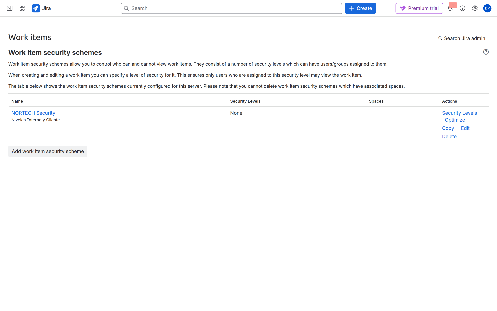
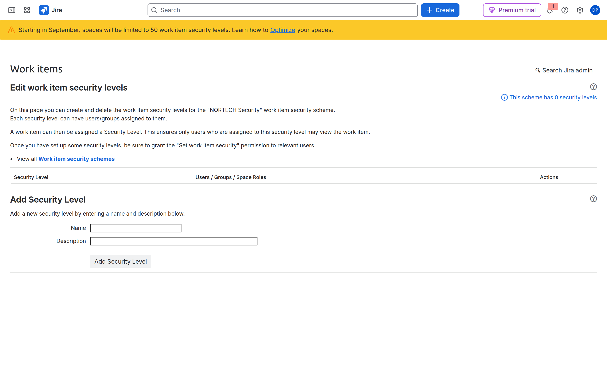
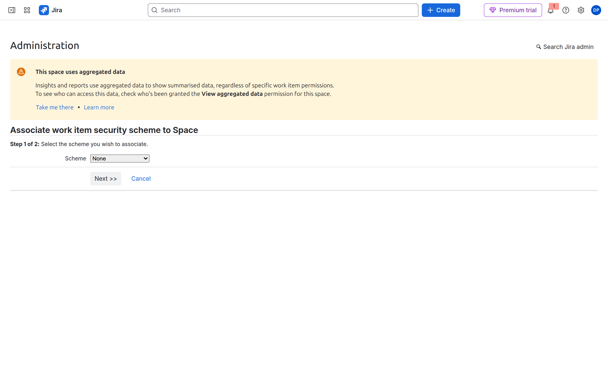
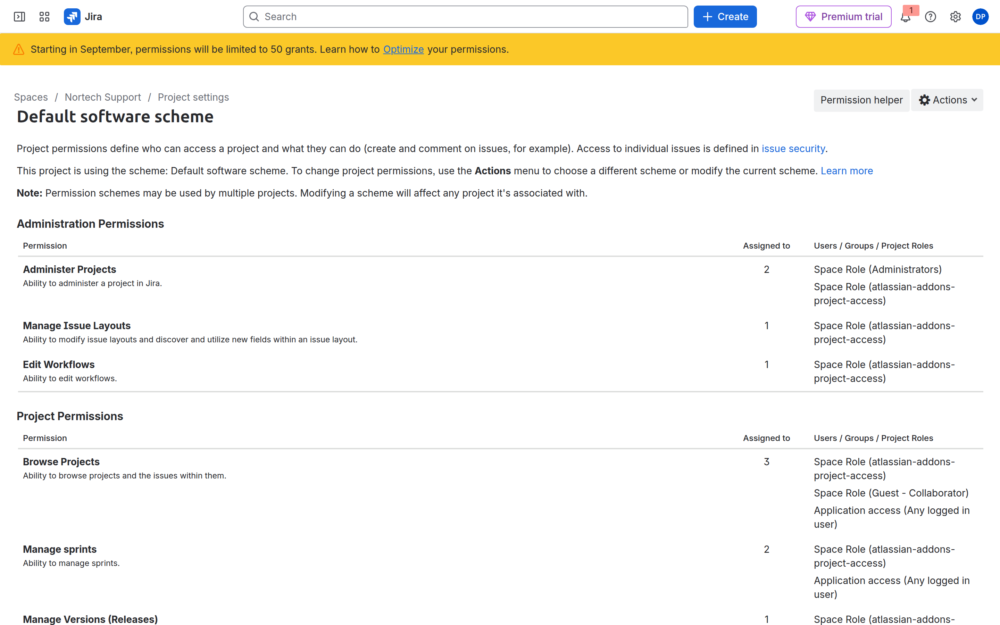
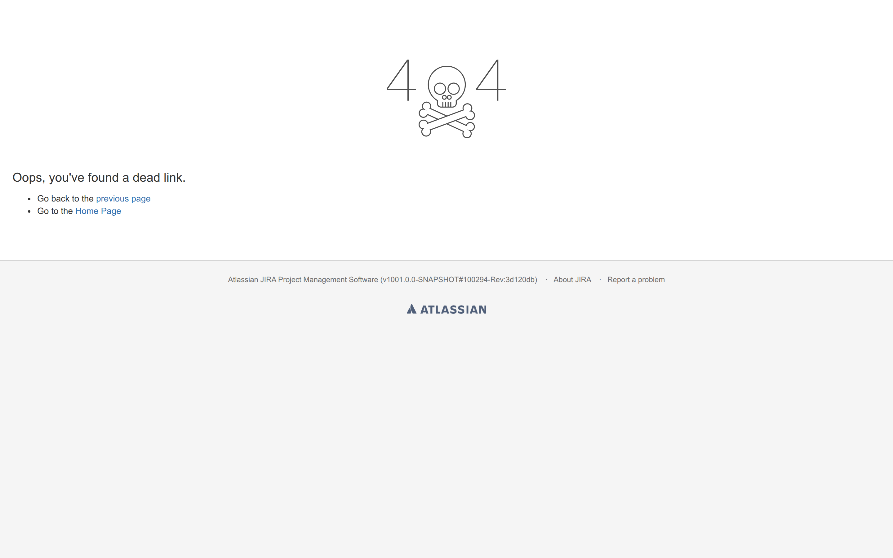
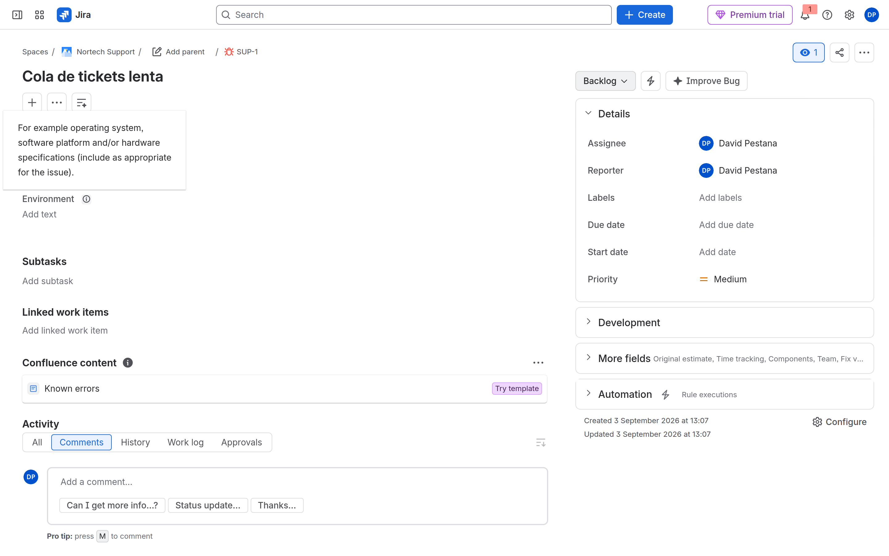

# M10-01 — Entorno multiempresa (issue security)

[← Página anterior](README.md) · [Siguiente página →](M10-02-confluence-marketplace.md)

### Objetivo

Un **work item security scheme** `NORTECH Security` con niveles **Interno** y **Cliente**, asociado a **SUP**, validado con el usuario invitado (M02).

### Prerrequisitos

- SUP (CMP). Segundo usuario invitado. **Jira administrator**.

### En qué consiste

| Fase | Acción |
|------|--------|
| 1 | Crear scheme + niveles |
| 2 | Asociar scheme a SUP |
| 3 | Permiso **Set Issue Security** |
| 4 | Poner nivel en una issue + probar visibilidad |

> [!NOTE]
> **Browse Projects** permite entrar al espacio. **Issue security** decide si ves *cada* ticket.

---

### 1 — Abrir Work item security schemes

**Acción:** **Settings (⚙️) → Jira settings**. Sidebar **Work items** → **Work item security schemes**.

Atajo URL: `https://TU-SITE.atlassian.net/secure/admin/ViewIssueSecuritySchemes.jspa`

**Por qué:** En UI 2026 el menú puede decir *Work items* en lugar de *Issues* / *Elementos de trabajo*.

**Resultado esperado:** Tabla de esquemas. Si ya existe `NORTECH Security`, edítalo; si no, **Add work item security scheme**.



---

### 2 — Niveles Interno y Cliente

**Acción:** En la fila `NORTECH Security`, pulsa **Security levels** / **Niveles de seguridad**.

Crea dos niveles:

| Nivel | Miembros (ejemplo curso) |
|-------|---------------------------|
| **Interno** | Role **Administrators**, **Developers**, grupo `nortech-soporte` |
| **Cliente** | Role **Administrators** + tu usuario admin. **No** el invitado de soporte |

**Default level:** `Interno` (al crear issues sin elegir nivel).

**Por qué:** Default demasiado restrictivo = nadie ve tickets nuevos.

**Resultado esperado:** Dos filas en la tabla de niveles. (En captura del site de curso puede estar vacío hasta que completes este paso.)




---

### 3 — Asociar el scheme a SUP

**Acción:** Desde administración de Jira, asocia el scheme al espacio **Nortech Support**. Wizard típico:

**Administration → Associate work item security scheme to Space** (URL patrón):

`/secure/project/SelectProjectIssueSecurityScheme!default.jspa?projectId=ID_SUP`

1. Elige **NORTECH Security**.
2. Confirma (**Associate** / **Next**).

Alternativa: en algunas versiones, enlace **Spaces** en la fila del scheme.

**Por qué:** Sin asociación, el campo **Security level** no aparece en SUP.

**Resultado esperado:** Columna **Spaces** del scheme muestra *Nortech Support*.



---

### 4 — Permiso Set Issue Security

**Acción:** **Work items → Permission schemes** → abre **NORTECH Permissions** (el que usa SUP tras M04).

Concede **Set Issue Security** / **Set work item security** solo a **Administrators** (no a **Users** genérico).

**Acción (comprobar SUP):** **SUP → Space settings → Permissions** — debe decir que usa **NORTECH Permissions** (o el scheme que editaste).

**Por qué:** Si nadie puede fijar el nivel, el scheme es teórico.

**Resultado esperado:** Permiso visible en el scheme; SUP enlazado.





---

### 5 — Campo Security level en pantalla

**Acción:** Asegúrate de que **Security level** está en la pantalla Create/Edit de SUP (M06). Crea o edita un **Bug** en SUP.

**Acción:** En **Edit**, campo **Security level** → elige **Cliente**.

**Por qué:** Simula ticket visible solo para cliente/admin, no para soporte interno genérico.

**Resultado esperado:** Issue guardada con nivel Cliente.




---

### 6 — Validar con usuario invitado

**Acción:** Ventana incógnito con el **invitado** (Browse en SUP, grupo soporte). Busca la issue con JQL:

```jql
project = SUP AND level = Cliente
```

**Contigo (admin):** debe aparecer. **Invitado:** vacío o sin acceso.

**Por qué:** Separación multiempresa / datos sensibles — objetivo del lab.

**Resultado esperado:** Invitado **no** ve esa issue; sí ve otras en nivel Interno.

---

## Comprueba tu entendimiento

**JQL**
`level = Cliente` con el invitado.
→ Vacío. Contigo: la issue.

## Reto

### 1 — Reporter ciego

Mete al **Reporter** en el nivel Cliente. ¿Debe el cliente ver su propio ticket?

<details>
<summary>Ver solución</summary>

Casi siempre sí. Add **Reporter** al nivel Cliente. Si no, el portal externo crea tickets que luego «desaparecen» para él.

</details>

## Errores frecuentes

| Síntoma | Causa probable | Cómo arreglarlo |
|---------|----------------|-----------------|
| No sale campo Security | Scheme no asociado / no en pantalla | Pasos 3 + M06 screens |
| Nadie ve nada | Default demasiado restrictivo | Default **Interno**; admins en todos los niveles |
| Invitado ve Cliente | Invitado en grupo del nivel Cliente | Quita al invitado del nivel |
