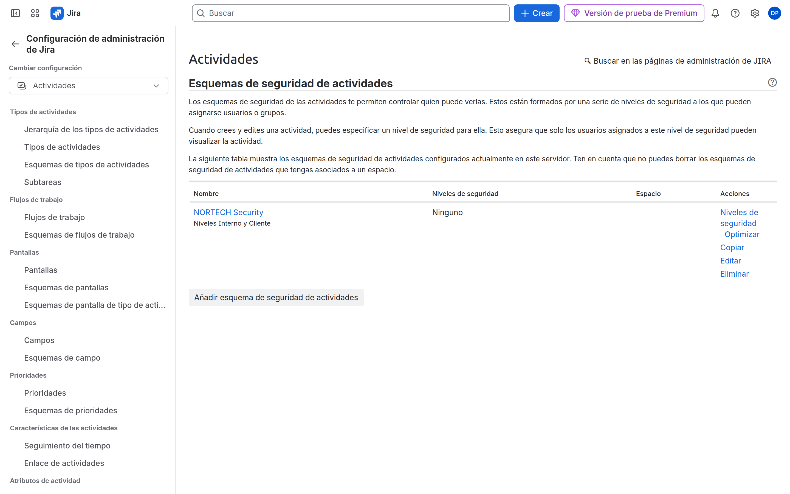
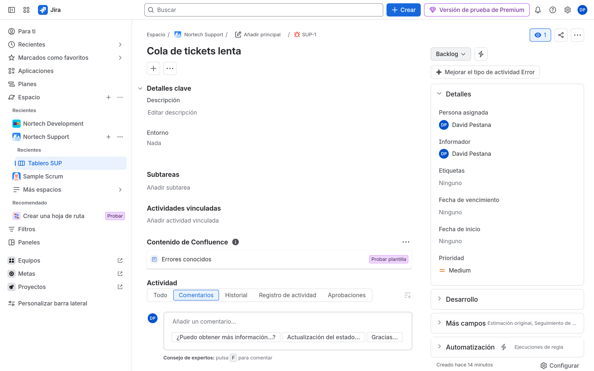

# M10-01 — Entorno multiempresa (issue security)

[← Página anterior](README.md) · [Siguiente página →](M10-02-confluence-marketplace.md)

### Objetivo

Un issue security scheme `NORTECH Security` con niveles Interno y Cliente, asociado a SUP, validado con el usuario invitado.

### Prerrequisitos

- SUP CMP. Segundo usuario (M02). Jira admin.

### En qué consiste

Crear scheme → niveles → set default → asociar proyecto → poner nivel en una issue → comprobar visibilidad.

### 1 — Scheme y niveles

**Acción:** **Elementos de trabajo** → **Esquemas de seguridad** → añadir `NORTECH Security`. Añade niveles:

| Nivel | Quién |
|-------|--------|
| `Interno` | Role Administrators, Developers, Groups `nortech-soporte` |
| `Cliente` | Role Administrators + un usuario/grupo concreto (tú). **No** el invitado de soporte |

Default: `Interno`.

**Por qué:** Browse Projects no basta para ver issues con nivel Cliente.

**Resultado esperado:** Scheme con dos niveles.

### 2 — Asociar y permiso Set Issue Security

**Acción:** Asocia el scheme a SUP. En `NORTECH Permissions`, concede **Set Issue Security** a Administrators (no a Users).

**Por qué:** Si nadie puede setear el nivel, el scheme no se usa.

**Resultado esperado:** **Configuración del espacio** → seguridad de trabajo muestra NORTECH.

### 3 — Issue restringida

**Acción:** Crea un Bug en SUP, campo **Security Level** / **Nivel de seguridad** = `Cliente`. Abre incógnito con el invitado (Browse en SUP, grupo soporte).

**Por qué:** Simula separación de clientes / datos sensibles.

**Resultado esperado:** El invitado **no** ve esa issue; sí ve otras en Interno.

## Comprueba tu entendimiento

**JQL**
`level = Cliente` con el invitado.
→ Vacío o error. Contigo: la issue.

## Reto

### 1 — Reporter ciego

Mete al **Reporter** en el nivel Cliente. ¿Debe el cliente ver su propio ticket?

Ver solución

Casi siempre sí. Add Reporter al nivel. Si no, el portal/agente externo crea tickets que luego «desaparecen» para él.

## Errores frecuentes

| Síntoma | Causa probable | Cómo arreglarlo |
|---------|----------------|-----------------|
| No sale el campo Security | Scheme no asociado / no está en la pantalla | Asocia + pantalla Edit/Create |
| Nadie ve nada | Default demasiado restrictivo | Default Interno; incluye Administrators en todos los niveles |
