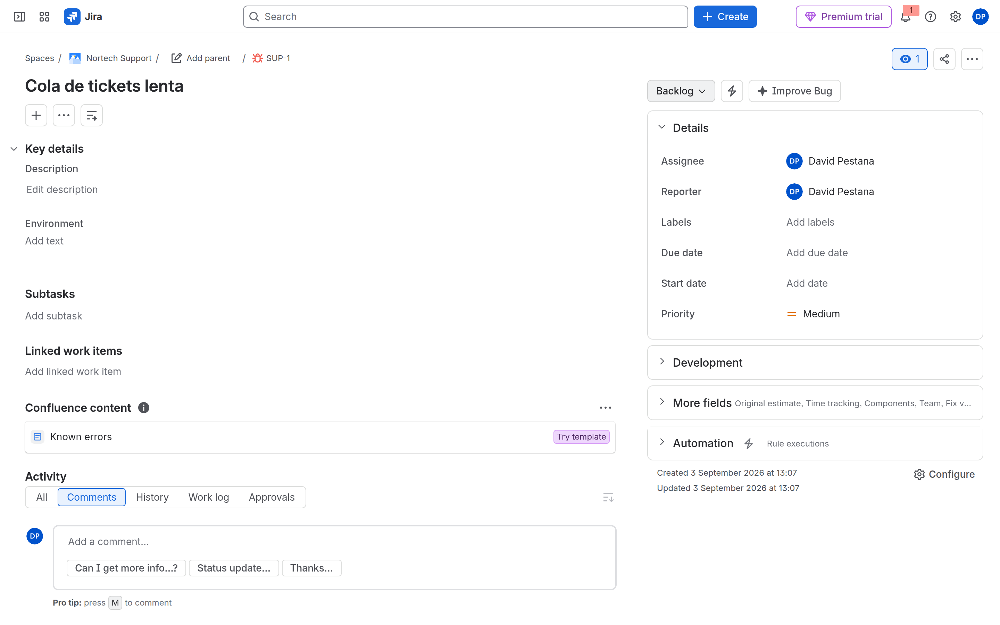
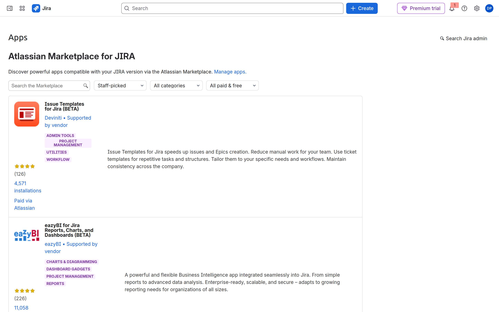
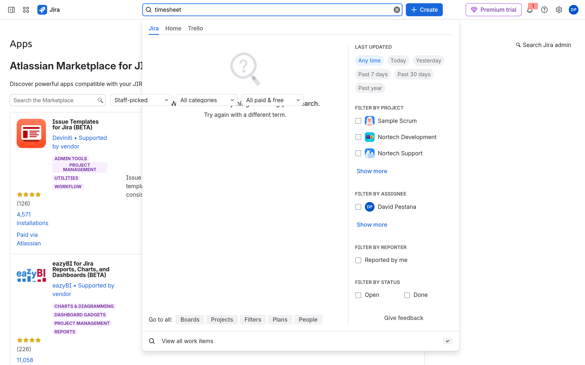

# M10-02 — Integración Jira-Confluence y Marketplace

[← Página anterior](M10-01-seguridad-multiempresa.md) · [Siguiente página →](M10-03-auditoria-operacion.md)

### Objetivo

Enlazar conocimiento (**Confluence**) a una issue de SUP y revisar el **Marketplace** sin dejar apps de pago instaladas.

### Prerrequisitos

- Site Jira. Para Confluence: trial del producto en [admin.atlassian.com](https://admin.atlassian.com) si no está (puede pedir captcha).

### En qué consiste

| Parte | Resultado |
|-------|-----------|
| Confluence trial | Producto activo en el mismo `*.atlassian.net` |
| Página + enlace | Bug SUP ↔ página Runbook |
| Marketplace | Leer **una** ficha (permisos, precio). No instalar de pago |

---

### 1 — Activar Confluence (si falta)

**Acción:** `admin.atlassian.com` → tu organización → **Products** / **Aplicaciones** → **Add product** → **Confluence** (trial).

Espera unos minutos. Abre `https://TU-SITE.atlassian.net/wiki` (Confluence del mismo site).

**Por qué:** Mismo tenant Atlassian; no hace falta otro correo.

**Resultado esperado:** Confluence carga (wizard → **Skip** si quieres ir rápido).

---

### 2 — Espacio y página Runbook

**Acción:** En Confluence, crea espacio **Nortech Docs** (team space) y página **Runbook SUP** con dos líneas de procedimiento de ejemplo.

**Por qué:** Simula base de conocimiento ligada a soporte.

**Resultado esperado:** URL de página tipo `/wiki/spaces/NORTECH/...`.

---

### 3 — Enlazar desde Jira (issue → Confluence)

**Acción:** Abre un Bug en **SUP** (p. ej. SUP-1). En el panel derecho o sección **Confluence content** / **Link**:

1. **Link** → **Confluence page** → elige **Runbook SUP**.
2. Guarda.

**Por qué:** El agente abre el runbook sin salir del ticket.

**Resultado esperado:** Bloque Confluence visible en la issue.

**Opcional (desde Confluence):** En la página, macro **Jira Issue** apuntando al mismo Bug.

---

### 4 — Marketplace: explorar sin instalar de pago

**Acción:** En Jira: **Settings → Apps** o URL `/plugins/servlet/upm/marketplace/featured`.

Si ves *App management has moved to Administration*, pulsa **Take me there** o usa el enlace desde **Connected apps**.

**Acción:** Navega categorías. Busca `timesheet` o `issue template`.

**Por qué:** Cada app = identidad OAuth, datos fuera de Jira, posible coste al caducar trial.

**Resultado esperado:** Listado Marketplace con *Staff-picked* y filtros.

---

### 5 — Leer una ficha (gobernanza)

**Acción:** Abre **una** app (Free o Paid). Anota:

- Permisos que pide (read/write issues, admin…)
- **Paid via Atlassian** vs Free
- Vendor y número de instalaciones

**No instales** nada de pago. Si pruebas una Free, **desinstala** al terminar (**Manage apps**).

**Resultado esperado:** Has leído la ficha completa.

---

## Comprueba tu entendimiento

**Quién instala**
Settings → Apps / Manage apps. Solo admins.
→ Un space admin no debería instalar a ciegas en un site gobernado.

## Reto

### 1 — Evaluación de impacto

Lista tres preguntas antes de instalar una app en Atos.

Ver solución

¿Datos fuera de la UE? ¿Permisos admin/issue? ¿Coste al caducar trial? ¿Quién opera? ¿Hay nativo (automation, JQL)?

## Errores frecuentes

| Síntoma | Causa probable | Cómo arreglarlo |
|---------|----------------|-----------------|
| No sale Confluence | Producto no añadido | Add product; espera minutos |
| Macro Jira no resuelve | Issue security M10-01 | Invitado sin ver issue |
| App de pago silenciosa | Instalar sin leer | Uninstall inmediato |
| UPM redirige | UI 2026 | Usar **Connected apps** en Administration |
