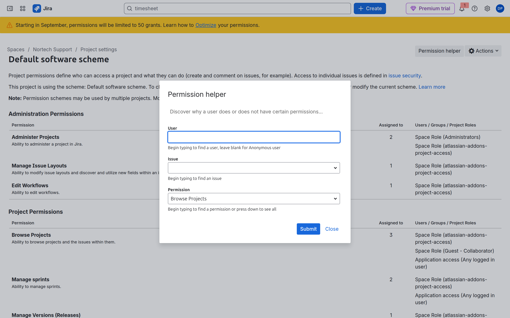
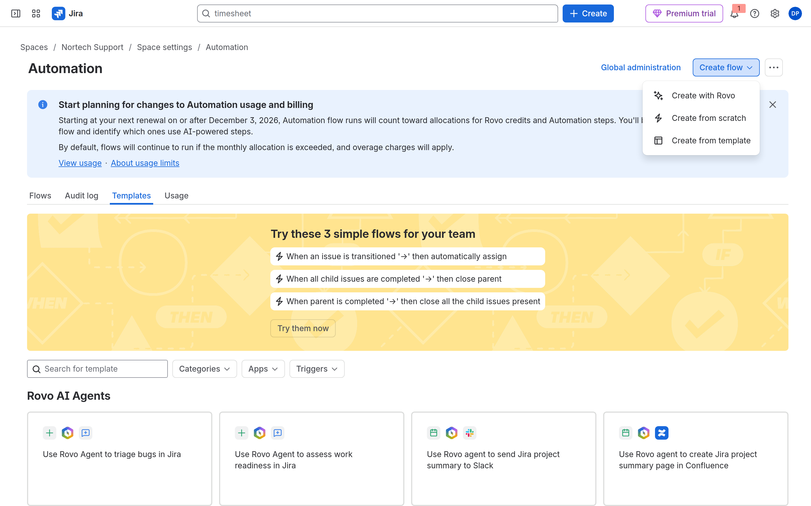
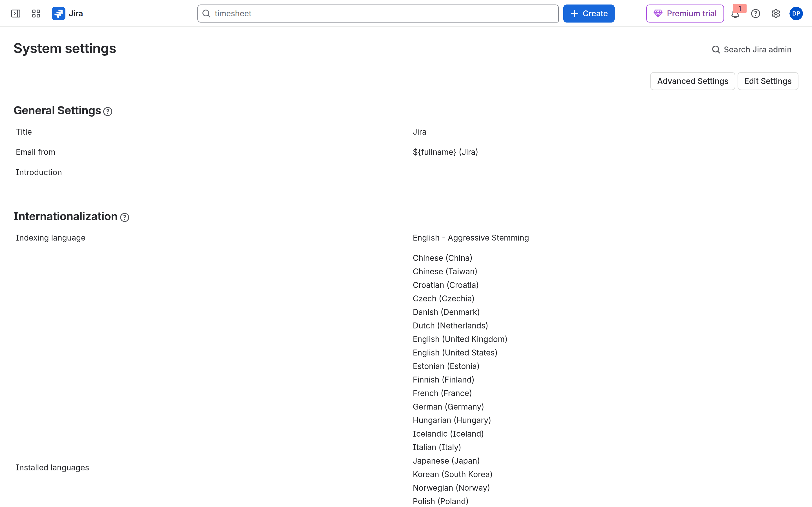
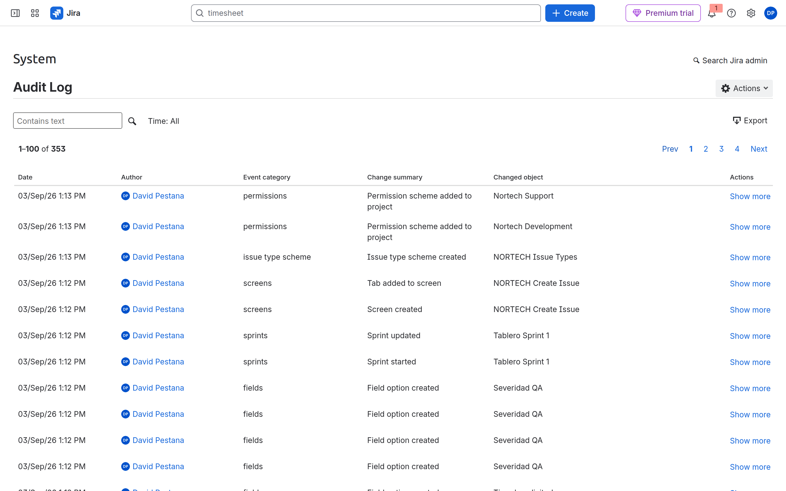
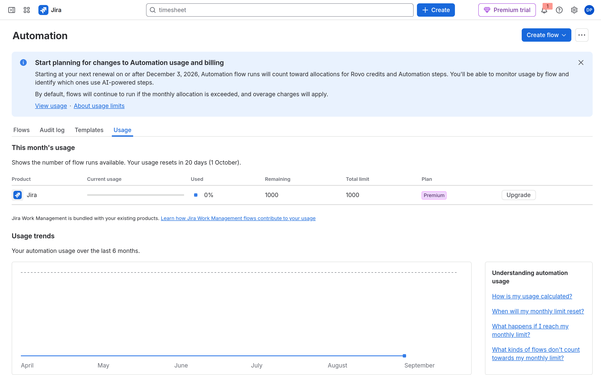

# M10-03 — Resolución de incidencias y auditoría

[← Página anterior](M10-02-confluence-marketplace.md) · [Siguiente página →](M10-04-examen-simulado.md)

### Objetivo

Aplicar un **checklist de diagnóstico** a incidentes típicos y localizar los **logs** correctos (site vs flujo vs org).

### Prerrequisitos

- Instancia con labs anteriores. Segundo usuario (invitado) ayuda en accesos.

### En qué consiste

Cuatro mini-escenarios + capturas de **Audit log** Jira, **Usage** automation y **Permission helper**.

---

### 1 — Problema de acceso (producto)

**Síntoma:** El invitado «no puede abrir Jira».

**Checklist (en orden):**

1. ¿Invitación **aceptada** y URL del site correcta (`*.atlassian.net`)?
2. ¿**Product access** Jira Software / Jira en [admin.atlassian.com](https://admin.atlassian.com)?
3. ¿Licencia / asiento disponible en trial?

**Por qué:** No empieces por permission scheme si no entra al producto.

**Resultado esperado:** Identificas cuál de las tres puertas falló en una frase.

---

### 2 — Problema de permisos (espacio)

**Acción (lab):** Quita al invitado del rol **Users** / grupo en **SUP → Space settings → People**. Pídele abrir SUP. Restaura el rol.

**Acción (herramienta):** **SUP → Space settings → Permissions** → enlace **Permission helper** / **Asistente de permisos**. Simula usuario + permiso **Browse Projects**.

**Por qué:** «Proyecto vacío» vs «Access denied» vs «No issues» son síntomas distintos.

**Resultado esperado:** Permisos restaurados; sabes usar el helper.

---

### 3 — Workflow / automation defectuosa

**Acción:** Elige un flujo de M09. Ábrelo → **Turn off flow** / desactiva. Repite la acción manual (crear Bug, transitar Story). Vuelve a **enable**.

**Acción:** En **Workflows** del espacio, comprueba que no hay **draft** sin publicar (M05).

**Por qué:** «Ayer funcionaba» → flujo off, workflow draft, o cuota automation.

**Resultado esperado:** Lista mental: (1) flujo disabled, (2) draft workflow, (3) transición renombrada.

---

### 4 — Audit log del site Jira

**Acción:** **Settings → Jira settings → System** (sidebar). Pulsa **Audit log**.

URL directa: `/auditing/view`

**Acción:** Filtra por categoría (*permissions*, *workflows*, *screens*…) o amplía fechas.

**Por qué:** Cambios de scheme, pantalla o permiso quedan aquí. Distinto del **Audit log** de un flujo suelto.

**Resultado esperado:** Tabla con eventos (p. ej. *Permission scheme added to project*).

---

### 5 — Cuota automation (Usage)

**Acción:** **Settings → Jira settings** → busca **Automation** global, o URL `/jira/settings/automation`. Pestaña **Usage**.

**Acción alternativa:** Space **Automation → Usage** (M09).

**Por qué:** Plan Free/trial tiene techo de ejecuciones; muchos **Scheduled** lo agotan.

**Resultado esperado:** Gráfico o tabla de uso del mes.

---

### 6 — Checklist de auditoría de plataforma

Recorre mentalmente (anota en tu cuaderno):

- [ ] Schemes **Default** aún asociados a espacios Nortech
- [ ] Apps instaladas vs necesarias
- [ ] Quién es **org admin** (¿hay backup?)
- [ ] Caducidad trial Premium
- [ ] Tableros con filtro JQL sin `project =`

**Resultado esperado:** 2–3 mejoras concretas para Nortech (asociar PMO a NORTECH Permissions, desinstalar apps demo, etc.).

---

## Comprueba tu entendimiento

**Orden de diagnóstico**

Product access → Browse / **issue security level** → screen/context → workflow condition → board filter → **automation actor**.

→ De fuera hacia dentro.

## Reto

### 1 — Audit log vacío

¿Qué haces si no ves eventos?

Ver solución

Amplía rango de fechas; confirma plan (Free tiene menos). Prueba org admin **Security** si el requisito es invitación, no cambio Jira.

## Errores frecuentes

| Síntoma | Causa probable | Cómo arreglarlo |
|---------|----------------|-----------------|
| Audit log vacío | Filtro fechas / plan | Amplía; Premium trial |
| Automation al 100 % | Demasiados Scheduled | Usage tab; disable demos |
| Confundir logs | Site vs flujo | `/auditing/view` vs Automation **Audit log** |
| 404 Audit log | URL antigua `/jira/settings/system/audit-log` | Usa `/auditing/view` |
