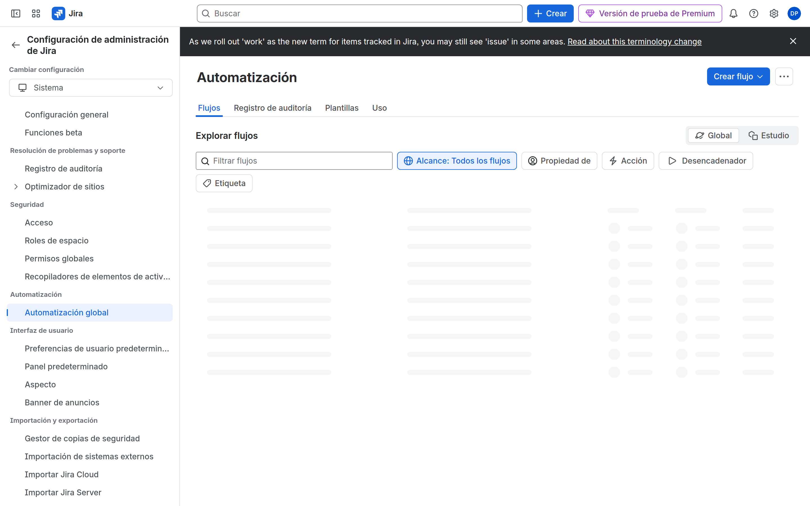

# M10-03 — Resolución de incidencias y auditoría

[← Página anterior](M10-02-confluence-marketplace.md) · [Siguiente página →](M10-04-examen-simulado.md)

> Práctica del módulo. La teoría y la demo están en el [README del módulo](README.md).

### Objetivo

Aplicar un checklist de diagnóstico a cuatro incidentes típicos y localizar el audit log.

### Prerrequisitos

- Instancia con los labs anteriores. Segundo usuario ayuda.

### En qué consiste

Cuatro mini-escenarios + revisión de logs y de límites de automation.

### 1 — Problema de acceso

**Acción:** Sintoma: el invitado no abre Jira. Recorre: ¿producto access? ¿invitación aceptada? ¿URL del site correcto?

**Por qué:** No empieces por el permission scheme.

**Resultado esperado:** Sabes decir en una frase cuál de las tres puertas falló (org / producto / proyecto).

### 2 — Error de permisos

**Acción:** Quita al invitado del rol de SUP, pídele que abra SUP, **devuélvele** el rol. Mira **Configuración del espacio** → **Permisos** → explorar espacios (*Browse Projects*).

**Por qué:** El síntoma «proyecto vacío» vs «no access».

**Resultado esperado:** Restaurado.

### 3 — Workflow / automation defectuosa

**Acción:** Elige una regla de M09, ponla **Disabled**, intenta el flujo manual, vuelve a **Enabled**. En un workflow, comprueba que no queda draft sin publicar.

**Por qué:** «Ayer funcionaba» = draft, regla off, o cuota.

**Resultado esperado:** Lista de tres causas posibles si una transición «no sale».

### 4 — Audit log y cuota

**Acción:** **Configuración de Jira** → **Sistema** → **Registro de auditoría** (o Administration → **Seguridad**). Filtra por permisos / workflow si hay eventos. Abre **Automatización** global o del espacio y mira el **uso**.

**Por qué:** Gobierno y escalabilidad: saber dónde se mira antes de abrir un ticket a Atlassian.

**Resultado esperado:** Ves eventos recientes y/o el uso de automation.

## Comprueba tu entendimiento

**Orden de diagnóstico**
Product access → Browse / security level → screen/context → workflow condition → board filter → automation actor.
→ De fuera hacia dentro.

## Reto

### 1 — Auditoría de plataforma (checklist)

Recorre y marca mentalmente: schemes Default aún en uso; apps instaladas; quién es org admin; trial caducidad; boards con filtros `order by created` sin proyecto.

Ver solución

Anota mejoras: asociar PMO a NORTECH Permissions; desinstalar apps; segundo org admin de respaldo; calendario de caducidad del trial. Eso es el laboratorio «auditoría» de la propuesta.

## Errores frecuentes

| Síntoma | Causa probable | Cómo arreglarlo |
|---------|----------------|-----------------|
| Audit log vacío | Plan Free / filtro de fechas | Amplía fechas; Premium |
| Automation al 100 % | Demasiadas reglas scheduled | Disable demos |
