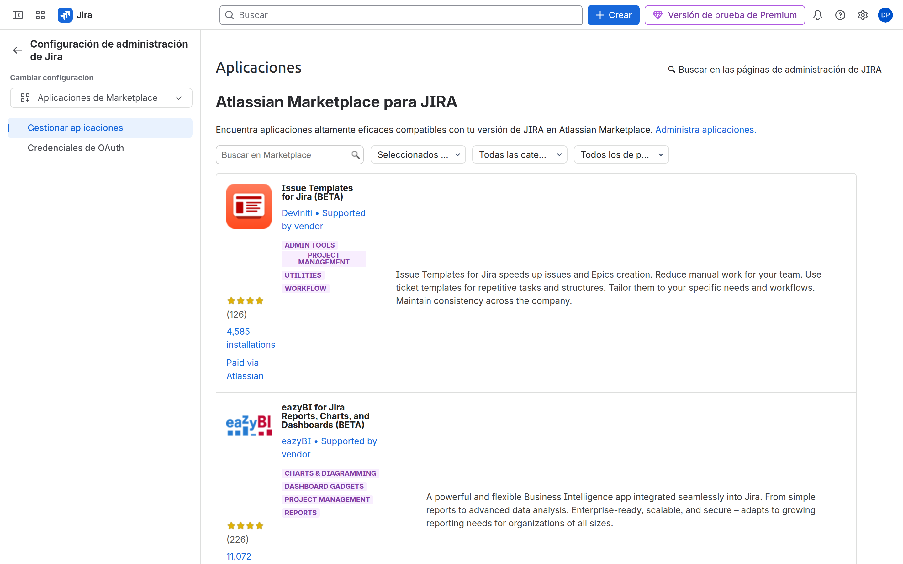

# M10 — Gobierno, integraciones y ACP-620

[← Página anterior](../M09-automatizacion/M09-preparacion-examen.md) · [Siguiente página →](M10-01-seguridad-multiempresa.md)

## Qué aprenderás

- Proteger issues con **issue security** (multiempresa / departamentos).
- Enlazar **Confluence** y mirar el **Marketplace** con criterio.
- Diagnosticar accesos, permisos, workflows y automation.
- Hacer un **examen simulado** ACP-620.

## Explicación

**Permission scheme** = quién entra al proyecto y qué botones tiene.  
**Issue security scheme** = quién ve *esa* issue aunque tenga Browse Projects.

Niveles típicos: `Interno`, `Cliente A`, `Dirección`. El reporter puede no verse a sí mismo si el nivel no lo incluye: trampa clásica.

Integraciones: Confluence (conocimiento), Marketplace (superficie de ataque y de coste). Gobierno: quién puede instalar apps, revisión de permisos de la app, desinstalar al terminar el lab.

Operación: registro de auditoría, límites de automation, no editar esquemas Default, change management (copia de scheme, no «pruebo en producción»).

## Demostración

1. **Elementos de trabajo** → esquemas de seguridad. Un scheme con dos niveles. Una issue en `Cliente` que el usuario de soporte interno no ve.

2. **Aplicaciones** → explorar más. Abre **una** ficha. **No** instales nada de pago.

## Laboratorio

Turno de los alumnos.

| Lab | Título |
|-----|--------|
| M10-01 | [Entorno multiempresa](M10-01-seguridad-multiempresa.md) |
| M10-02 | [Confluence y apps](M10-02-confluence-marketplace.md) |
| M10-03 | [Auditoría y operación](M10-03-auditoria-operacion.md) |
| M10-04 | [Examen simulado ACP-620](M10-04-examen-simulado.md) |

→ **[M10-01](M10-01-seguridad-multiempresa.md)**
